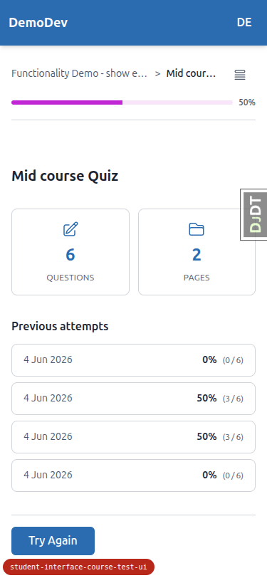
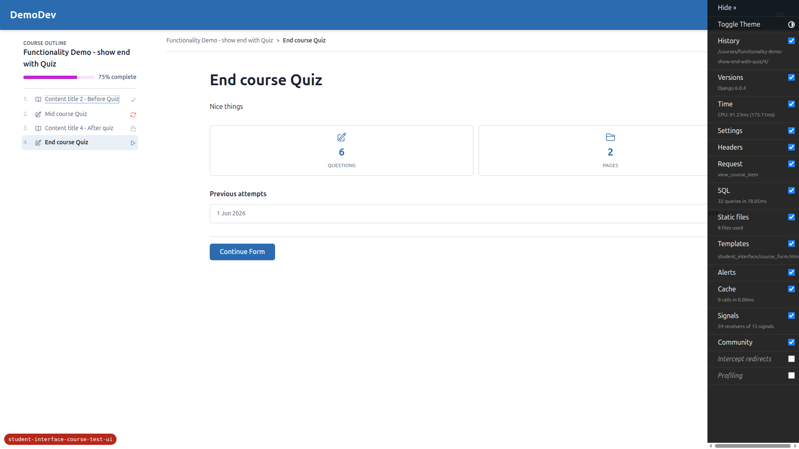
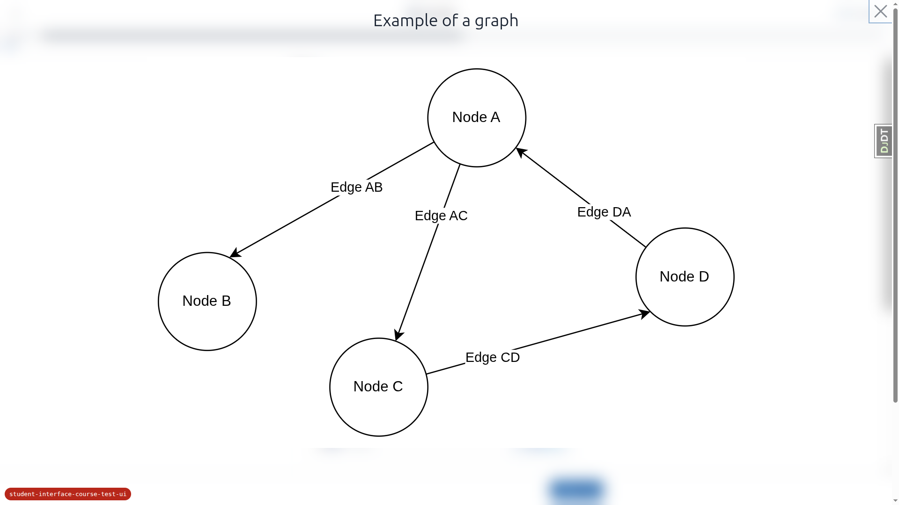
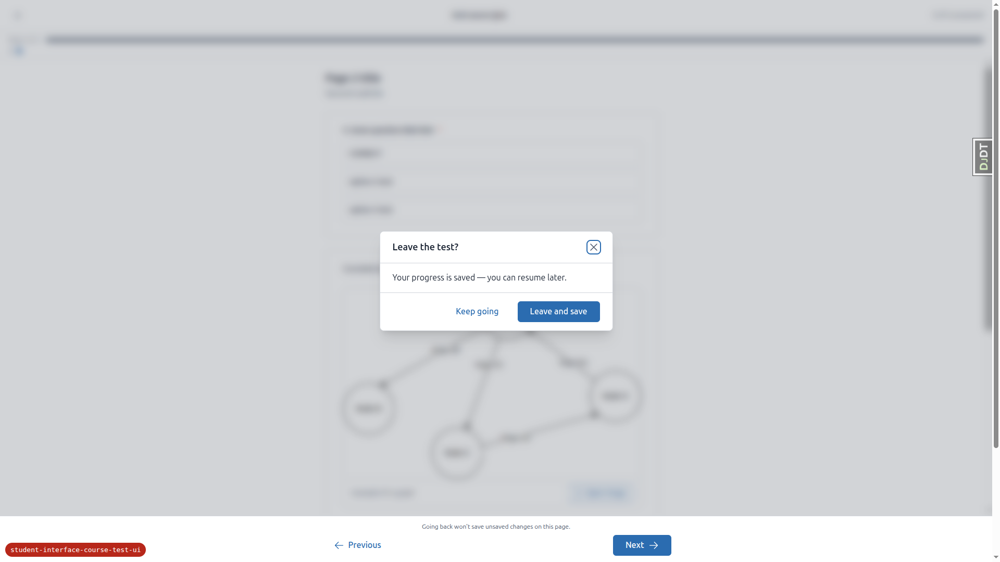
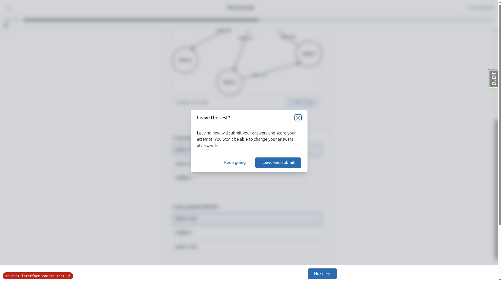
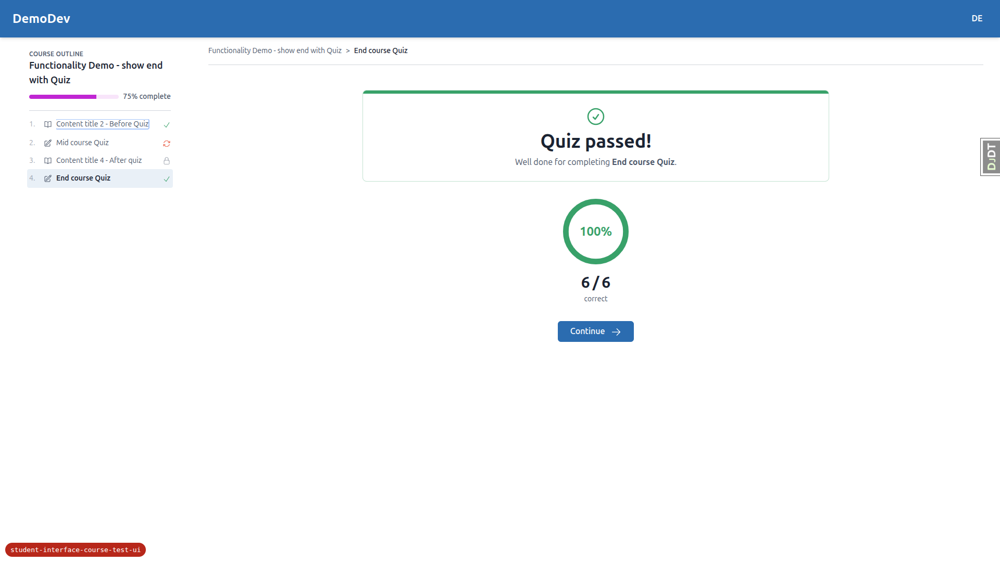
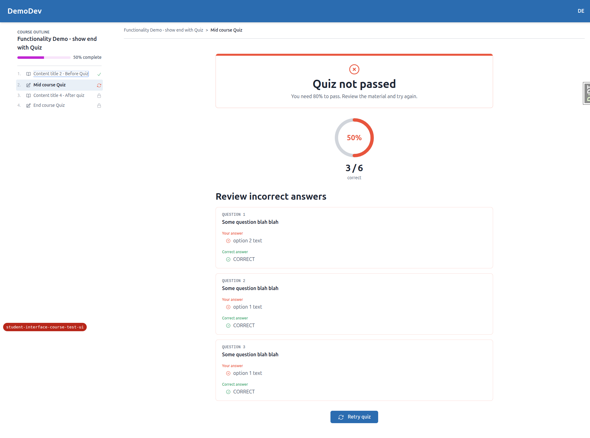
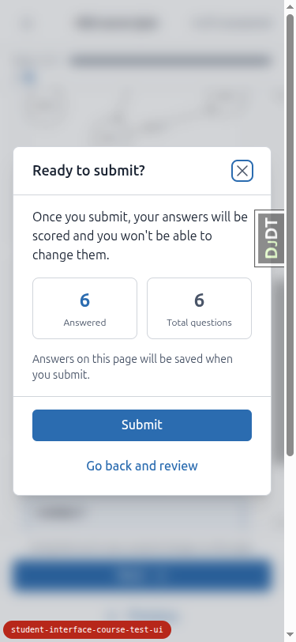
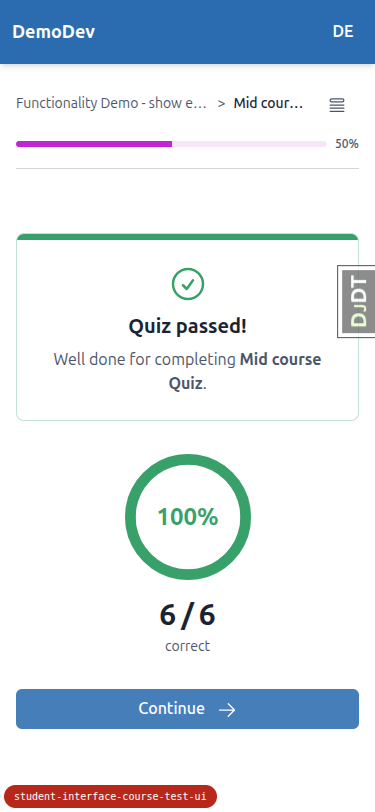

# QA Report: Student interface — course test/exam UI

**Date:** 2026-06-04
**Branch:** `student-interface-course-test-ui`
**Site:** DemoDev (dev settings force `FORCE_SITE_NAME = "DemoDev"`)
**Tester:** Automated QA (Playwright MCP), logged in as `demodev@email.com`
**Test plan:** `3. frontend_qa.md`
**Viewports:** Desktop 1920×1080, Mobile 375×812, Tablet 768×1024

---

## Summary

The re-skinned test/exam flow (start screen → runner → results), the `submit_on_exit`
behaviour, and accessibility all work as specified. The runner layout, answered-count honesty,
PRG navigation, submit dialog (with focus management, Escape, and double-submit guard),
save-on-exit and submit-on-exit dialogs, the server-side safety net, the `beforeunload`
courtesy warning, both result screens, all four question types, keyboard operability, and
default-theme styling were all verified and pass.

**Two issues were found**, described below: one functional bug (a 500 when entering the
runner for an already-completed form) and one spec-conformance deviation (the previous-attempts
summary lists every attempt rather than best/most-recent). A couple of tangential observations
are also noted.

---

## Bug 1 — 500 `AttributeError` when entering the runner for an already-completed form

**Severity:** Medium (server error; reachable by URL by any logged-in, registered learner)
**Test affected:** Surfaced while setting up Test 8 (navigating to a completed form's
`fill_form` URL). Not a step the test plan explicitly walks, but it is a crash on a GET an
authenticated user can trigger.

**Steps to reproduce:**
1. As a learner who has **already completed** a form, navigate directly to that form's runner
   URL, e.g. `GET /courses/functionality-demo-show-end-with-topic/3/fill_form/1`.
2. The page returns **HTTP 500**.

**Expected:** The runner should not 500 when there is no incomplete attempt. It should redirect
the learner back to the form start screen (or results), exactly as the POST branch of the same
view already does.

**Actual:** `AttributeError: 'NoneType' object has no attribute 'existing_answers_dict'`

```
File "freedom_ls/student_interface/views.py", line 578, in form_fill_page
    existing_answers = form_progress.existing_answers_dict(questions)
AttributeError: 'NoneType' object has no attribute 'existing_answers_dict'
```

**Root cause (confirmed in code):** In `form_fill_page` (`views.py`), `form_progress =
FormProgress.get_latest_incomplete(...)` returns `None` when there is no incomplete attempt
(e.g. the form is completed). The **POST** branch already guards this case and redirects to the
start screen (`views.py:542-547`, with the comment *"Send the learner back to the form start
screen rather than 500."*). The **GET** path has **no equivalent guard** and dereferences
`form_progress` at `views.py:578`, crashing.

**Suggested fix:** Apply the same `if form_progress is None: redirect(... view_course_item ...)`
guard on the GET path (before line 578) that the POST path already uses.

---

## Bug 2 — Previous-attempts summary lists *every* attempt instead of best/most-recent

**Severity:** Low (spec/plan conformance; cosmetic, grows unbounded over time)
**Test affected:** Test 1 (start screen — previous-attempts summary)



**Expected:** Per the plan, the start-screen previous-attempts summary should be a *compact*
panel showing the **best / most-recent score** for a quiz (plan §173-174, §298; spec §86, §207).
The deferred history page + "View all" link were explicitly removed precisely so the start
screen stays lightweight.

**Actual:** The summary renders **one row per completed attempt** with no limit. After a few
re-attempts during QA the panel showed 4 rows (`0% (0/6)`, `50% (3/6)`, `50% (3/6)`,
`0% (0/6)`), and it will keep growing as attempts accumulate.

**Root cause (confirmed in code):** `view_form` builds `completed_form_progress =
FormProgress.objects.filter(...).order_by("-completed_time")` with **no slice/limit**
(`views.py:449-451`), and `partials/exam_previous_attempts.html` loops over the whole queryset.
The partial's own header comment says *"Shows best / most-recent score for QUIZ"*, so the
template intent and the implementation disagree.

**Note:** the spec wording *"(best / most-recent scores where applicable)"* is slightly
ambiguous, but the plan is explicit. There is correctly **no "View all" link** and no disabled
placeholder. If "show all completed attempts" is in fact the desired behaviour, the spec/plan
and the partial's comment should be updated to match; otherwise the queryset should be limited.

---

## Tangential observations (not failures)

### A. Dev database had unapplied migrations at QA start
On first load, `/` returned a 500: `column freedom_ls_content_engine_course.learning_outcomes
does not exist`. Two content_engine migrations
(`0010_course_difficulty_course_estimated_duration_and_more` and `0011_merge_20260604_1314`)
were pending. Running `manage.py migrate` resolved it and QA proceeded normally. This is a local
dev-DB state issue, not a code defect, but worth flagging so the migration set is applied before
review. (The early `500 @ /` console error in later snapshots is this same stale request.)

### B. Submit-on-exit dialog copy vs. discarded current-page edits
On a `submit_on_exit = True` form, the exit dialog says *"Leaving now will submit your answers
and score your attempt."* The "Leave and submit" button posts a **separate CSRF-only form** to
`form_submit_and_exit`, so the **current page's unsaved edits are discarded** — only previously
saved pages are scored. This is **by design** (plan §340, §356: *"unsaved edits on this page
aren't kept"*, and matches the server-side safety net which also can't capture unsaved edits).
Flagging only because the word "your answers" could read as "including what I just typed on this
page." No action required unless the copy is to be tightened.

---

## What was tested and passed

All checks below verified in the **default theme**.

### Test 1 — Start screen (normal chrome)
- Global header + course chrome present (not the sidebar-less runner). ✓
- Title, intro markdown render. ✓
- Meta grid shows exactly two truthful cells (questions + pages); no "estimated time"/"unlimited tries". ✓
- Previous-attempts summary shown; **no "View all" link**, no disabled placeholder. ✓ (but see Bug 2 re: row count)
- CTA correct per state: **Start** (no progress), **Continue** (incomplete save-on-exit attempt), **Try Again** (failed quiz). ✓



### Test 2 — Runner layout & accessibility
- No course sidebar/TOC and no global header — runner owns the viewport with its own top bar, progress strip, body, footer. ✓
- Top bar: exit "X" (left), title (centre), honest "N of M answered" (right) — does **not** say "saved". ✓
- Progress strip "Page X of Y" with a fill bar matching the page fraction. ✓
- Page dots: current/visited pages are links; not-yet-reached pages are non-clickable ("Page 2 (not yet accessible)"). ✓
- Questions are `<fieldset>` with `<legend>`; multiple-choice = radios, checkboxes = checkboxes (label tiles); selection highlight is driven by the checked input. ✓
- Keyboard: arrow keys move radio selection; Space toggles checkboxes. ✓
- Markdown-image lightbox opens (confirms `content_engine`/`alpine-components.js` loads in the runner — the previously-fixed QA bug). ✓
- No console errors, no Alpine CSP "blocked inline expression" errors. ✓
- *Two-option multiple-choice:* no 2-option question exists in demo data, so this was verified by code inspection — the template (`course_form_page.html`) only branches on the four types and renders all `multiple_choice` as radio tiles regardless of option count; there is **no** bespoke True/False renderer. (See "Test gaps".)




### Answered-count honesty
- After answering page 1 and advancing, page-2 top-bar count reflects the **persisted** page-1 answers. ✓
- Selecting/typing on the current page increases the count **live** without advancing; the "Ready to submit?" modal shows the same tally. ✓

### Test 3 — Navigation (PRG)
- **Next** saves the current page then advances; saved answers persist (verified via Back). ✓
- **Previous** is a plain GET link and does **not** save in-progress edits (unsaved edit discarded on return). ✓
- Locked page dots cannot be clicked to skip ahead. ✓
- Runner GET responds with `Cache-Control: no-store`. ✓

### Test 4 — Final-page submit dialog
- Dialog "Ready to submit?" opens (does not submit immediately); body explains scoring + immutability. ✓
- Shows only answered / total counts — **no "flagged"**. ✓
- "Go back and review" dismisses and keeps the learner on the page. ✓
- "Submit" finalises and lands on the results page. ✓
- Double-submit guard: Submit is `x-bind:disabled="submitting"` (disables on first click). ✓
- Accessibility: `role="dialog"`, focus moves into the dialog, **Escape** closes it and returns focus to the Next button. ✓


### Test 5 — Exit behaviour (the X control)
- **5a Save-on-exit** (`submit_on_exit=False`): exit dialog warns progress is saved and resumable; confirming returns to the start screen with the attempt still incomplete; re-entering offers **Continue** and resumes at the correct page. ✓
- **5b Submit-on-exit** (`submit_on_exit=True`): exit dialog warns leaving will submit and score; "Leave and submit" finalises and shows results. ✓
- **5b Server-side safety net:** answered one page then left via raw browser navigation (no X); returning to the start screen shows the attempt **completed** (no lingering "Continue"; finalised attempt at 50% (3/6) — page 1 saved, page 2 unanswered). ✓
- **5c beforeunload:** raw navigation triggers the generic browser "leave site?" prompt; the handler only calls `e.preventDefault()` and **never calls a Django endpoint** (confirmed in `alpine-components.js` and verified live — the prompt fired during navigation). ✓




### Test 6 — Results screens (normal chrome)
- **6a QUIZ:** normal chrome; pass/fail banner; SVG score ring rendering the percentage; ring colour from a token (`text-success` over `text-border` track); `quiz_show_incorrect` review lists the learner's wrong answers with the correct options; **no** per-topic breakdown and **no** "Here's the idea" explanations; back/retry navigation works. ✓ (verified both a passing 100% result and a failing 50% result with the incorrect-answers review)
- **6b CATEGORY_VALUE_SUM:** clear "marking is in progress" state with no fabricated score; existing category-sum display preserved (Satisfaction 3/7, Recommendation 5/5). ✓





### Test 7 — Theming sanity
- All three screens render correctly in the default theme; no raw/unstyled elements, no broken layout. ✓
- Progress fill uses the secondary token (grey in default). ✓
- **No Phosphor / Google-fonts CDN links**; icons are inline SVG via `c-icon`. ✓ (The only external scripts are pre-existing app-wide CDNs — htmx, Alpine, Chart.js — out of scope for this feature.)
- First-class build: not available in this environment, so the first-class palette spot-check was **not** run. (See "Test gaps".)

### Test 8 — Question-type coverage
- `multiple_choice` (radios), `checkboxes`, `short_text` (`<input type="text">`), `long_text` (`<textarea>`) all render, are keyboard-operable, correctly labelled (visible legend + `sr-only` label tying each text input to its question), and persist through Next/submit into scoring/results. ✓


### Responsive (mobile 375×812 / tablet 768×1024)
- **Mobile:** runner top bar fits (X / title / count); page dots + fill bar render; question tiles and Submit stack full-width; start screen, course-outline drawer, submit modal, and results all render without overflow or overlap; touch targets are large (full-width tiles/buttons). ✓
- **Tablet:** runner uses a clean centred content column; start screen shows a 2-column meta grid; the course outline collapses to a drawer toggle (same as mobile); submit modal and results render at sensible widths. ✓






---

## Test gaps / things not executed

1. **Two-option multiple-choice (Test 2):** no 2-option `multiple_choice` question exists in the
   demo content, so the "renders like any other MC, no bespoke True/False UI" check was verified
   by **code inspection** rather than in the browser. The template has no True/False branch — all
   `multiple_choice` render identically as radio tiles regardless of option count — so a 2-option
   question would necessarily render as standard radios. (Not blocked by data that
   `qa-data-helper` would normally create; this is a content/question-definition gap, and the
   code-level guarantee is strong.)
2. **First-class theme spot-check (Test 7):** no first-class build was available in this
   environment, so only the default theme was verified. The default theme is the one that "must
   work" per the plan; first-class is "if available".
