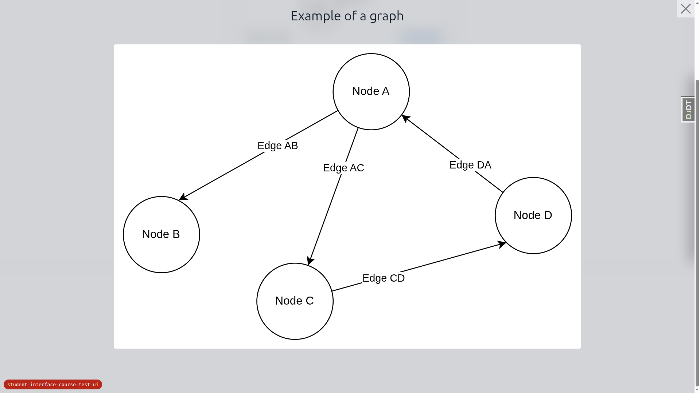
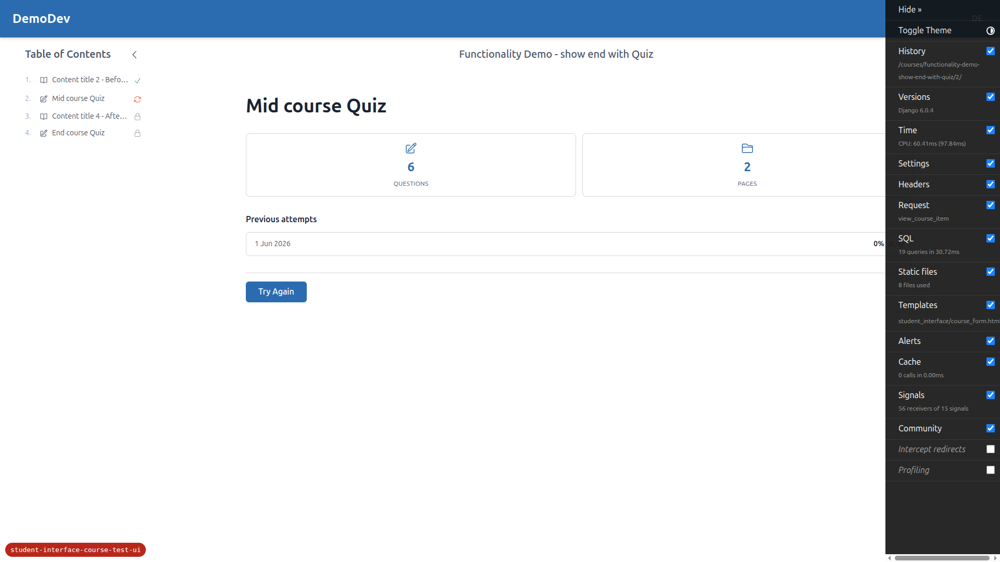
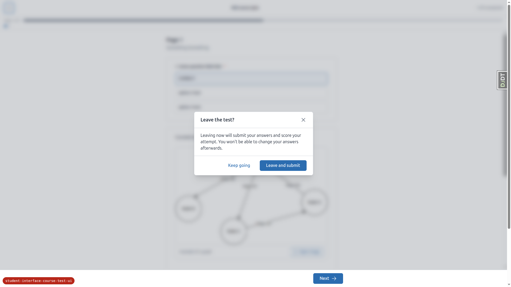
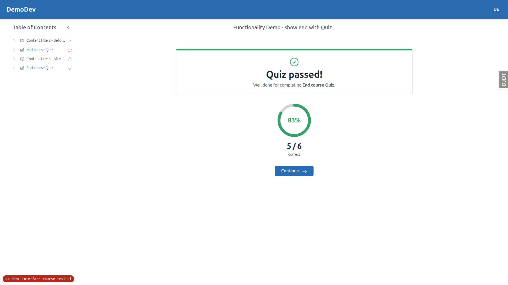
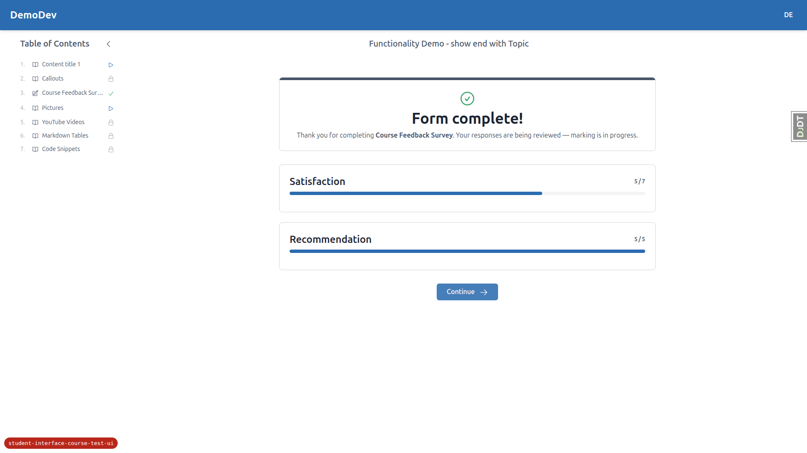
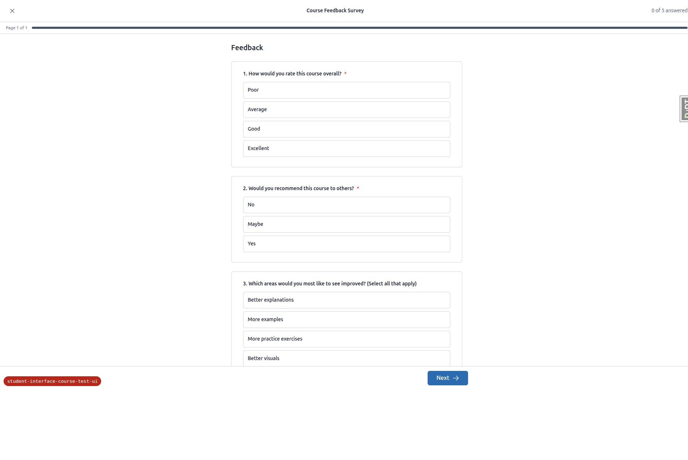
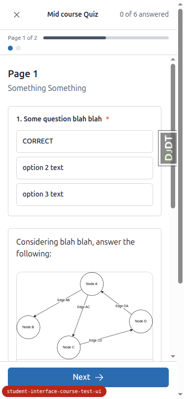
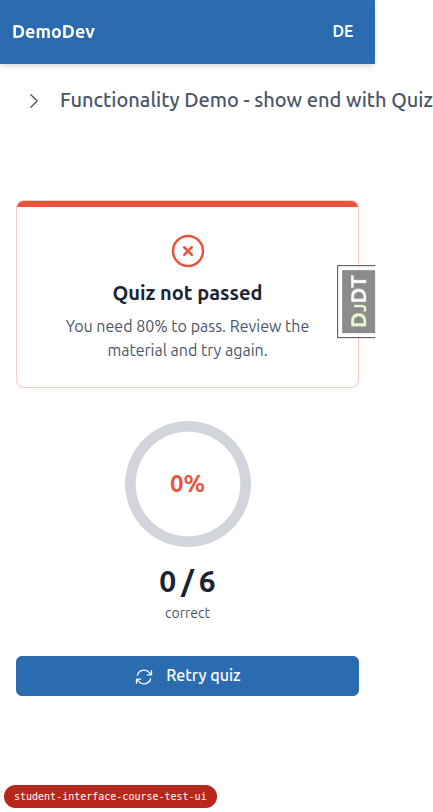
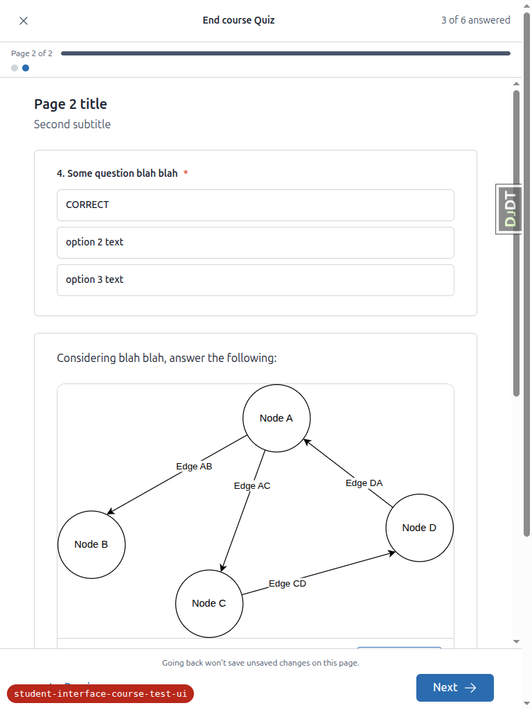

# QA Report: Student interface — course test/exam UI

**Date:** 2026-06-02
**Tester:** Playwright MCP (manual walk-through), DemoDev site, default theme
**Build under test:** branch `student-interface-course-test-ui`
**Forms exercised (DemoDev demo content):**

| Form | Strategy | `submit_on_exit` | Course item URL |
|------|----------|------------------|-----------------|
| End course Quiz | QUIZ (pass 50%, `show_incorrect=False`) | False | `/courses/functionality-demo-show-end-with-quiz/4/` |
| Mid course Quiz | QUIZ (pass 80%, `show_incorrect=True`) | **True** | `/courses/functionality-demo-show-end-with-quiz/2/` |
| Course Feedback Survey | CATEGORY_VALUE_SUM (all 4 question types) | False | `/courses/functionality-demo-show-end-with-topic/3/` |

Demo content was reloaded (`content_save ./demo_content DemoDev`) before testing so the new
question types and `submit_on_exit` flag were live.

---

## Summary

The re-skinned test/exam flow works well overall: the start, runner, and results screens render
correctly in the default theme across desktop (1920×1080), mobile (375×812), and tablet (768×1024);
PRG navigation, save-on-exit, submit-on-exit, the server-side stale-attempt safety net, the
beforeunload warning, all four question types, and both quiz and survey result screens all behave as
specified.

**Three bugs and one spec/implementation discrepancy were found:**

1. **[HIGH] Runner doesn't load `content_engine` Alpine components → broken image lightbox blocks
   quiz submission** (and logs console errors). Affects any form whose content contains a markdown
   image — including both demo quizzes.
2. **[MEDIUM · a11y] Submit dialog focus management broken** — focus does not move into the dialog on
   open and the focus trap spans the whole runner, so Tab/Shift+Tab escapes the open modal.
3. **[LOW · a11y] sr-only runner heading mislabels pages as "Question"** — announces "Question 1 of 2"
   when there are 6 questions across 2 pages.
4. **[Discrepancy] Answered count is a live tally, but the spec & QA plan call for "persisted answers
   only".** This is a deliberate, tested change (commit `edcf21d`) — needs a decision: update the
   spec/QA plan, or revert.

---

## Bug 1 — [HIGH] Runner omits `content_engine/js/alpine-components.js`; markdown images break and block submission

**Tests affected:** §2 (No console errors / no Alpine CSP errors), §4 (Submit lands on results),
overall runner usability for image-containing forms.

**Expected:** A form/question whose markdown contains an image renders cleanly in the runner with no
console errors, and the image lightbox (open/close) works — exactly as it does on normal course pages.

**Actual:**
- On every runner page that renders a markdown image, the console logs **`Uncaught Error: Undefined
  variable: contentLightbox`** on load, and **`Uncaught Error: Undefined variable: onEscape`** whenever
  Escape is pressed.
- More seriously: once the runner re-renders (e.g. **opening the "Ready to submit?" dialog** on the
  final page, or pressing Escape), the image lightbox panel — which can no longer be hidden by its
  (now-undefined) Alpine component — renders **full-screen and covers the entire runner**, sitting on
  top of the submit dialog. The **Submit** and **Go back and review** buttons become un-clickable
  (`document.elementFromPoint` at the Submit button's centre returns the lightbox ``). A learner
  taking a quiz that contains an image **cannot submit it through the normal UI.**

**Root cause:** `student_interface/_course_base.html` loads both
`student_interface/js/alpine-components.js` **and** `content_engine/js/alpine-components.js` (the latter
registers the `contentLightbox` component used by `cotton/picture.html`). The new runner base
`student_interface/_exam_runner_base.html` extends `_base.html` and loads only the `student_interface`
one, so `contentLightbox`/`onEscape` are undefined in the runner.

**Repro:** Start *End course Quiz* or *Mid course Quiz* → answer through to the last page → click
**Next** to open the submit dialog → the graph image expands full-screen and a real click on **Submit**
is intercepted by the image. (Submission only succeeded in this QA run by dispatching the click via JS.)

**Scope note:** The *Course Feedback Survey* (no image) submits normally with a real click and logs no
errors — confirming the problem is isolated to forms with markdown images and to the missing script
include.

---

## Bug 2 — [MEDIUM · accessibility] Submit dialog focus is not moved into the dialog and the focus trap is not scoped to it

**Test affected:** §4 — "Dialog accessibility: focus moves into the dialog … Tab is trapped inside
while open."

**Expected:** When the "Ready to submit?" dialog opens, focus moves into the dialog and Tab/Shift+Tab
stay within the dialog's controls.

**Actual:**
- On open, focus stays on the **Next** trigger button (outside the dialog); it is not moved to a dialog
  control.
- The focus trap is scoped to the **whole runner** (19 focusable elements), not the dialog (3
  controls). Shift+Tab from the dialog's first control moves focus to **Next** — i.e. out of the modal,
  to controls behind it. Forward-tabbing past the last dialog control wraps to the runner's Exit "X",
  not back into the dialog.
- `role="dialog"` and `aria-modal="true"` are present ✓. **Escape closes the dialog and returns focus
  to Next ✓.**

**Root cause:** `makeConfirmDialog._openDialog` focuses/traps within `this.$el`. Commit `edcf21d`
generalised `examSubmitDialog` → `examRunnerForm`, which now wraps the **entire runner body** (so the
top bar, every question, and the dialog all share one `$el`). The dialog's focus logic therefore
queries focusables across the whole runner instead of the dialog panel.

(The save-on-exit and submit-on-exit "Leave the test?" dialogs use `examExitDialog`, whose `$el` is the
small exit-control wrapper, so they are not affected by this scoping bug.)

---

## Bug 3 — [LOW · accessibility] sr-only runner heading labels pages as "Question"

**Test affected:** §2 (accessible labelling).

**Expected:** The screen-reader-only `<h1>` should describe the current page, e.g. "End course Quiz —
Page 1 of 2".

**Actual:** `course_form_page.html:326` renders
`{{ form.title }} — Question {{ current_page_num }} of {{ total_pages }}`, so the sr-only heading
announces **"End course Quiz — Question 1 of 2"** even though the form has **6 questions across 2
pages**. The variables are page numbers; the literal word should be "Page", not "Question".

---

## Discrepancy — Answered count is a live tally, spec/QA plan say "persisted only"

**Test affected:** §2 "Answered count honesty" — *"Type into page-2 fields without advancing — the
count does not increase (only persisted answers count)."*

**Observed:** Selecting/typing answers on the current page updates the top-bar count **immediately**,
before saving (e.g. selecting all of page 1 takes "0 of 6" → "3 of 6"; selecting a page-2 answer
without advancing takes "3 of 6" → "4 of 6"). The count = persisted answers on other pages + live
answers on the current page.

**Spec/plan say otherwise:** spec `1. spec.md` lines 113 & 239 require an answered count that "reflects
**persisted** answers only", and QA plan §2 explicitly expects the count **not** to increase from
unsaved current-page edits.

**This is intentional and tested:** commit `edcf21d` ("Fix runner answered count: tally answers filled
in on the current page") deliberately introduced the live tally — the previous persisted-only count
showed "0 Answered" in the submit modal even after answering every question. It ships with E2E + unit
tests.

**Not filed as a code bug.** This needs a decision: either update the spec (lines 113/239) and QA plan
§2 to document the live-tally behaviour, or revert to persisted-only if that was a hard requirement.
The live tally is the more honest UX (the submit modal showing "6 Answered" matches what the learner
sees), so updating the docs is the likely resolution.

---

## What passed (by QA-plan section)

- **§1 Start screen** — normal app chrome (global header + course TOC); title/subtitle/intro render;
  meta grid shows exactly two truthful cells (Questions, Pages) with no "estimated time"/"unlimited
  tries"; previous-attempts summary shows for forms with completed attempts (best/recent score) with
  **no "View all" link** and no placeholder; CTA correctly shows **Start Form** (no progress),
  **Continue Form** (incomplete save-on-exit attempt), and **Try Again** (failed quiz).
  
  

- **§2 Runner layout & a11y** — no course sidebar / global header; top bar has Exit "X" (left), title
  (centre), "N of M answered" (right, never "saved"); progress strip shows "Page X of Y" with a fill
  bar whose width matches the page fraction (50% on page 1 of 2) using the **secondary** token; page
  dots are links for accessible pages and non-clickable for locked pages; each question is a
  `<fieldset>`/legend; multiple-choice = radios, checkboxes = checkboxes; selecting a tile highlights
  it via the checked input; **arrow keys** move within a radio group and **Space** toggles checkboxes;
  a two-option multiple-choice renders like any other (no bespoke True/False UI). *(Console errors —
  see Bug 1.)*
  

- **§3 Navigation (PRG)** — **Next** saves then advances (answers persist on Back); **Previous** is a
  plain GET link that does **not** save in-progress edits (unsaved change discarded on return); locked
  pages can't be reached via dots; runner GETs send **`Cache-Control: no-store`**.

- **§4 Final-page submit dialog** — clicking Next on the last page opens "Ready to submit?" (does not
  submit immediately); body explains scoring is final; shows only **Answered / Total questions** (no
  "flagged"); **Go back and review** dismisses; **Submit** finalises and lands on results; **Escape**
  closes and returns focus to Next. *(Focus-in / Tab-trap — see Bug 2.)*
  

- **§5a Save-on-exit (X)** — exit dialog "Leave the test? — Your progress is saved, you can resume
  later" with **Keep going** / **Leave and save**; confirming returns to the form start with the
  attempt still incomplete; re-entering offers **Continue Form** and resumes at the correct page.
  

- **§5b Submit-on-exit (X)** — exit dialog warns "Leaving now will submit your answers and score your
  attempt"; **Leave and submit** finalises and shows results. **Server-side safety net:** abandoning a
  saved attempt via raw browser navigation (no X) and returning to the start screen shows the stale
  attempt **completed** (no lingering "Continue"; finalised attempt in the previous-attempts summary);
  starting again creates a new attempt.
  

- **§5c beforeunload** — a generic browser "leave site?" prompt appears on raw navigation/reload from
  the runner; it calls no Django endpoint. (Deliberate in-runner navigation — Next/Previous/exit links
  — does **not** trigger it.)

- **§6a QUIZ results** — normal chrome; pass/fail banner ("Quiz passed!" / "Quiz not passed"); SVG
  **score ring** rendering the percentage with a token-driven colour (`text-success` green on pass,
  `text-border` track; error/red on fail) over a `currentColor` arc; honest stats ("5 / 6 correct",
  "0 / 6 correct"); with `quiz_show_incorrect=True` the **"Review incorrect answers"** list shows each
  question's *Your answer* vs *Correct answer*; **no** per-topic breakdown and **no** per-question
  "Here's the idea"; Continue / Retry navigation works.
  
  

- **§6b CATEGORY_VALUE_SUM results** — clear **"marking is in progress"** state with no fabricated
  score; existing category-display block preserved ("Satisfaction 5/7", "Recommendation 5/5").
  

- **§7 Theming** — all three screens render correctly in the default theme; progress fill uses the
  secondary token; **no Phosphor / Google-fonts CDN links** (only existing htmx/Alpine/chart.js deps);
  icons are inline SVG via `c-icon`. *(First-class build not available — first-class palette spot-check
  skipped.)*

- **§8 Question-type coverage** — `multiple_choice` (radio), `checkboxes` (checkbox, multi-select),
  `short_text` (`<input type="text">`), `long_text` (`<textarea>`) all render as native, labelled
  controls inside fieldsets, are keyboard-operable, and persist through navigation into scoring/results.
  

- **Responsive (mobile 375×812 & tablet 768×1024)** — start screen (two-cell meta grid, attempts list,
  CTA), runner (top bar, progress strip + dots, full-width option tiles, sticky full-width Next),
  dialogs, and results all adapt cleanly with good touch targets and no overflow. The course TOC
  becomes a drawer on small screens.
  
  
  

---

## Notes / tangential observations

- On mobile, the start/results screens (which keep the normal `_course_base.html` chrome) open with the
  course **TOC drawer expanded by default**, covering the content until dismissed. This is inherited
  course-player behaviour, not specific to this feature — flagged only for awareness.
- The Django Debug Toolbar handle (`DJDT`) overlaps some content in screenshots; it is a dev-only
  overlay and not part of the app.
- Could not be tested: visual confirmation of the **double-submit guard** disabling the Submit button —
  submission navigates away immediately, so the reactive `disabled` state couldn't be observed in the
  browser. The guard is implemented via the `submitting` flag + `x-bind:disabled` (recent commit
  `6f875e9` also addressed a stuck-disabled regression here); worth a dedicated check after Bug 1 is
  fixed (which currently forces JS submission on image forms).
