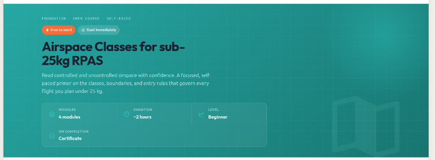
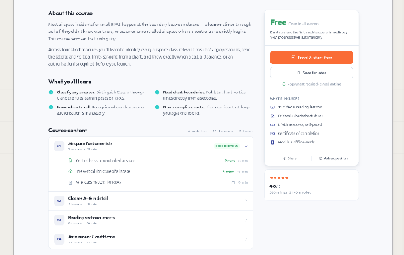

When a student clicks on an unstarted course then we need to display details about the course in a beautiful and mobile-responsivve way

Redirect to a new page, remove the "modal" functionality. Clean up the current implementation. Tidy up all files and remove debt. We wont be going back to the modal approach.

The page we go to should have the following

# Breadcrumbs

- Re-use existing Breadcrumbs functionality
- The first crumb should say "<- all courses"

# hero

- background color should be the same as the course color
- course Icon should be large and semi transparent on bottom right
- Title and brief description
- Basic stats

Here is a design:

Note that the design was made by an external tool that is not aware of our setup. It also aims to adhere to the First Class theme.
Do not invent stats or add placeholder fake text. Only put legitimate information there.

# Main content area

## Left hand main area

Refer to this design: 

- Include a longer course description
- Table of contents. Note that we should re-use existing TOC partials/components. Dont reinvent things here. We have a system

If you want to add new types of information that are not already in the data-model:
- Ask first
- Update the demo content so that we can see it in action
- include sensible defaults or visual adjustments for missing information. Eg if there is no course description, leave it out.

## Right hand panel

Add a surface that allows users to sign up for the course. Include basic info.

# Out of scope

Course content preview

# Important

Code that is no longer needed should be removed.
