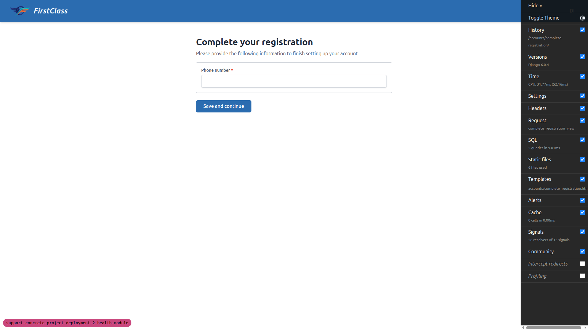
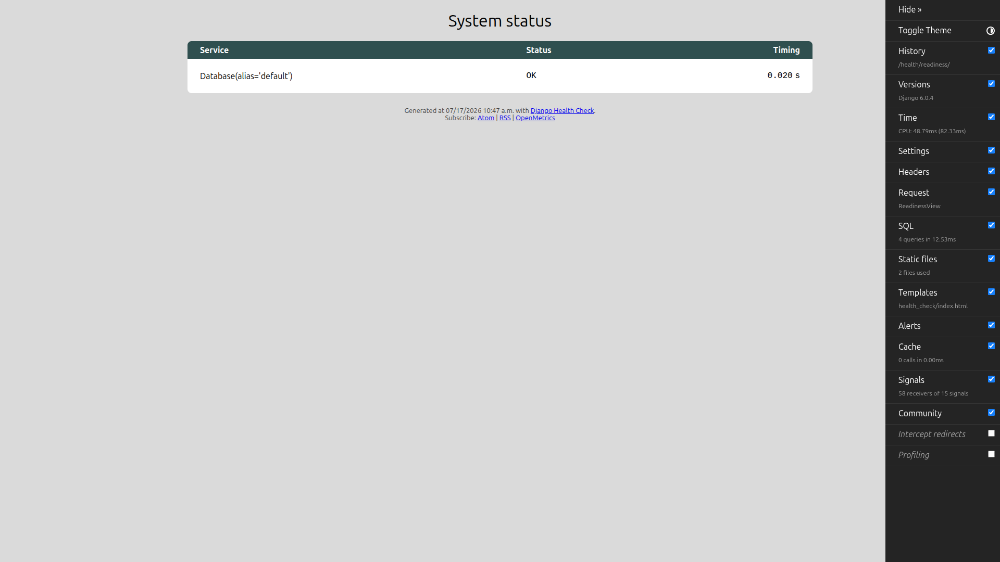

# QA Report: P1 importable health module

**Feature:** `freedom_ls.health` liveness/readiness endpoints + registration-middleware exemption
**Test plan:** `3. frontend_qa.md` (health-module)
**Date:** 2026-07-17
**Branch:** `support-concrete-project-deployment-2-health-module` (branch badge confirmed on the dev server)
**Site:** DemoDev (dev `FORCE_SITE_NAME`)

## Summary

**All 5 tests passed. No bugs found.**

| # | Test | Result |
|---|------|--------|
| 1 | Liveness endpoint (no dependencies) | ✅ PASS |
| 2 | Readiness endpoint (DB check only) | ✅ PASS |
| 3 | Old static `/health/` path is gone (regression) | ✅ PASS |
| 4 | Registration-completion middleware exempts health paths | ✅ PASS |
| 5 | Superuser is unaffected (sanity) | ✅ PASS |

Mobile and tablet passes were intentionally skipped: the feature ships **no custom FLS
frontend UI**. `/health/liveness/` returns raw JSON and `/health/readiness/` renders
`django-health-check`'s built-in third-party status page — neither is FLS-authored markup,
so responsive testing does not apply (per the `do_qa` "only test custom frontend code" rule).

---

## Test 1 — Liveness endpoint (no dependencies) — PASS

Visited `/health/liveness/` while **logged out**.

- HTTP **200**, `Content-Type: application/json`, body `{"status": "alive"}`.
- Django Debug Toolbar reported **`SQL 0 queries`** for the request — confirms liveness touches
  no database (a DB blip must not affect it).

## Test 2 — Readiness endpoint (DB check) — PASS

Visited `/health/readiness/`.

- HTTP **200** (`curl -i` confirmed), `Content-Type: text/html` — the `django-health-check`
  status dashboard.
- Dashboard lists **only** `Database(alias='default')` → **OK**. No cache and no storage
  checks appear, confirming those are opt-in and not registered by default.

## Test 3 — Old static path is gone (regression) — PASS

Visited `/health/` (the old static endpoint path with no sub-path).

- HTTP **404**. The old `{"status":"healthy"}` static view is removed; only `/health/liveness/`
  and `/health/readiness/` resolve now.

## Test 4 — Registration-completion middleware exempts the health paths — PASS

Test data (a DemoDev learner with an **incomplete** registration, gated by an
`additional_registration_forms` entry on DemoDev's `SiteSignupPolicy`) was created via the
`fls:qa-data-helper` agent. Login: `demodev_incomplete_reg@email.com`.

1. Logged in as that learner → immediately redirected to `/accounts/complete-registration/`.
2. Visiting a normal page (`/`) also redirected to `/accounts/complete-registration/` —
   confirming `RegistrationCompletionMiddleware` is actively gating this account.

   

3. `/health/liveness/` → served **200 JSON `{"status": "alive"}`**, **no** redirect to the
   completion form.

   

4. `/health/readiness/` → served the **200 dashboard**, **no** redirect to the completion form.

   

The `EXEMPT_URL_NAMES` entries (`health:liveness` / `health:readiness`) correctly match the
resolved view names — the health paths stay reachable for a gated learner.

## Test 5 — Superuser is unaffected (sanity) — PASS

Logged in as superuser `demodev@email.com`; visited both endpoints.

- `/health/liveness/` → 200 JSON `{"status": "alive"}`.
- `/health/readiness/` → 200 dashboard, no redirect.

---

## Notes / observations

- **Argument mismatch (not a product bug):** the `/do_qa` invocation was passed the
  *home_page* feature's `3. frontend_qa.md` as its test-plan argument. The health-module has
  its **own** `3. frontend_qa.md` in this spec directory, which matches the current worktree,
  so that plan was executed instead. No action needed beyond noting the mangled `@`-reference.
- The `SECURE_REDIRECT_EXEMPT` / SSL-redirect behaviour is a production-settings concern
  (`SECURE_SSL_REDIRECT` is off in dev with `DEBUG=True`) and is covered by a settings unit
  test, per the test plan's own note — not exercised here by design.
- Nothing unrelated to the feature appeared broken during testing.
