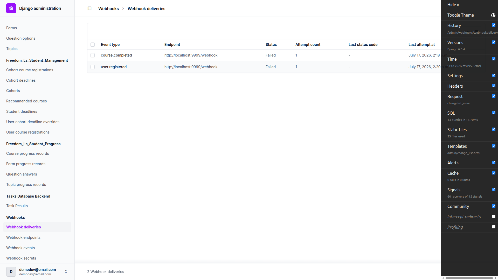
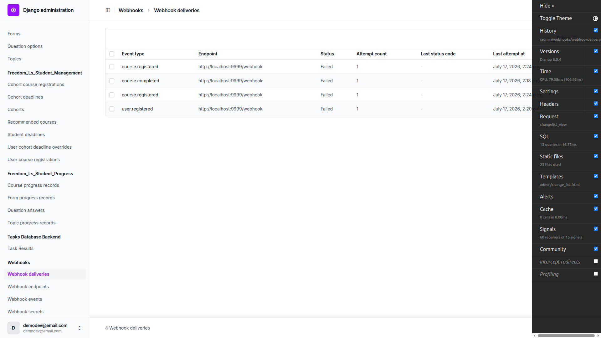
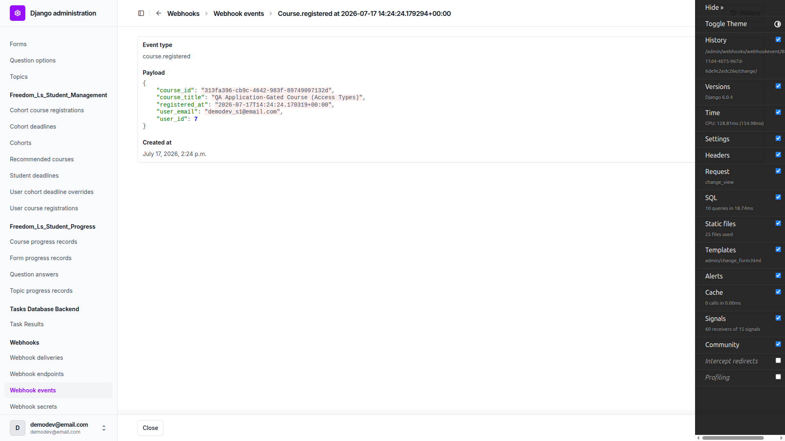
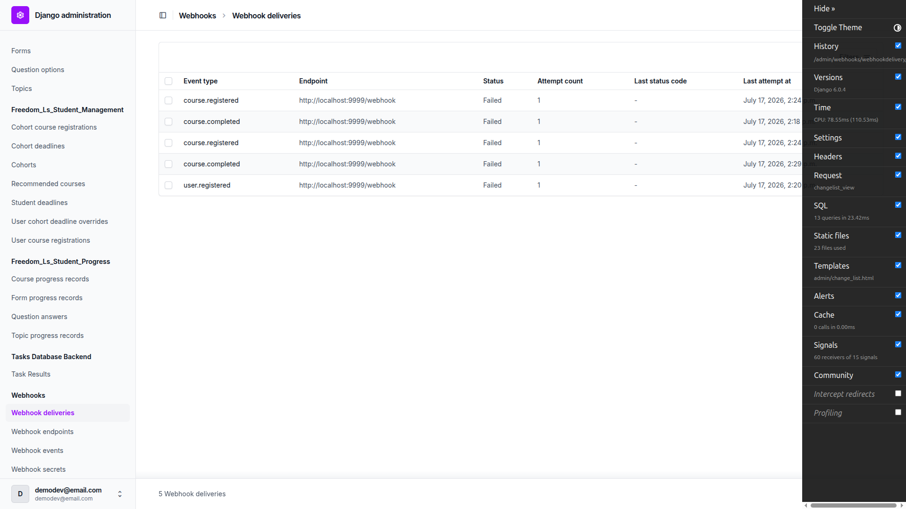
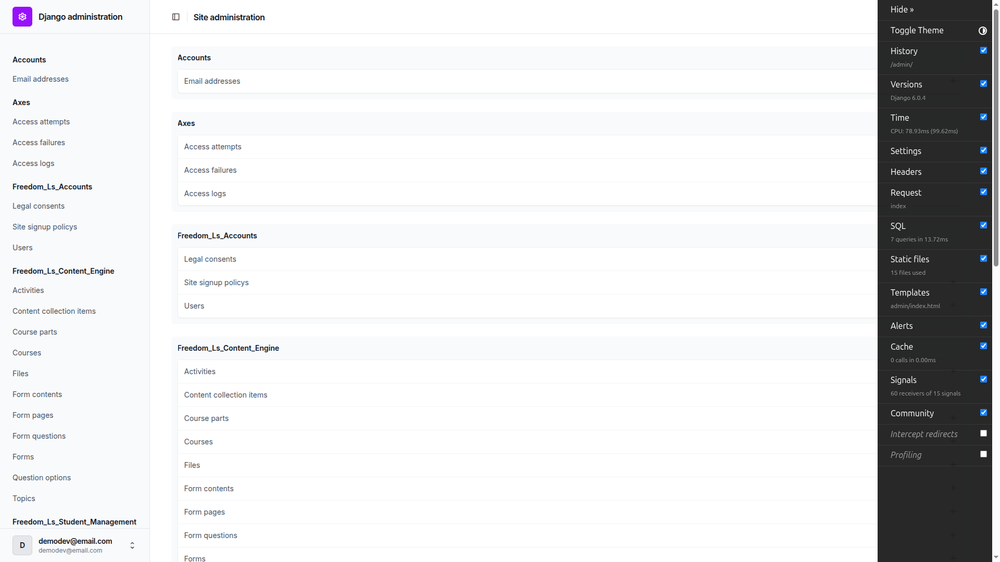
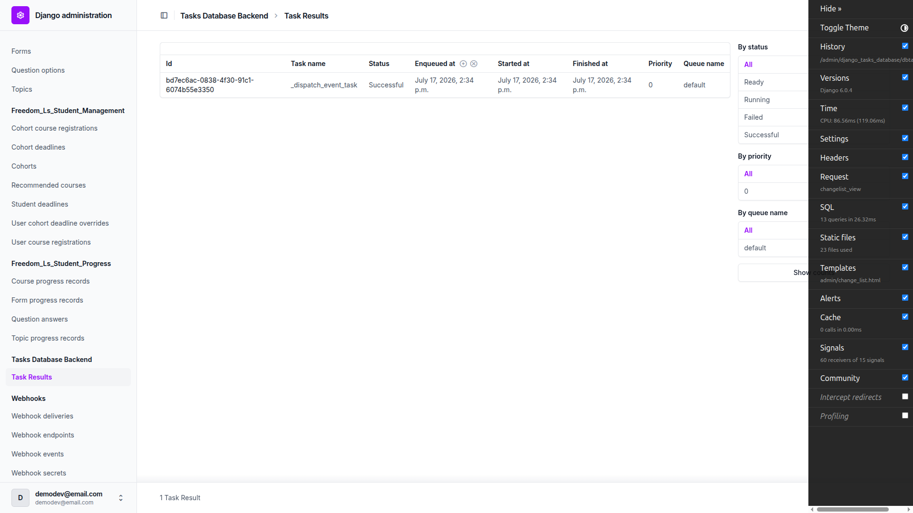
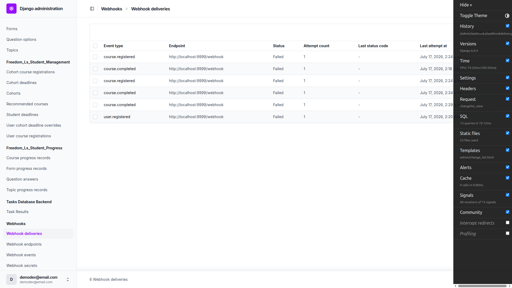
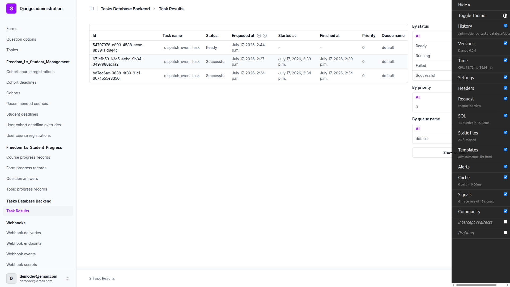
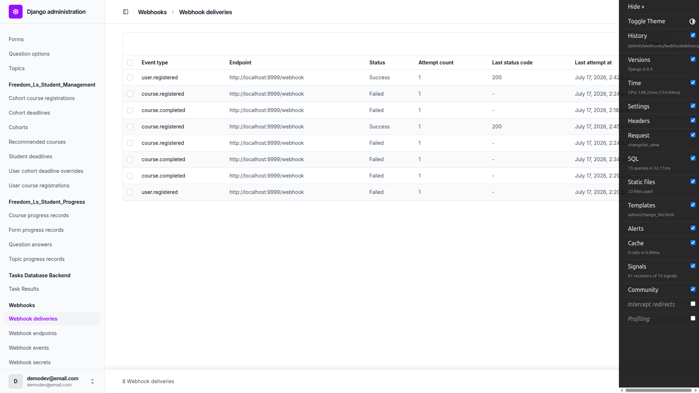

# QA Report — Background Tasks (durable backend) Frontend QA

**Date:** 2026-07-17
**Branch:** `support-concrete-project-deployment-3-background-tasks`
**Site:** DemoDev (dev forced via `FORCE_SITE_NAME`)
**Tooling:** Playwright MCP, desktop 1920×1080. Webhook capture target: dummy `http://localhost:9999/webhook`
(deliveries record as `failed`), plus a temporary local `200`-returning listener for the Part B success-path checks.

## Overall result: ✅ PASS — no defects found in the feature under test

The durable-backend change (production defaults to `django_tasks_db.DatabaseBackend` with an out-of-process
`db_worker`) and the `WebhookDelivery` idempotency guard behave as designed. Every user-facing flow
(signup, course registration, course completion) produces exactly **one event and one delivery**; the admin
surfaces are intact; the durable backend drives delivery out-of-process via a visible task queue and never
drops queued work.

No bugs were found. One adversarial sub-check (A3 application-gated) is **not executable in the dev
environment** for a configuration reason (documented below), and mobile/tablet passes are **not applicable**
because the feature is Django-admin-only. A few plan-vs-implementation wording mismatches and two behavioural
observations are recorded for the plan author — none are product defects.

---

## Results at a glance

| Test | Result | Notes |
|------|--------|-------|
| **A1** Webhook admin surfaces (regression) | ✅ PASS | Checkboxes for event types, no Secret field on Add, Secret read-only after save, Failure count 0; events read-only w/ payload JSON; delivery columns Status + Attempt count; Send-Test + Retry + Enable/Disable all work. Wording notes below. |
| **A2** Signup → `user.registered` | ✅ PASS | 1 event + 1 delivery; re-signup with same email creates no second account and no duplicate event. |
| **A3** Course registration → `course.registered` | ✅ PASS (main + re-enrol) / ⚠️ 1 sub-check not executable | Free enrol → 1 event + 1 delivery; re-enrol → no duplicate. App-gated adversarial **cannot be exercised in dev** (see below). |
| **A4** Course completion → `course.completed` | ✅ PASS | 1 event + 1 delivery; re-finishing an already-complete course is a no-op (no new event). |
| **B1** Tasks admin surface exists | ✅ PASS | `Tasks Database Backend` → `Task Results` present, with By status / priority / queue filters. |
| **B2** Delivery is asynchronous (worker-driven) | ✅ PASS | Completion enqueues `_dispatch_event_task`; worker drains it out-of-process; delivery transitions after the request returns. |
| **B3** Single delivery per (event, endpoint) | ✅ PASS | No duplicate deliveries anywhere across all flows. |
| **B4** Regression under durable backend | ✅ PASS | Send-Test still creates a fresh event+delivery; Retry still updates the existing row; neither trips the unique constraint. |
| **B5** Worker not running → tasks queue, don't drop | ✅ PASS | With worker stopped the dispatch task sits `Ready` and nothing is delivered; starting the worker drains it and the delivery is created + delivered (`Success`, HTTP 200). |
| **Mobile (Step 6) / Tablet (Step 7)** | N/A | Feature is Django-admin-only (no custom webhook/tasks frontend). Per plan guidance, admin surfaces are not responsive-tested. |

---

## Part A — Default dev (`ImmediateBackend`)

### A1 — Admin surfaces (regression) ✅

- **Add endpoint form:** event types render as **checkboxes** (User registered / Course completed /
  Course registered), no free-text, and the **Secret** field is not shown.
  
- **After save:** Secret is populated and **read-only**, Failure count is `0`.
  
- **Events admin:** read-only (title "…to view", no Add button), payload JSON visible.
  
- **Deliveries admin:** columns include **Status** and **Attempt count**; filters for **Status** and **Event type**.
  
- **Send Test:** creates a fresh event + delivery (delivery `failed` — nothing listening on :9999).
  
- **Retry:** updates the existing row in place (Last attempt 2:17→2:18, Next retry set), **no duplicate row**.
  
- **Disable / Enable bulk actions:** toggle `Is active` correctly.
  

**Plan-vs-implementation wording notes (not defects):**
1. "Send test ping … action → Go" — the feature is implemented as an Unfold **detail-page button** ("Send Test",
   `actions_detail`), not a changelist action. It works; the plan's "select the endpoint → action" wording is
   slightly off.
2. The test webhook is sent as a **real event type with a `"_test": true` flag** in the payload, not as a
   literal `webhook.test` event type as the plan wording implies.
3. **Endpoint filter:** `WebhookDeliveryAdmin.list_filter` is `["status", "endpoint", "event__event_type"]`, so
   an endpoint filter **is** configured, but Django suppresses a related-field filter when only one related
   object exists (`has_output()` needs >1 choice), so "By endpoint" does not render with a single endpoint. This
   is standard Django behaviour, not a bug.
4. **Retry attempt count:** on retry the row's `last_attempt_at` and `next_retry_at` advance (row updated in
   place, no duplicate), but `attempt_count` stayed at `1` rather than incrementing. This satisfies the plan's
   stated criteria (row updates, no duplicate) — noted only as an observation.

### A2 — Signup → `user.registered` ✅

Signed up `qa_signup_a2@email.com`, confirmed via Mailpit (verification is mandatory).

Exactly one `user.registered` event and exactly one delivery were created.

**Adversarial (re-signup same email):** allauth returned the same "verify your email" page (account-enumeration
prevention), created **no second account** (still a single `QASignup` user) and **no duplicate**
`user.registered` event.

### A3 — Course registration → `course.registered` ✅ (main + re-enrol); ⚠️ app-gated sub-check not executable

- Free/self-serve course (`qa-free-course-access-types`) shows an "Enrol for free" CTA → `/access/`; enrolling
  routes into the course player and fires exactly one `course.registered` event + one delivery.
  
  
- **Re-enrol** on the same course created **no** second `course.registered` (registration is `get_or_create`;
  the event fires only on create).
  

**⚠️ App-gated adversarial not executable in dev.** The plan expects enrolling in an application-gated course to
redirect to an apply page and fire **no** `course.registered`. In dev, `config/settings_dev.py` sets
`OVERRIDE_COURSE_ACCESS_TO_FREE = True`, which makes `VisibilityEnforcingBackend` bypass all per-course gating
and treat **every** course as free/self-register. As a result the student was taken straight into the app-gated
course and a `course.registered` event fired. Investigation (code read) confirmed the gating code
(`ApplicationCourseAccessBackend`) and the QA fixture (`qa_create_course_access_types`) are both correct — the
scenario simply cannot be exercised while the dev override is on. The **webhook layer behaved correctly**: it
fired `course.registered` because a genuine `UserCourseRegistration` was created.

### A4 — Course completion → `course.completed` ✅

Completed `qa-free-course-access-types` via "Finish Course" → landed on `/finish/`; exactly one
`course.completed` event + one delivery.

**Adversarial (re-finish already-complete course):** the completed course no longer offers a "Finish Course"
button, and a direct re-POST of `mark_complete` was a no-op — **no** new `course.completed` event. All events
have exactly one delivery each.

---

## Part B — Durable `DatabaseBackend` + `db_worker`

Temporarily enabled by appending `TASKS = fls_defaults.DATABASE_TASKS` to `config/settings_dev.py`, migrating,
restarting the server, and running `manage.py db_worker` in a second shell. **The override was reverted after
testing** (dev is back on `ImmediateBackend`).

### B1 — Tasks admin surface exists ✅

`Tasks Database Backend` → `Task Results` is present with By status / By priority / By queue name filters.

**Note:** this admin section is registered under **both** backends (the `django_tasks_db` app is always in
`INSTALLED_APPS` from base), so the plan's phrasing that it "did not exist under `ImmediateBackend`" is not
strictly accurate — the section is visible under `ImmediateBackend` too, it just never has task rows because
`ImmediateBackend` does not enqueue to the DB.

### B2 — Delivery is asynchronous (worker-driven) ✅

Drove a fresh course completion. The request returned immediately to `/finish/`; a `_dispatch_event_task` row
appeared in the Tasks admin and was drained out-of-process by the worker (`Successful`), and the delivery
transitioned (to `failed` against the dead :9999 target — the expected outcome for an unreachable target).
This never happened in Part A, where `ImmediateBackend` produced no task rows.

### B3 — Single delivery per (event, endpoint) ✅

Across every flow, each event has exactly one delivery — no duplicates. (Consistent with the automated
`test_dispatch_event_is_idempotent`.)

### B4 — Regression under the durable backend ✅

With the worker running, **Send Test** still creates a fresh event + delivery (delivered inline), and **Retry**
still updates the existing row in place — neither trips the unique constraint.

### B5 — Worker not running → tasks queue, don't drop ✅

- Worker **stopped**, drove a `course.registered` flow: the dispatch task sits **`Ready`** (unprocessed) in the
  Tasks admin and nothing is delivered.
  
  
- Worker **started**: the queued task drains (`RUNNING`→`SUCCESSFUL`), the delivery is created and delivered
  **`Success` (HTTP 200)** (verified against a temporary local listener).
  

This demonstrates the hard operational dependency the change introduces: with the durable backend the worker
**must** run or user-triggered webhooks stay queued (never dropped).

---

## Observations (not defects)

1. **Delivery-row creation timing under the durable backend.** The `WebhookDelivery` row is created by the
   dispatch **task** (when the worker runs), not synchronously at event time. So with the worker stopped, the
   delivery row does not yet exist — only the event and the queued task do. The plan's B5 wording ("the
   `WebhookDelivery` stays pending") describes it as an already-existing pending row; in practice the row
   appears only once the worker processes the task. Behaviourally equivalent (nothing is delivered, nothing is
   dropped) — flagged only so the plan text matches reality.

2. **Circuit breaker works (positive finding).** Because QA used a permanently-dead target (:9999), after 7
   consecutive failed deliveries the endpoint's circuit breaker tripped (`disabled_at` set, `failure_count` 7),
   and subsequent events produced **no** deliveries until a later successful delivery cleared it
   (`failure_count`→0, `disabled_at`→cleared). This is correct, documented behaviour ("Circuit breaker state:
   set when failure threshold is reached, cleared on successful delivery") — worth noting because it can
   surprise a QA run that uses an unreachable target for many deliveries in a row.

## Not tested / limitations

- **A3 application-gated adversarial** — not executable in dev due to `OVERRIDE_COURSE_ACCESS_TO_FREE = True`
  (see A3). Not a data gap (the fixture exists and is correct), so this was not routed to `fls:qa-data-helper`.
  To exercise it, the dev override would need to be temporarily disabled — a possible note for the plan author.
- **Mobile (Step 6) & Tablet (Step 7)** — not applicable; the feature is entirely Django admin (Unfold), which
  per the plan guidance is not responsive-tested. The frontend flows used to *trigger* webhooks (signup,
  enrol, finish) are pre-existing and unchanged by this feature.
