# QA Report — Background Tasks (durable backend) Frontend QA

**Date:** 2026-07-17
**Branch:** `support-concrete-project-deployment-3-background-tasks`
**Site:** DemoDev (dev forced via `FORCE_SITE_NAME`)
**Test plan:** `3. frontend_qa.md`
**Tooling:** Playwright MCP (desktop 1920×1080), read-only `manage.py shell` for ground-truth counts, `fls:qa-data-helper` for test data, `fls:sdd-worker` for one root-cause investigation.

## Result

**No defects were found in the change under test** (production default → durable `django-tasks-db` `DatabaseBackend` + `db_worker`, plus the `WebhookDelivery` idempotency guard).

- Every user flow (signup, course registration, course completion) produces **exactly one** `WebhookEvent` and **exactly one** `WebhookDelivery` per `(event, endpoint)`; repeated/idempotent actions create **no duplicates**.
- The durable backend's async path works: the request returns immediately, the task is durably queued, and the `db_worker` performs the delivery **out-of-process**. A queued task survives worker downtime and drains on restart.
- The webhooks Django admin (endpoints / events / deliveries / send-test / retry / enable-disable) is intact under both `ImmediateBackend` (default dev) and the durable `DatabaseBackend`; the new unique constraint does not block send-test (fresh event) or retry (reuses the row).

A handful of **deviations from the plan's wording** were observed. **None is a defect in this branch** — they are pre-existing behaviours, a dev-only preview override, expected protective behaviour, or loose wording in the plan. They are documented below so the plan can be tightened.

Mobile (Step 6) and tablet (Step 7) testing was **not applicable**: the feature's entire UI surface is the Django admin (Unfold), and the plan directs skipping mobile/tablet for admin interfaces. The signup / course-detail / course-player pages used here are only flow *triggers* (pre-existing, unrelated frontend), not part of this change.

---

## Part A — default dev (`ImmediateBackend`): regression + synchronous flows

### Test A1 — Webhook admin surfaces (regression) — PASS (2 wording notes)

- **Add-endpoint form:** event types render as **checkboxes** (User/Course registered, Course completed), the **Secret** field is **not** shown, Failure count 0. 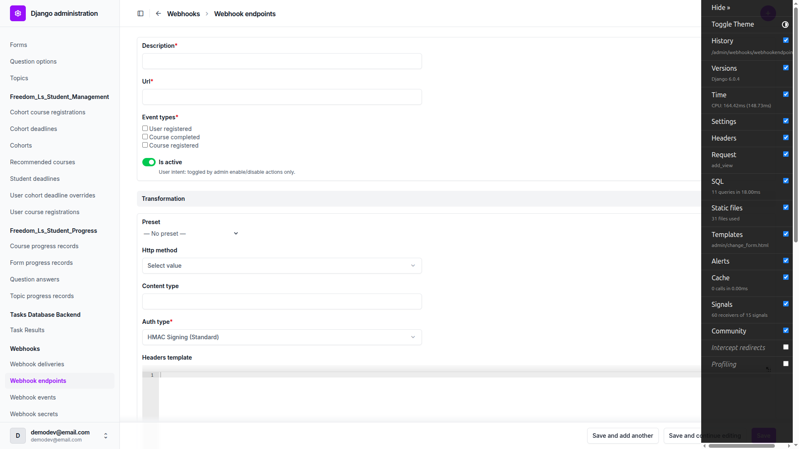
- **Saved endpoint:** Secret is populated and **read-only** (static text, not an input), Failure count 0, all three event types checked. 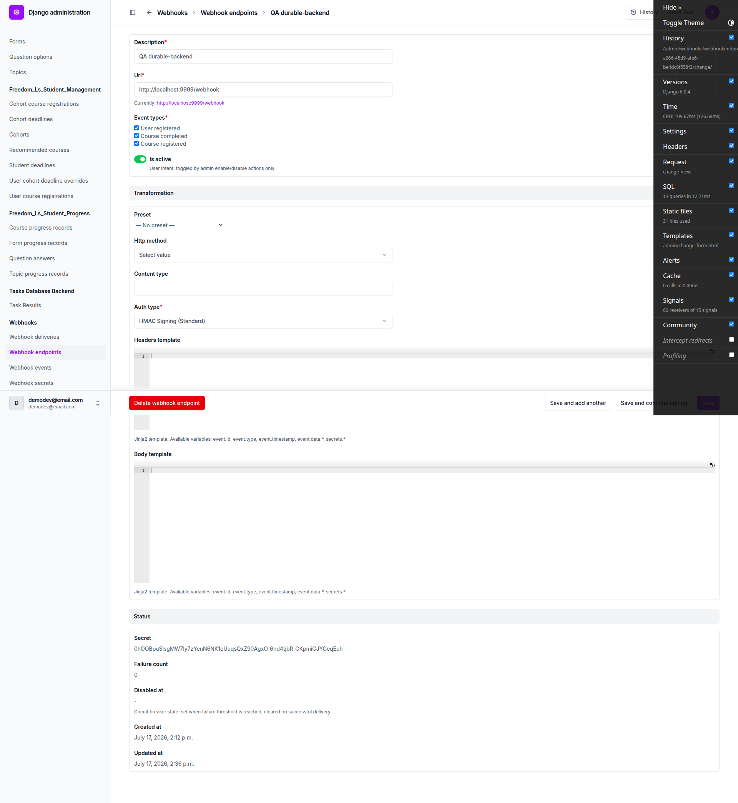
- **Events changelist:** read-only ("Select webhook event **to view**", no Add button), payload JSON visible on the detail. 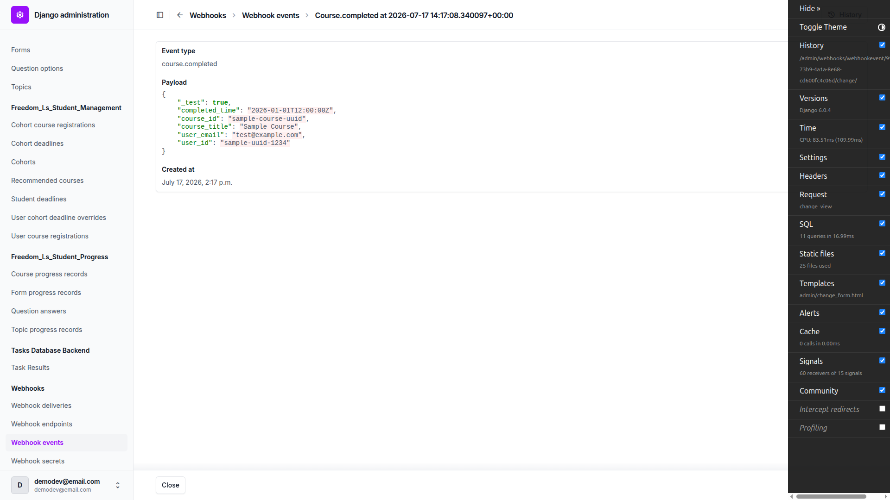
- **Deliveries changelist:** columns include **Status** and **Attempt count** (plus Last status code, Last attempt at). 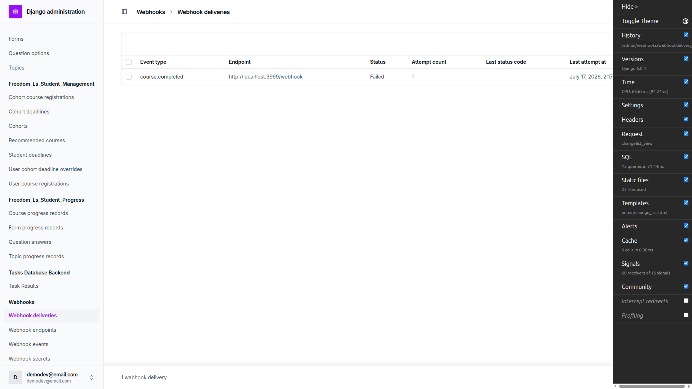
- **Send test:** creates a fresh event + a delivery; delivery `failed` because nothing listens on the dummy `http://localhost:9999/webhook` (`Connection refused`). 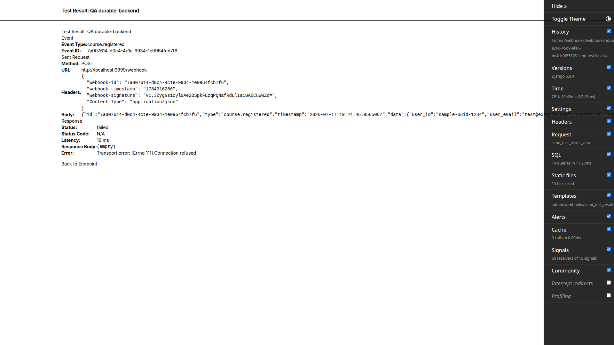
- **Retry:** updates the **existing** delivery row (last-attempt time advanced) with **no duplicate row** and no unique-constraint error. 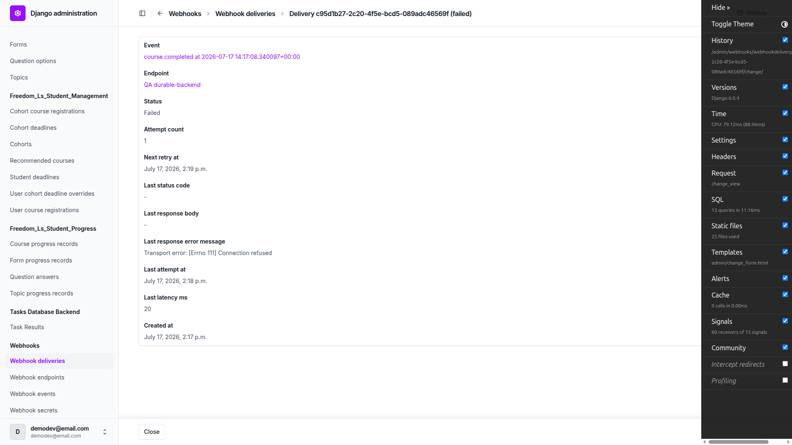
- **Disable / Enable bulk actions:** toggle `Is active` False→True correctly. 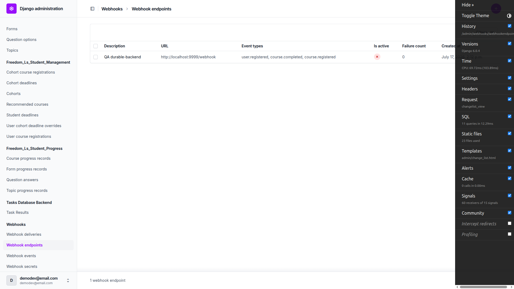

**Wording note A1-i (not a defect):** the plan describes "Send test ping" as a changelist bulk action selected with "Go". In the implementation it is an Unfold **detail-page action** (`actions_detail`, `freedom_ls/webhooks/admin.py:73,126`) — a **"Send Test"** button on the endpoint's change page. Functionality is present and correct; only the described UI path differs.

**Wording note A1-ii (not a defect):** the plan expects a literal `webhook.test` event. Send-Test actually creates an event of the **selected** real type (e.g. `course.registered`) with `"_test": true` in the payload — not a distinct `webhook.test` type. This is the current, consistent behaviour.

### Test A2 — Signup → `user.registered` — PASS

- Signed up `webhook_signup_qa@example.com` via `/accounts/signup/`, confirmed via the Mailpit link. 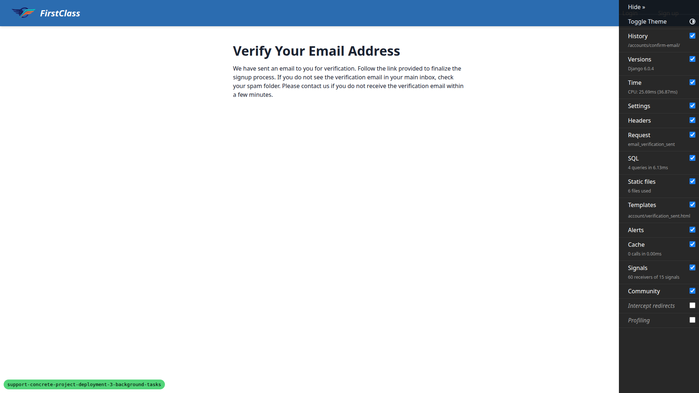 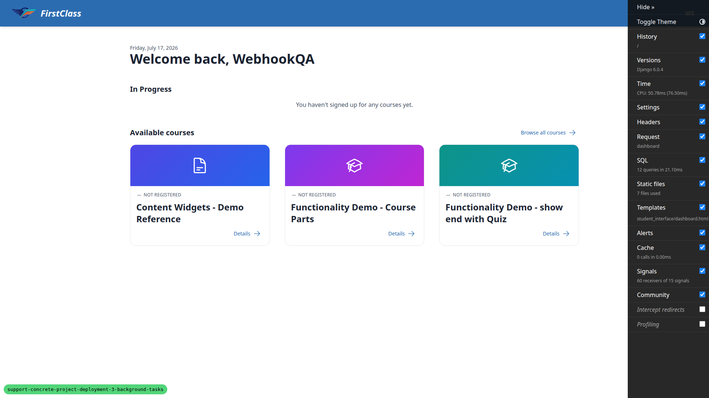
- Exactly **one** `user.registered` event fired (at email-confirmation, 19:30:48) and exactly **one** delivery against the endpoint.
- **Adversarial (re-signup, same email):** allauth's email-enumeration protection returned the identical "verify your email" page and sent an **"Account already exists"** email (confirmed in Mailpit) — **no** second account, **no** duplicate `user.registered`. 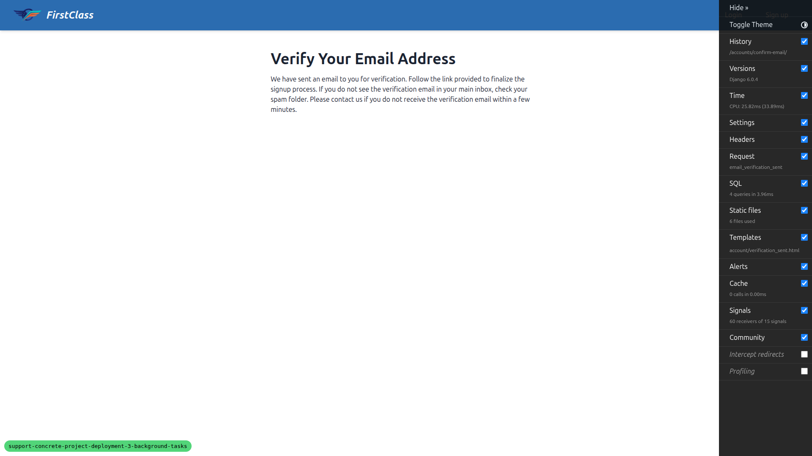

### Test A3 — Course registration → `course.registered` — PASS (see app-gated note)

- As a fresh, unregistered student, the **free** course detail page shows "Enrol for free" → `/courses/<slug>/access/`. 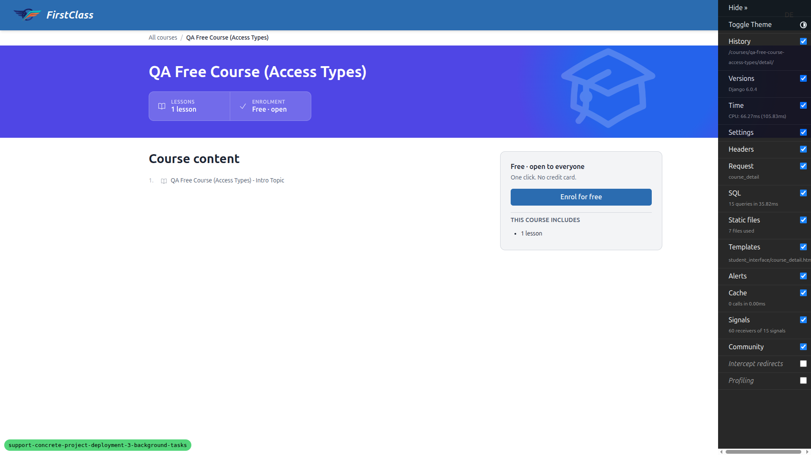 Enrolling routed into the player and fired exactly **one** `course.registered` + one delivery. 
- **Adversarial (re-enrol same course):** hitting `/access/` again just re-opened the player — registration is `get_or_create`, so **no** second `course.registered`.
- **Adversarial (application-gated course):** see **Finding 2** — in default dev this cannot be exercised because of an intentional dev override. It was **re-run with the override disabled** and **passed** (Part B section): the app-gated course shows **"Apply now"**, `/access/` **redirects to the apply page**, and **no** `course.registered` fires.

### Test A4 — Course completion → `course.completed` — PASS

- As the student, advanced to the final topic and clicked **"Finish Course"**, landing on `/courses/<slug>/finish/`. 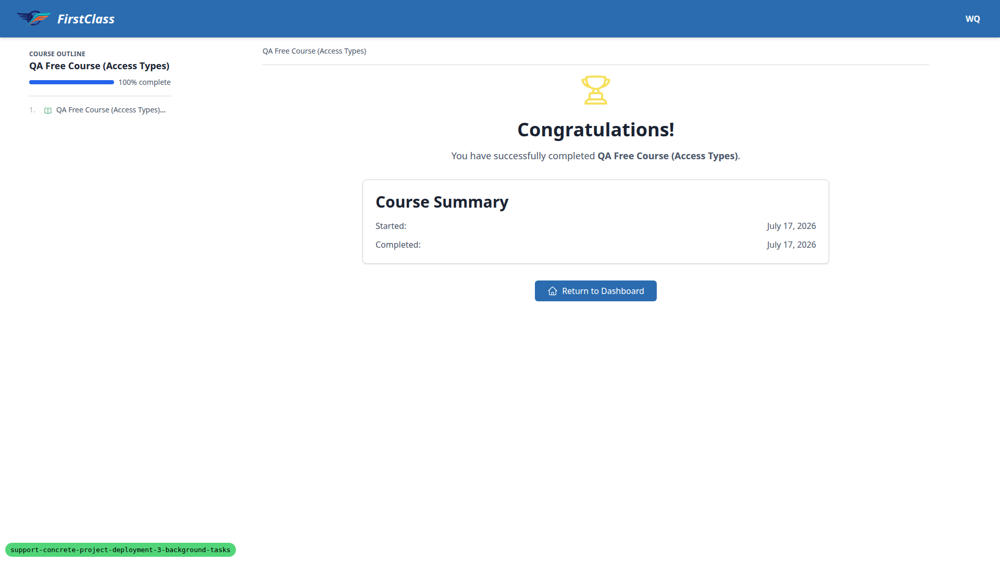 Exactly **one** `course.completed` + one delivery.
- **Adversarial (re-finish already-complete course):** the player no longer shows a "Finish Course" button, and a direct re-POST of `mark_complete` was a no-op — **no** new `course.completed` event.

**Ground truth (read-only query) for A2–A4** — one event and one delivery each, no duplicates:

| Flow | Event | Deliveries |
|---|---|---|
| `user.registered` (webhook_signup_qa) | 1 | 1 (failed — 9999 dead) |
| `course.registered` (free course) | 1 | 1 (failed) |
| `course.completed` (free course) | 1 | 1 (failed) |

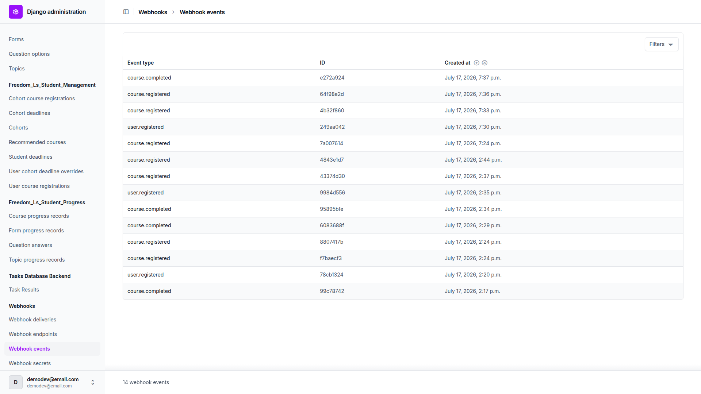 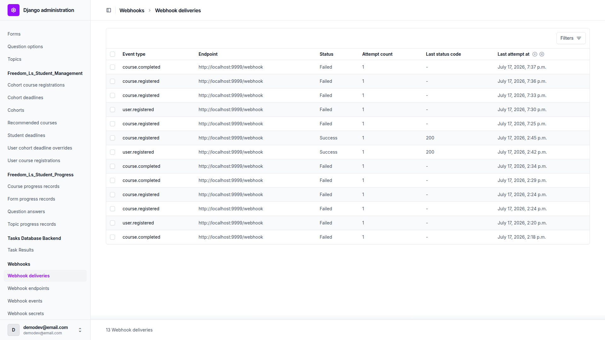

All deliveries are `failed` only because the QA target `http://localhost:9999/webhook` has no listener (as the plan intends); the point verified here is that exactly one row is created and transitions.

---

## Part B — durable `DatabaseBackend` + `db_worker` (the change under test)

Enabled by temporarily appending `TASKS = fls_defaults.DATABASE_TASKS` to `config/settings_dev.py`, `migrate` (no new migrations — tables already present), restart, and a second-shell `python manage.py db_worker`. **Reverted afterwards** (`git diff config/settings_dev.py` is now empty).

### Test B1 — Tasks admin surface — PASS (1 note)

The **Task Results** admin (`/admin/django_tasks_database/dbtaskresult/`) lists `_dispatch_event_task` rows with state (Ready / Successful / …) and enqueued/started/finished timestamps. 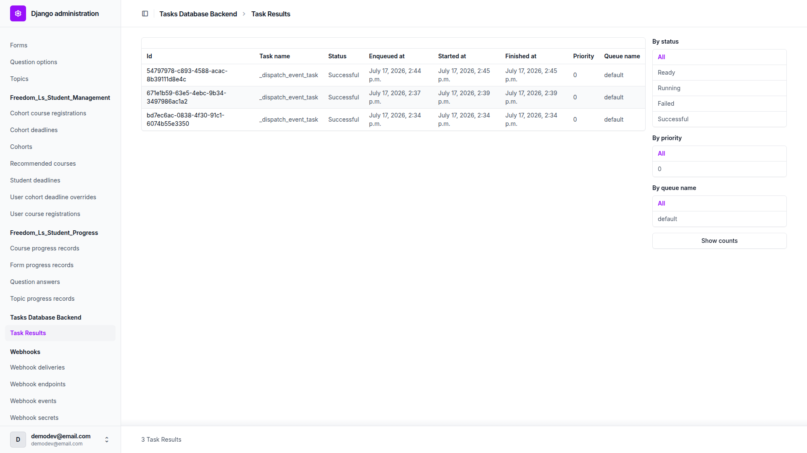

**Note B1-i (not a defect):** the plan says this admin "did not exist under `ImmediateBackend`". In fact the admin surface is present whenever `django_tasks_db` is installed — and it **is** in `INSTALLED_APPS` in base settings, so it shows under `ImmediateBackend` too. What the durable backend actually adds is **real task rows** being created and executed (under `ImmediateBackend` the task runs inline and no queue row persists).

### Test B2 — Delivery is asynchronous (worker-driven) — PASS

- With the worker running, driving enrolment enqueued a task that the worker drained **automatically, out-of-process** (`_dispatch_event_task` enqueued 19:46:21 → finished **Successful** 19:46:22).
- Driving course completion **while the worker was stopped** created the event and returned the page **before any delivery ran**; the delivery was performed only when the worker later processed the task (request 19:50:10 → delivery created & attempted 19:52:13 on worker start). 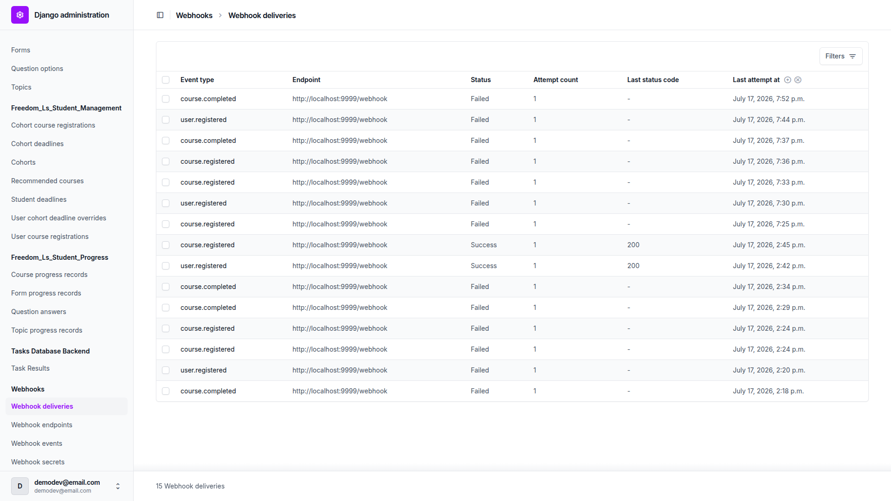

**Note B2-i / B5-i (architecture, not a defect):** the `WebhookDelivery(status="pending")` row is created **inside** the task body (`dispatch_event`, `freedom_ls/webhooks/events.py:56,78`), which runs in the worker. So under the durable backend, while the worker is down there is a **queued task but no delivery row yet** — the delivery row appears (briefly `pending`, then transitions) only when the worker runs the task. The plan's phrasing ("the `WebhookDelivery` stays `pending`" while the task is queued) reads as if the delivery row pre-exists; it does not. The guarantee the plan cares about — *request returns immediately, nothing is delivered until the worker runs, the task is not lost* — holds.

### Test B3 — Single delivery per `(event, endpoint)` — PASS

Every processed event produced exactly **one** `WebhookDelivery` for the `(event, endpoint)` pair (verified by query and by the delivery-list row count increasing by exactly one per drained task). No duplicates. (The at-least-once/redelivery dedup path is additionally covered by the automated `test_dispatch_event_is_idempotent`.)

### Test B4 — Regression under the durable backend — PASS

Repeated the send-test and retry admin actions with the durable backend + worker running:
- **Send Test** created a fresh event + delivery (synchronous preview), status `failed` (9999 dead). 
- **Retry** updated the existing delivery row (last-attempt advanced) with **no duplicate row** (row count 14 → 14) and no unique-constraint error.

### Test B5 — Worker not running → tasks queue, don't drop — PASS

- With the worker **stopped**, driving a flow left the task **Ready** (queued, unprocessed) in the Tasks admin and delivered nothing. 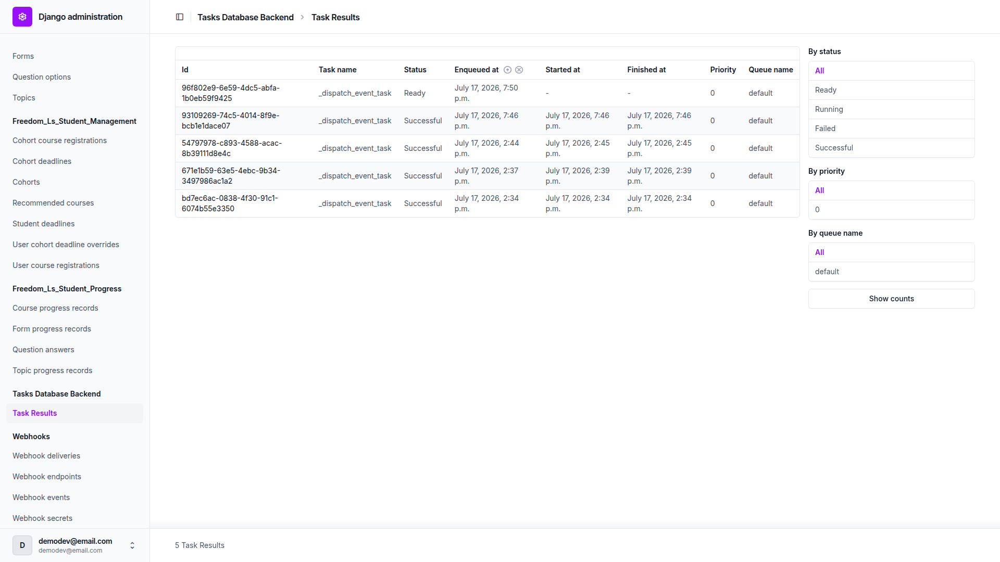
- **Starting** the worker drained the queued task (→ **Successful**) and produced the delivery (→ `failed`, 9999 dead). 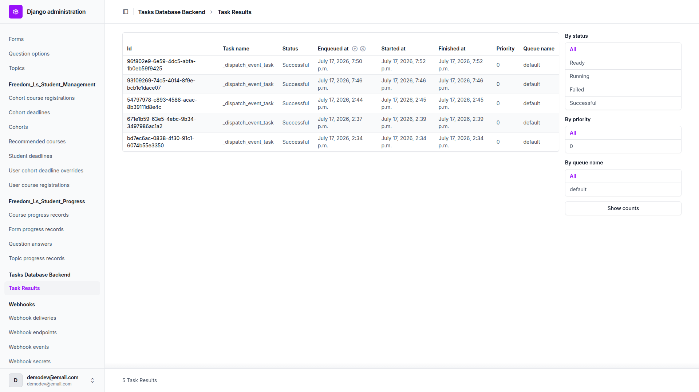

This demonstrates the hard operational dependency the change introduces: with the durable backend the worker **must** run or user-triggered webhooks stay queued (they are not lost, and nothing is delivered until the worker runs).

---

## Findings / observations (all tangential — none is a defect in this branch)

### Finding 1 — Delivery changelist is missing the "By endpoint" filter (pre-existing, minor)

Test A1.3 expects filters for "Status / Endpoint / Event type". The rendered sidebar has **By status** and **By event type** only — **no "By endpoint"** — even though `WebhookDeliveryAdmin.list_filter = ["status", "endpoint", "event__event_type"]` includes `endpoint` (`freedom_ls/webhooks/admin.py:206`). The `endpoint` `RelatedFieldListFilter` does not render (confirmed absent from the DOM, not just visually hidden). **This branch does not touch `freedom_ls/webhooks/admin.py`** (`git log main..HEAD` on that file is empty), so it is **pre-existing and unrelated** to the durable-backend change. Flagged for awareness; out of scope for this spec.

### Finding 2 — App-gated adversarial can't run in default dev (intentional dev override, not a bug)

In default dev the application-gated course showed **"Enrol for free"** and `/access/` self-enrolled the learner (firing a `course.registered`) instead of redirecting to the apply page. Root cause (investigated by a subagent, and independently confirmed): `config/settings_dev.py:118-119` sets `OVERRIDE_COURSE_ACCESS_TO_FREE = True`, an intentional **dev/staging preview override** (from the already-shipped spec `spec_dd/3. done/2026-07-11_16:24_override_course_access_and_details_page/`) that makes `VisibilityEnforcingBackend` replace every course's decision with the free decision. Both web chokepoints (`course_detail` and `initiate_course_access` in `freedom_ls/student_interface/views.py`) correctly consult `get_course_access_backend().get_access(...)`; the earlier `shell` repro showed "Apply now" only because it bypassed the wrapper. Production is unaffected (base/prod default the override to `False`, guarded by system check `W001`). **`git log main..HEAD` confirms this branch touches none of `config/settings_dev.py`, `freedom_ls/course_access`, or `student_interface/views.py`.**

Because the webhook itself fires correctly on a real registration, this override made a `course.registered` fire for the gated course — expected *given the override*, not a webhooks fault. To close the plan's check, the adversarial was **re-run with `OVERRIDE_COURSE_ACCESS_TO_FREE = False`** and **passed**: the gated course showed **"Apply now"** → `/applications/apply/...`, and `/access/` **redirected to the apply page with no registration and no `course.registered` event**. 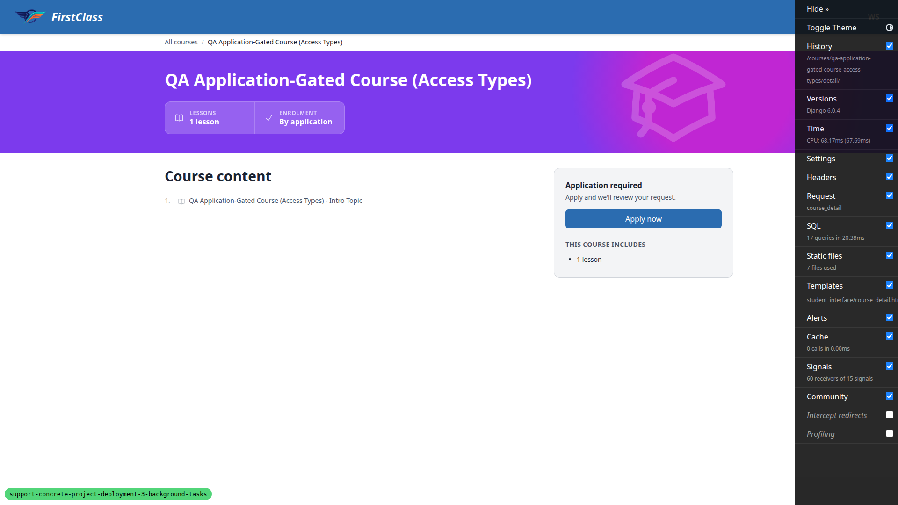 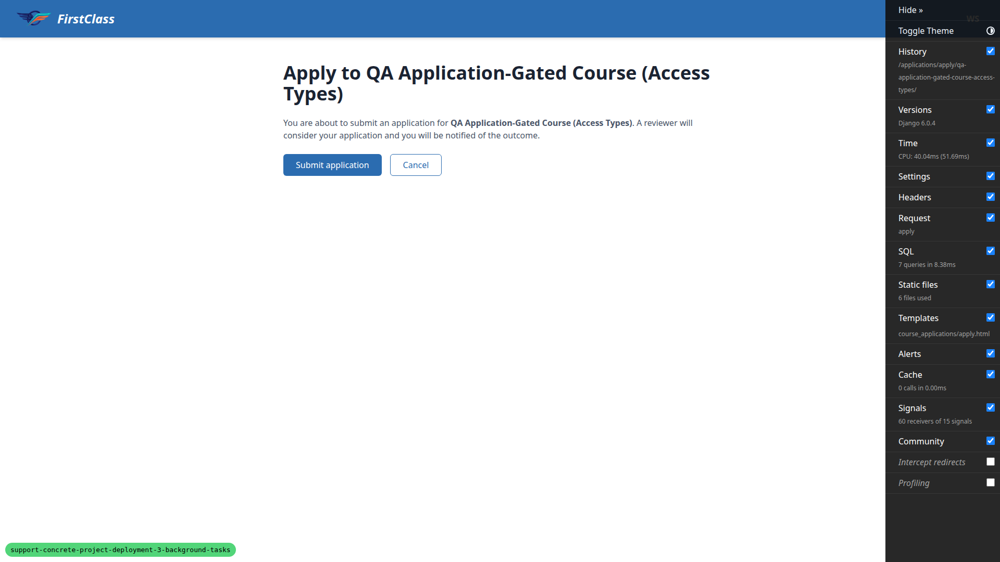 (Default-dev bypass, for the record: 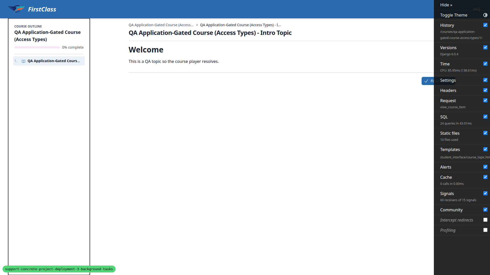)

**Suggestion for the plan:** note that Test A3's application-gated adversarial requires `OVERRIDE_COURSE_ACCESS_TO_FREE = False` in dev, or it silently self-enrols.

### Finding 3 — Circuit breaker trips with the dead 9999 target (expected protective behaviour)

Using the dummy dead target, deliveries always fail; after the failure threshold (~5–6) the endpoint's circuit breaker set `disabled_at` and **subsequent events produced no deliveries at all** (the tripped endpoint is skipped — the dispatch task completes "successfully" with nothing to deliver). This is correct protective behaviour, but it means QA with a permanently-dead target only yields a handful of deliveries before the breaker trips; re-enabling the endpoint (the Enable bulk action) clears it. Worth calling out in the plan so a mid-run "no new deliveries" is not mistaken for a bug. (Detailed root-cause notes were captured during the run and are folded into this report.)

---

## Test data & environment

- Test data created via the **`fls:qa-data-helper`** agent: fresh pre-verified student `webhook_qa_student@email.com`, reused `qa-free-course-access-types` (1-topic free course) and `qa-application-gated-course-access-types` (application-gated). The `webhook_signup_qa@example.com` account created by Test A2's real signup was reused (registered for nothing) for the Part B / app-gated flows.
- No tests were skipped for missing data.
- Temporary `config/settings_dev.py` edits (durable `TASKS`, and `OVERRIDE_COURSE_ACCESS_TO_FREE = False` for the app-gated re-check) were **reverted** — working tree clean for that file. Dev server and `db_worker` were stopped.
