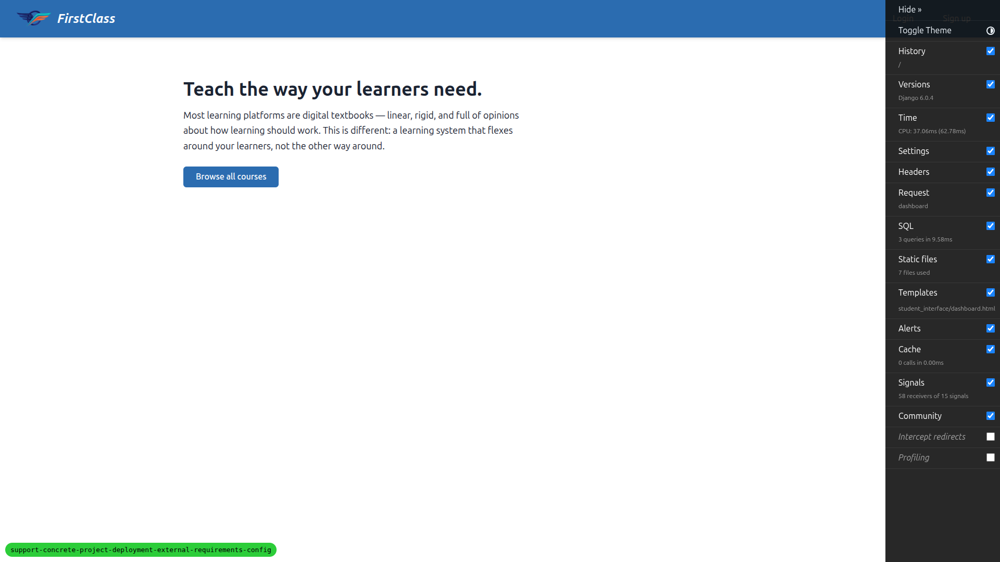
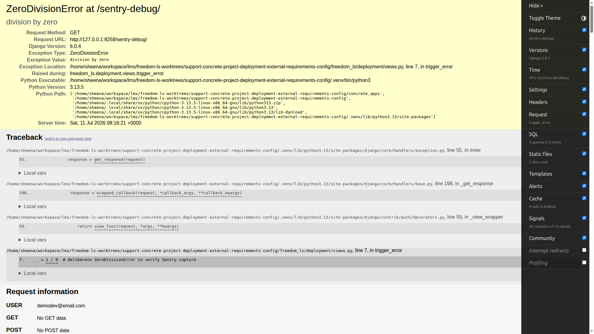
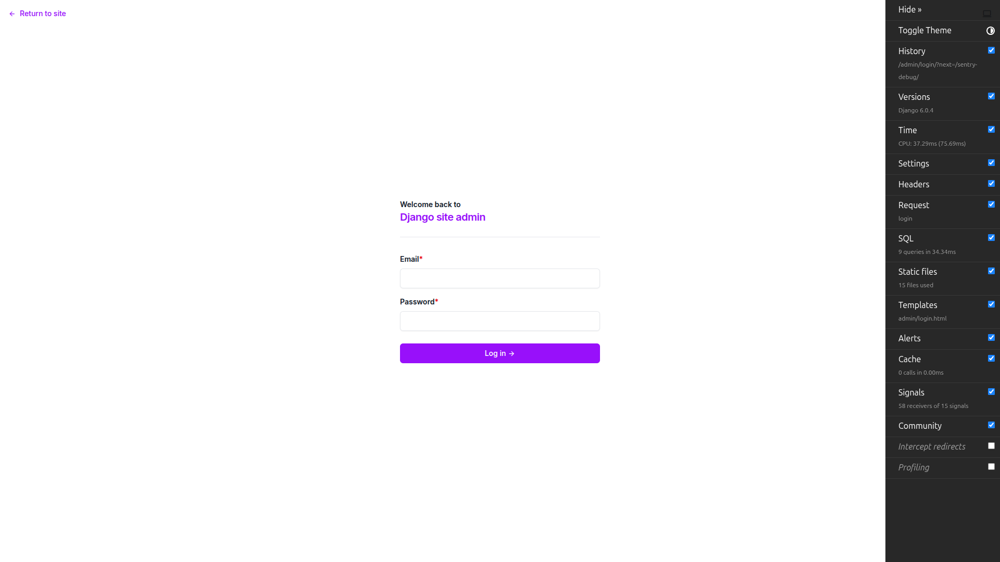

# QA Report: External requirements config (PostHog snippet + `sentry-debug/`)

**Date:** 2026-07-11
**Branch:** `support-concrete-project-deployment-external-requirements-config`
**Test plan:** `3. frontend_qa.md`
**Tool:** Playwright MCP (desktop 1920×1080)

## Summary

**All 5 tests passed. No bugs found.**

| Test | Description | Result |
|------|-------------|--------|
| 1 | PostHog snippet renders with the configured host (key set) | ✅ PASS |
| 2 | PostHog snippet absent when the key is unset | ✅ PASS |
| 3 | `/sentry-debug/` fires a 500 for a staff user | ✅ PASS |
| 4 | `/sentry-debug/` denied for anonymous users | ✅ PASS |
| 5 | `/sentry-debug/` denied for a logged-in non-staff user | ✅ PASS |

---

## Test 1 — PostHog snippet renders with the configured host (key set)

**Config A** (`POSTHOG_API_KEY=phc_qa_test_key`, `POSTHOG_API_HOST=https://us.i.posthog.com`).

- **US host:** The `<head>` of `/` contains the `posthog.init(...)` block with the exact configured
  values, and no EU host anywhere:
  ```js
  posthog.init('phc_qa_test_key', {
      api_host: 'https://us.i.posthog.com',
      defaults: '2025-11-30'
  })
  ```
  Key matches `POSTHOG_API_KEY`; `api_host` matches `POSTHOG_API_HOST`. The old hardcoded
  `https://eu.i.posthog.com` was **not** present.

  

- **EU host (config-driven proof):** After restarting Config A with
  `POSTHOG_API_HOST=https://eu.i.posthog.com` and reloading, the snippet showed
  `api_host: 'https://eu.i.posthog.com'` and the US host was gone — confirming the host is driven by
  config, not hardcoded.

  

- **Network beacon (optional):** With the US config, the browser fired requests to the configured
  region — `https://us-assets.i.posthog.com/static/array.js` (200) and
  `POST https://us.i.posthog.com/e/` — confirming the client wiring targets the configured host.
  (The `401`/`404` responses are expected with a fake key; no real project receives data.)

**Result:** PASS.

---

## Test 2 — PostHog snippet absent when the key is unset

**Config B** (no `POSTHOG_API_KEY`).

The page source for `/` contained **no** `posthog.init(...)` block — in fact no reference to
`posthog` at all — confirming the `` guard renders nothing when unconfigured.
This is the dev/unconfigured default.


**Result:** PASS.

---

## Test 3 — `/sentry-debug/` fires for a staff user

Logged in as `demodev@email.com` (superuser ⇒ passes the staff gate) and visited `/sentry-debug/`.

The request returned **HTTP 500** with Django's yellow debug traceback page titled
`ZeroDivisionError at /sentry-debug/`. The page text confirmed `division by zero`, raised at
`trigger_error` in `freedom_ls/deployment/views.py` — exactly the intended behaviour that Sentry
would capture in a real deployment.



**Result:** PASS.

---

## Test 4 — `/sentry-debug/` is denied for anonymous users

While logged out, visiting `/sentry-debug/` produced **no** 500. Instead the request was redirected
to `/admin/login/?next=/sentry-debug/` (`staff_member_required` behaviour) — landing on the admin
login form, not the error traceback.


**Result:** PASS.

---

## Test 5 — `/sentry-debug/` is denied for a logged-in non-staff user

A plain non-staff, non-superuser user (`qa_login@email.com`, `is_staff=False`,
`is_superuser=False`, DemoDev site) was created via the `fls:qa-data-helper` agent. After logging in
as that user (avatar initials "QL", distinct from staff "DE") and visiting `/sentry-debug/`, the
request returned **no** 500 and was redirected to `/admin/login/?next=/sentry-debug/` — confirming the
endpoint stays gated for authenticated-but-non-staff users and is never an unauthenticated/non-staff
guaranteed-500.



**Result:** PASS.

---

## Notes / scope

- **Mobile & tablet testing — not applicable.** The two surfaces this feature changes are (a) an
  invisible `<head>` script (PostHog snippet, no visual layout) and (b) `/sentry-debug/`, which is a
  server-side 500 traceback or a redirect to the Django admin login page. Neither introduces custom
  responsive frontend layout, so viewport-specific testing (hamburger nav, table reflow, touch
  targets, etc.) has nothing feature-specific to exercise. No mobile/tablet screenshots were taken.
- **R2 media changes not verifiable locally** (as the plan itself notes): dev uses `FileSystemStorage`
  (no bucket), so signed-URL behaviour is a deployment-time check against a real R2 bucket, out of
  scope for this local QA.
- **Test data:** the non-staff login user for Test 5 was created via the `fls:qa-data-helper` agent,
  not by hand.
- Nothing unrelated or out of place was observed during testing.
