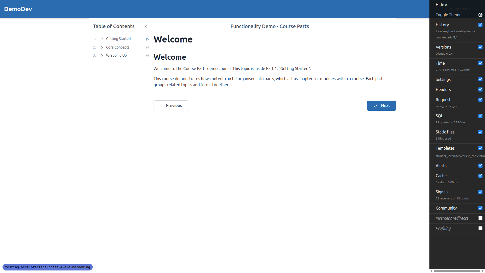
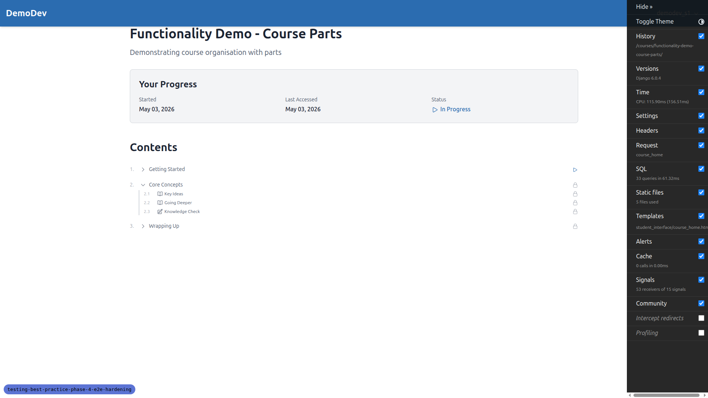
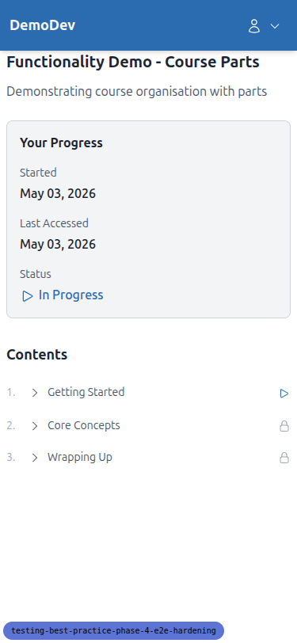
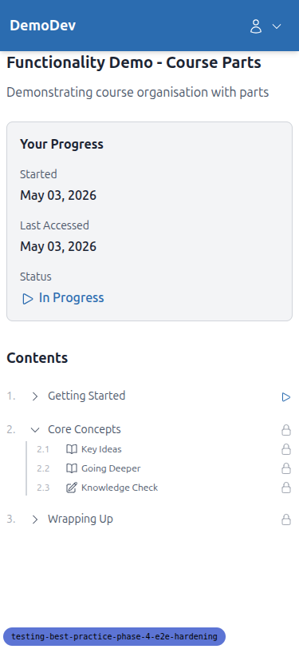
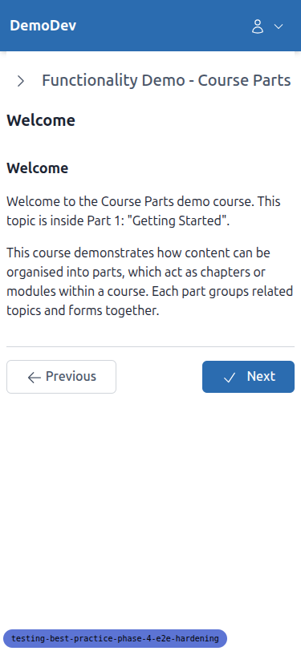
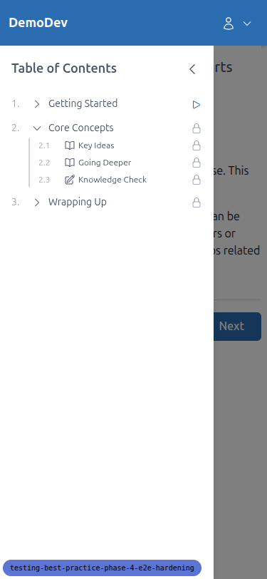
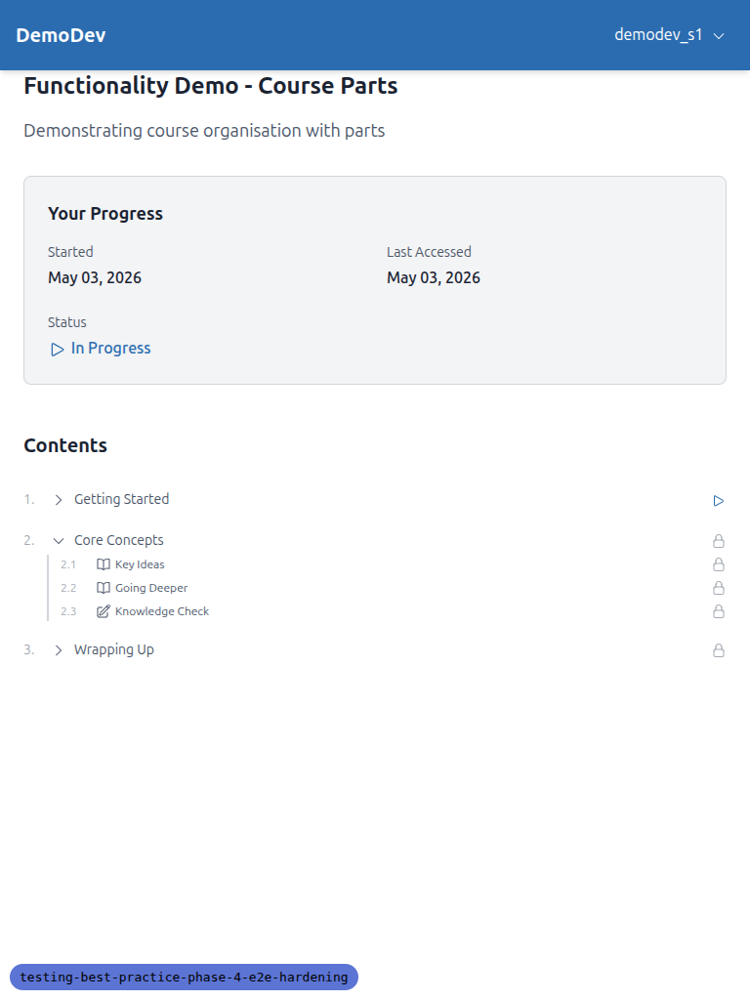
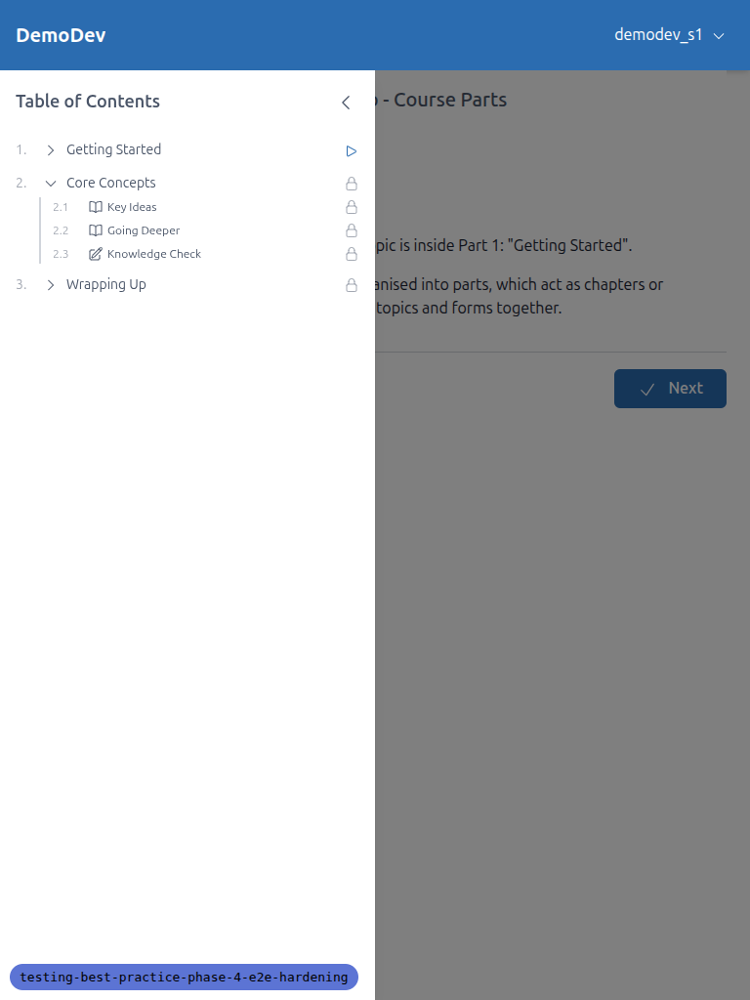

# QA Report — Phase 4: E2E hardening

**Date:** 2026-05-02
**Tester:** Claude Code (do_qa)
**Site:** DemoDev
**Test plan:** `3. frontend_qa.md`
**Outcome:** PASS — all three test cases passed on desktop, mobile, and tablet viewports. No regressions, no console errors, no broken markup.

## Test data setup

The test plan requires a student enrolled in the `functionality-demo-course-parts` course on DemoDev. None existed at the start of the run. Setup performed via `manage.py shell`:

- Created a `UserCourseRegistration` for `demodev_s1@email.com` against the course on DemoDev (site id 3).
- Set the user's password to match the email.
- Marked the user's `EmailAddress` as verified (allauth required this before login).

## Test 1 — Course-part expand/collapse on a topic detail page

**URL:** `/courses/functionality-demo-course-parts/2/` (the spec listed `/student/courses/...` but the actual root URLconf mounts `student_interface.urls` at `/`, so the correct path drops the `/student` prefix; the kwargs and pattern are otherwise as documented). The first item index `1` redirects to `2` automatically because index 1 is the course-part header itself.

**Result:** PASS

- `data-storage-key` attributes rendered correctly: `coursePart_functionality-demo-course-parts_1`, `_2`, `_3` — prefix, slug interpolation, and forloop.counter all correct.
- Clicking the "Core Concepts" toggle expanded the part, made the three child items (Key Ideas, Going Deeper, Knowledge Check) visible, and wrote `coursePart_functionality-demo-course-parts_2 = "true"` to localStorage.
- Clicking again collapsed the part and wrote `"false"` to the same key.
- No console errors throughout.

## Test 2 — Persistence across navigation

**Result:** PASS

- After expanding "Core Concepts" on the topic page (key value `"true"`), navigating to `/courses/functionality-demo-course-parts/` showed the part already expanded with all three children visible — confirming the storage key is read identically by both `course_topic.html` (sidebar TOC) and `course_home.html` (Contents partial).
- Collapsing the part on the course home, navigating away (dashboard) and back, found it collapsed on arrival; localStorage key value `"false"`.

## Test 3 — Smoke check, other interactive components

**Result:** PASS

- Clicked the in-progress child link under "Getting Started" from the course home; the topic page loaded with title and content rendering correctly. No console errors.
- TOC sidebar links continued to work as navigation; Previous/Next navigation also functional. No broken markup.

## Mobile (375x812) results

- TOC sidebar collapses behind a hamburger-style toggle on the topic page; opens on tap and lays out cleanly as an overlay drawer.
- Course-home Contents toggle works; clicking "Core Concepts" expands inline and writes the same localStorage key as desktop.
- Persisted state is honoured when opening the sidebar drawer on a topic page.

## Tablet (768x1024) results

- Course home Contents partial renders with the persisted Core Concepts expansion as expected.
- The topic page presents the TOC as a drawer overlay (mobile-style) at this width rather than a side-by-side desktop layout. Functionality (toggling, clicking, navigating) works correctly. This is a layout choice rather than a bug, but worth flagging as tangential — the drawer covers a significant portion of the main content area when open at tablet width.

## Tangential observations (not bugs in scope)

- **Tablet layout uses mobile drawer:** at 768px the topic page TOC is an overlay drawer, not a side-by-side layout. Out of scope for this QA but flagged as feedback.
- **Spec URL prefix:** the test plan documented `/student/courses/...` as the path, but the project mounts `student_interface.urls` at `/`, so the correct path is `/courses/...`. The plan should be updated for future re-runs.
- **First-item redirect:** navigating to `/courses/functionality-demo-course-parts/1/` redirects to `/2/`. This is because index 1 is the course-part header, not a navigable topic. The spec text said "the first item inside the course"; that turns out to be index 2 in this dataset.

## Difficulties

None blocking. Test data setup required a manual shell step (registration + password + email verification) because no enrolled student existed for the course.
