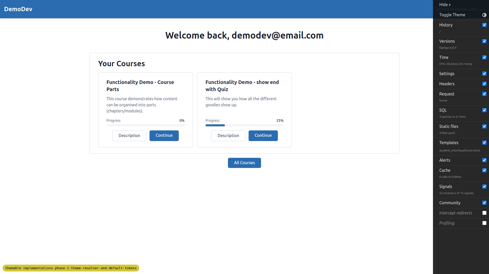
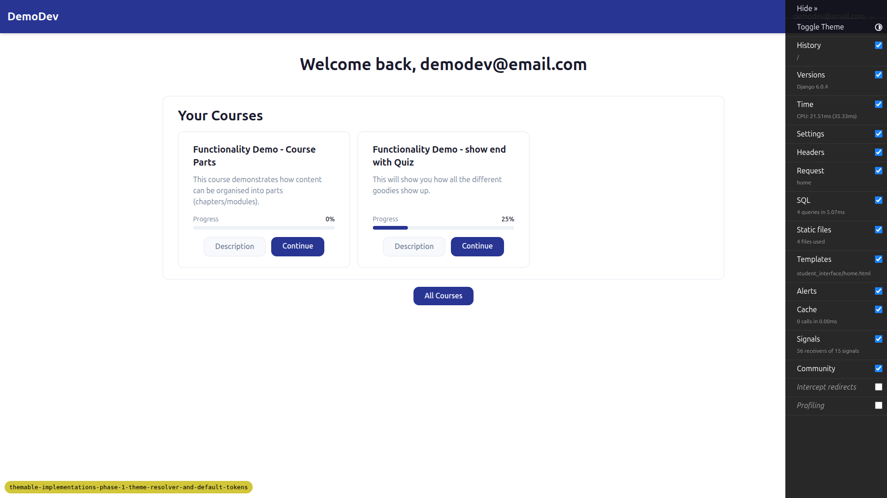
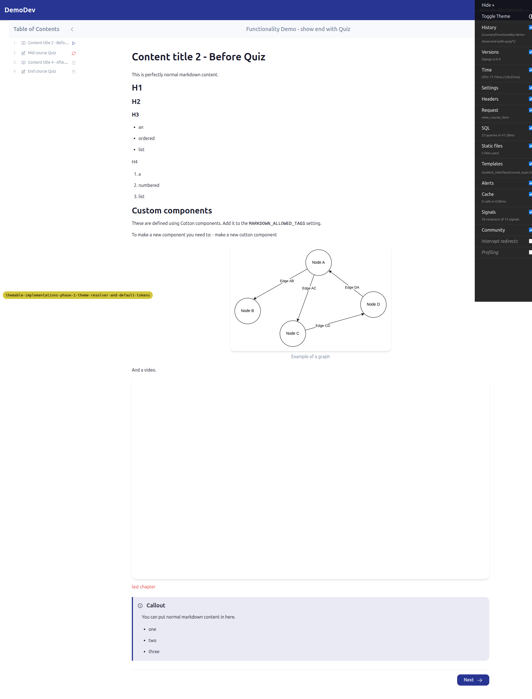
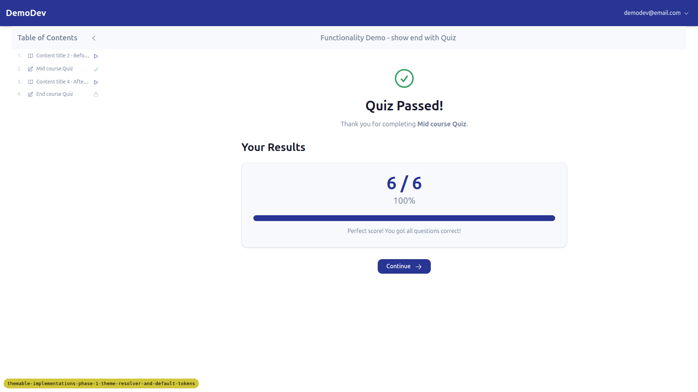
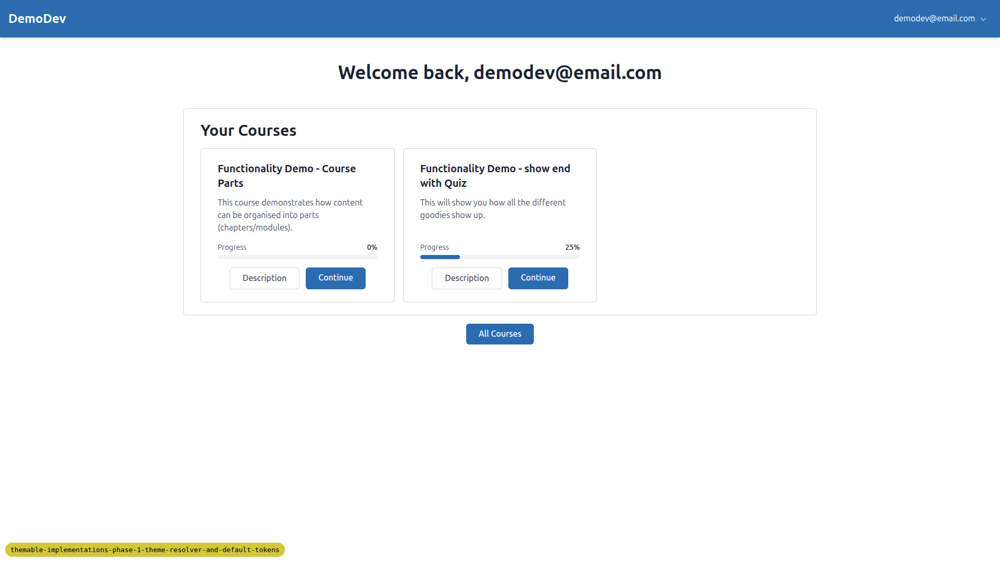
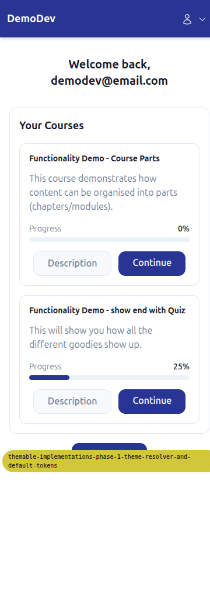

# QA Report — Phase 2: First Class theme (Tier 1 tokens)

Date: 2026-05-06
Branch: `themable-implementations-phase-1-theme-resolver-and-default-tokens`
Tested via Playwright MCP at desktop (1920×1080), mobile (375×812) and tablet (768×1024) viewports.

## Summary

All 5 tests in the plan **pass**. The `first_class` theme cleanly rebrands every page using Tier-1 tokens only (colours, fonts, radii); switching back to `default` returns the Phase-1 baseline with no leakage; email colour fallbacks resolve correctly under both themes; and both themes' `theme.css` resolve regardless of which theme is active.

No bugs were found. A handful of cosmetic observations are listed under "Notes / observations (not bugs)" below — they are tangential to the Phase 2 scope and intentionally left for later phases.

## Test results

| # | Test | Result |
|---|------|--------|
| 1 | Default theme regression (Phase-1 baseline) | PASS |
| 2 | `first_class` theme — end-to-end Tier-1 rebrand | PASS |
| 3 | Switch back to default | PASS |
| 4 | Email colour fallbacks under both themes | PASS |
| 5 | Static asset isolation (both `theme.css` URLs resolvable) | PASS |
| — | Mobile/tablet sanity check on `first_class` | PASS |

---

### Test 1 — Default theme regression

Built and started under `FLS_THEME=default`. The home, course list, course-home and topic pages render identically to the Phase-1 baseline.

Tokens verified at runtime (`getComputedStyle(document.documentElement)`):

- `--color-primary` = `#2B6CB0` (ocean blue)
- `--color-secondary` = `#475569`
- `--color-surface` = `#FFFFFF`
- `--color-border` = `#D1D5DB`
- body colour `rgb(26, 35, 50)` = `#1A2332` (default body text)
- body font: system sans stack — no DM Sans

Screenshots: `desktop_1.1_default_landing.png`, `desktop_1.2_default_courses.png`, `desktop_1.3_default_course_home.png`, `desktop_1.4_default_topic.png`.



---

### Test 2 — `first_class` theme rebrand

Stopped server, ran `FLS_THEME=first_class npm run tailwind_build`, then `FLS_THEME=first_class uv run python manage.py runserver 8400`. Server started cleanly.

Tokens verified at runtime:

- `--color-primary` = `#283593` (deep indigo) — visible on header, primary CTAs, links.
- `--color-secondary` = `#00CEC9` (electric teal)
- `--color-accent` = `#FF6B35` (altitude orange)
- `--color-surface` = `#F8F9FC` (stratosphere off-white)
- `--color-border` = `#E2E8F0`
- body colour `rgb(26, 26, 46)` = `#1A1A2E` (cockpit dark)
- `--font-sans` = `"DM Sans", system-ui, sans-serif`
- `--font-heading` = `"Outfit", system-ui, sans-serif`

Pages walked: `/`, `/courses/`, course home, topic page, mid-course quiz form, educator interface, account profile, signed-out landing, login.

**Tier-1 visible everywhere.** Header bar is indigo; "Continue", "All Courses", "Sign In", "Save", "Try Again", "Next", "Finish", "Continue" CTAs all render in indigo. Body is DM Sans, headings (`h1`–`h4`) are Outfit. Surface is the cooler off-white. Cards and inputs read slightly rounder.

**Things that did not change (correctly):**

- Button shape — `btn-primary` retains the same radius and shadow as default; only the colour changes.
- Cotton component templates — same markup as default.
- Layout / structure — every page matched the default-theme layout.
- All routes that work under default work under first_class.

**Interactive flow.** Signed out, signed back in, walked the Mid course Quiz, completed page 1 and page 2, and got the success screen. The "Quiz Passed!" view shows the green semantic-success check (correctly preserved across themes) alongside the indigo progress bar / score (primary colour rebranded).

Screenshots: `desktop_2.1_first_class_landing.png` … `desktop_2.13_first_class_form_complete.png`.





---

### Test 3 — Switch back to default

Killed the runserver, ran `FLS_THEME=default npm run tailwind_build`, restarted on the same port. Reloaded `/`. Tokens at runtime came back to the Phase-1 baseline (`--color-primary` = `#2B6CB0`, system sans, white surface, etc.). Visual diff against Test 1 baseline shows no leakage.

Screenshot: `desktop_3.1_default_after_switch.png`.



---

### Test 4 — Email colour fallbacks

Ran the documented shell -c probes under each theme:

```
FLS_THEME=default       → #2B6CB0 #1A2332
FLS_THEME=first_class   → #283593 #1A1A2E
```

Both match the expected values. `parse_tailwind_colors` is correctly resolving brand keys from the active theme's `theme.css` rather than the hard-coded fallback.

---

### Test 5 — Static asset isolation

While `first_class` was active:

- `GET /static/themes/first_class/theme.css` → **200**
- `GET /static/themes/default/theme.css` → **200**

While `default` was active:

- `GET /static/themes/default/theme.css` → **200**
- `GET /static/themes/first_class/theme.css` → **200**

Namespacing under `static/themes/<slug>/` works as designed; assets do not collide.

---

### Mobile (375×812) and tablet (768×1024)

Walked the home page and one topic page under each viewport with `first_class` active. Header collapses to the user-icon dropdown on mobile; the indigo bar fills the full width; cards stack into a single column at 375 and into two columns at 768. Tap targets remain large enough; nothing overflows or overlaps. Body fonts switch to DM Sans correctly at both widths.

Screenshots: `mobile_2_first_class_landing.png`, `mobile_2_first_class_topic.png`, `tablet_2_first_class_landing.png`, `tablet_2_first_class_course_home.png`.




---

## Notes / observations (not bugs)

These are tangential to the Phase 2 spec; they are **not** regressions and the spec explicitly defers them to later phases. Recording them so they're not forgotten:

1. **"last chapter" link colour and ordered-list link colour on topic page render in orange/red rather than indigo** under `first_class`. This is the existing markdown `<a>` styling using a non-primary colour — it pre-dates Phase 2 and behaves the same under `default`. Belongs to whatever phase tackles markdown content links / Tier-2 tokens for content links.
2. **Body surface colour appears as plain white on most pages even under `first_class`.** The surface token (`#F8F9FC`) only shows where elements explicitly use `bg-surface`. The base layout currently doesn't apply it to `<body>` / page wrapper in many templates. Phase 3/4 (component-class shape and template work) will touch the page chrome and is the natural place to wire this up if desired.
3. The Django debug toolbar intercepted clicks during the form-fill flow on desktop; I hid it via JS to proceed. Not a Phase 2 issue — pre-existing dev-only friction.

## Difficulties / things not tested

- The `compress_screenshots.py` helper expects `spec_dd/` adjacent to the script (`Path(__file__).parent / "spec_dd"`), so it errored with "spec_dd/ directory not found". I checked all screenshots manually — the largest was 176 KB, well below the 1 MB pre-commit limit, so compression wasn't needed. Worth fixing the script's path resolution separately.
- Did not test signup or password-reset flows; the plan's interactive flow only required login + completing a form, both of which were exercised.
