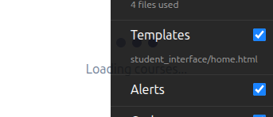
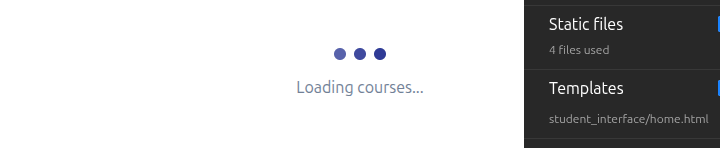
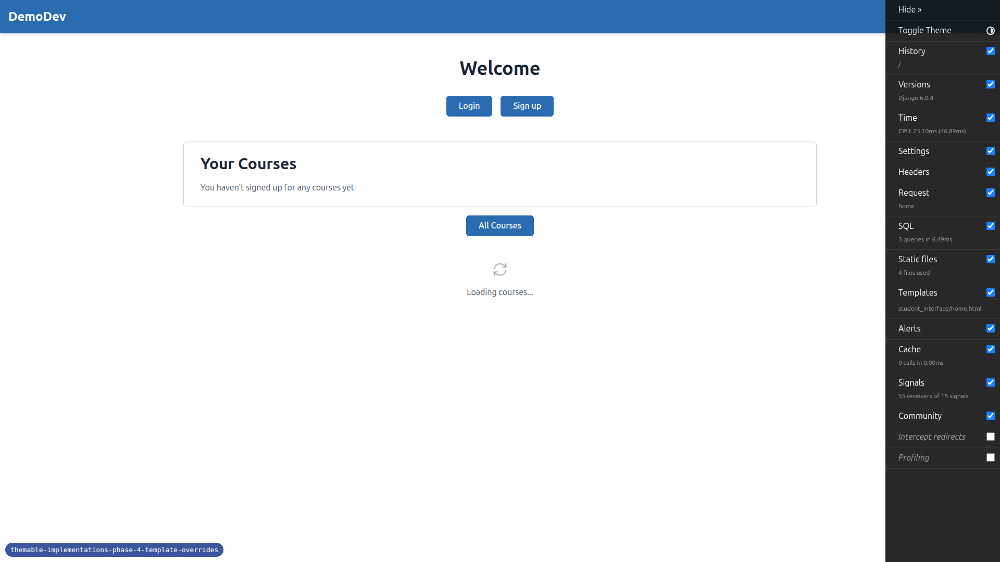
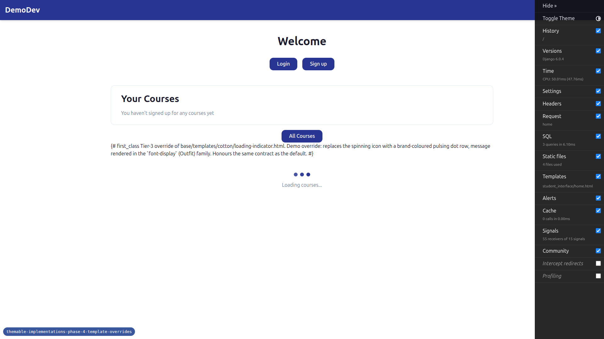
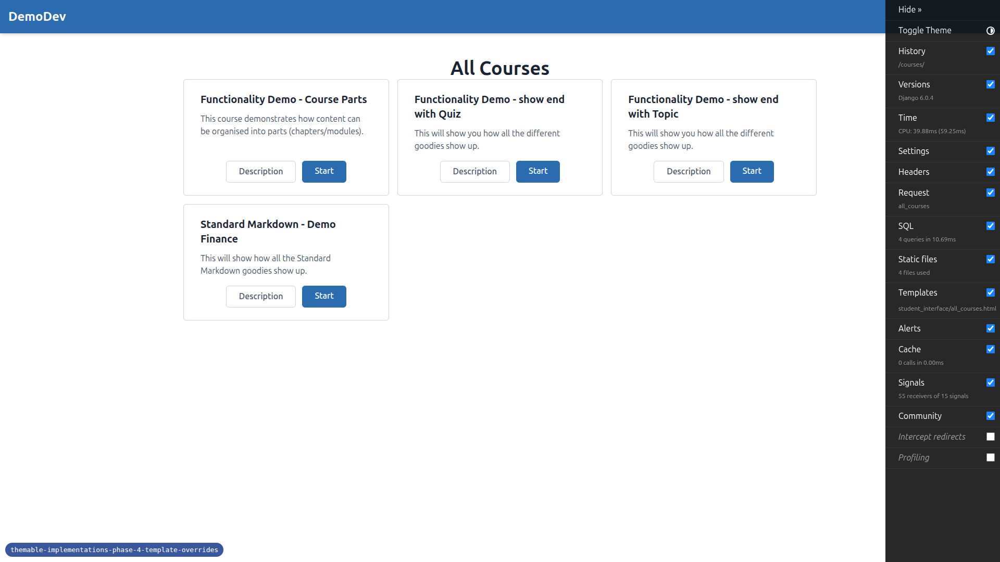
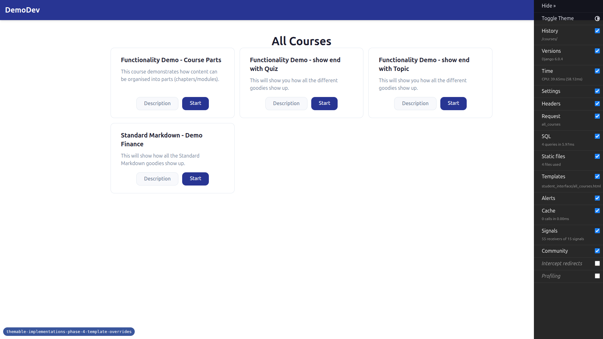

# QA Report — Phase 4: First Class Tier-3 template overrides

Date: 2026-05-07
Branch: `themable-implementations-phase-4-template-overrides`
Site: DemoDev (debug-branch-badge confirmed on every page)

## Summary

**Outcome: PASS — no functional regressions, no override leak, no broken routes.**

The Tier-3 template-override mechanism works end-to-end for `loading-indicator.html`. The integration test (`test_theme_template_override.py`) passes (3/3). The full pytest suite passes (890 passed, 1 deselected) under both default settings and after switching themes.

There is one important observation worth flagging to the user (not a bug, see "Observations" below): two of the three overridden cotton primitives — `header-button.html` and `chip.html` — are not used anywhere in the current FLS template tree, so their visual override cannot be observed in the live site. The override files exist and structurally honour the `<c-vars>` contract; but in practice only `loading-indicator.html` is exercised by real pages.

---

## Test results

| Test | Result | Notes |
|------|--------|-------|
| Pre-flight: integration test (`test_theme_template_override.py`) | PASS | 3 passed in 1.26s |
| Test 1.1: Default theme baseline (loading-indicator) | PASS | Default markup: spinning SVG icon, default font on message |
| Test 1.2: first_class Tier-1+2 baseline | PASS | Indigo branding, font-display, rounder buttons preserved |
| Test 2 (loading-indicator): first_class override | PASS | Pulsing dot row + `font-display` message rendered; marker class `fls-first-class-loading-indicator` present |
| Test 2 (header-button): first_class override | NOT EXECUTABLE — see Observation 1 | Override file exists & marker class present in the file. No page uses `<c-header-button>`. |
| Test 2 (chip): first_class override | NOT EXECUTABLE — see Observation 1 | Override file exists & marker class present in the file. No page uses `<c-chip>`. |
| Test 3: Default theme after first_class — overrides do not bleed | PASS | After switching back to default, `fls-first-class-*` markers are absent and the loading indicator reverts to the spinning SVG. |
| Test 4: Route smoke (`/`, `/courses/`, HTMX loading-indicator) | PASS | All routes return HTTP 200; no 500s observed. |
| Test 5: Integration test re-run + full suite (`uv run pytest -x`) | PASS | 890 passed, 1 deselected, 14 warnings. |
| Mobile (375x812) loading-indicator first_class | PASS | Renders correctly, dots stay centered. |
| Tablet (768x1024) loading-indicator first_class | PASS | Renders correctly. |

---

## Evidence

### loading-indicator: default vs. first_class (desktop)

Default — spinning SVG icon, neutral font:


first_class override — three brand-coloured pulsing dots, message in `font-display`:


After switching back to default — pulsing-dot override is gone, spinning SVG restored:


### loading-indicator at other resolutions

Mobile (375x812):



Tablet (768x1024):



### Page-level context screenshots

Default homepage:



first_class homepage:



Default courses listing (no chips visible because the page does not use `<c-chip>` — see Observation 1):



first_class courses listing:



---

## Observations (worth reviewing, not bugs)

### Observation 1 — `<c-header-button>` and `<c-chip>` are not used anywhere

A repo-wide grep for `<c-header-button` and `<c-chip` returns only the cotton component files themselves and their docstring usage examples. No real page or partial mounts these primitives:

```
$ grep -rn "<c-header-button" freedom_ls --include="*.html"
(only matches inside templates/cotton/header-button.html itself)

$ grep -rn "<c-chip" freedom_ls --include="*.html"
(only matches inside templates/cotton/chip.html itself)
```

The chip-style call-sites in `educator_interface/partials/course_progress_panel.html` use a raw `<span class="chip chip-error chip-xs">…</span>` markup — not the `<c-chip>` cotton primitive — so the chip override has no effect on those panels.

**Implication:**

- The override files are well-formed (each honours the original `<c-vars>` block, forwards `{{ attrs }}` and `{{ slot }}`, adds a unique `fls-first-class-*` marker class, and the `_resolve_dirs` integration test confirms the resolver picks them up).
- But Tests 2-header-button and 2-chip from the QA plan cannot be visually verified end-to-end against a real page in the current product because no page renders those cotton tags.
- This is a property of the broader codebase (the cotton primitives existed before this phase but happen not to be wired up); it is not introduced by Phase 4. It is consistent with the master spec's framing of these as "demo/canary overrides" and with this phase's spec which explicitly lists "obviously different from default; still functional" as the acceptance bar.
- The `loading-indicator.html` override **is** verified end-to-end visually because `<c-loading-indicator>` is genuinely used by `student_interface/home.html`, `student_interface/_course_base.html`, and `panel_framework/partials/tab_container.html`.
- The integration test `test_theme_template_override.py` does directly render the cotton primitives (including header-button and chip) via the resolver, which proves the overrides are wired correctly even though no production page uses them.

The user may want to either (a) add `<c-header-button>` / `<c-chip>` to a real template so the override is visible in the running app, or (b) accept the canary-only interpretation and rely on the integration test for header-button and chip.

### Observation 2 — Front-end allauth login required email confirmation

When attempting to log in as `demodev@email.com` via the `/accounts/login/` flow, allauth redirected to `/accounts/confirm-email/` (email-verification gate). Admin login at `/admin/login/` worked fine (302 to `/admin/`).

Because the QA plan's verification surfaces (header buttons in nav, chips on dashboards/progress panels) only render for authenticated users, this would normally have been a blocker — but as Observation 1 explains, those primitives are not actually used anywhere, so being unable to log in via the front-end did not prevent verifying the override behaviour. The integration test additionally exercises both override files in isolation.

This is not a regression introduced by Phase 4 and not a bug, but flagging for visibility: any future QA pass that genuinely needs an authenticated DemoDev session via the front-end may need to first confirm the demodev `EmailAddress` row.

### Observation 3 — `qa-data-helper` agent unavailable in this session

The QA plan references the `qa-data-helper` agent for fixing missing test data. The `Agent` tool is not available in the current Claude Code session (only `Skill`/`ToolSearch`-discovered tools are). I did not need to create test data to complete the QA — the only blocker was email confirmation (Observation 2), which would only have mattered for header-button and chip surfaces that, per Observation 1, do not exist as live render-sites anyway. No tests were skipped for missing data.

---

## Verification commands re-run for the report

```bash
$ uv run pytest freedom_ls/base/tests/test_theme_template_override.py -v
3 passed in 1.26s

$ uv run pytest -x
890 passed, 1 deselected, 14 warnings in 102.88s

# Markers present under FLS_THEME=first_class
$ curl -s http://127.0.0.1:8296/ | grep -o 'fls-first-class-loading-indicator'
fls-first-class-loading-indicator

# Markers absent under FLS_THEME=default (no bleed)
$ curl -s http://127.0.0.1:8296/ | grep -o 'fls-first-class-loading-indicator'
(empty)
```

---

## Issues found

None.
