# QA Report — Themable FLS documentation (Phase 5)

**Date:** 2026-06-17
**Branch:** `themable-implementations-phase-5-documentation`
**Test plan:** `3. frontend_qa.md`
**Method:** Playwright MCP, desktop (1920×1080), mobile (375×812), tablet (768×1024).
Demo data (DemoDev) already present — no `fls:qa-data-helper` delegation needed.

## Result summary

**All tests passed. No functional bugs found.** The headline success criterion
was met: following `docs/how tos/theme-fls.md` *only*, a brand-new third theme
(`qa_canary`) was built end-to-end and rendered correctly in the browser, and the
canonical `default` and `first_class` themes are unbroken. Email colours track the
active theme as the corrected `email_templates.md` claims.

| Test | Description | Result |
|------|-------------|--------|
| 1 | Baseline renders under `default` | ✅ Pass |
| 2 | Build a brand-new third theme by following the guide | ✅ Pass |
| 2.5 | Unknown-slug failure mode (`ImproperlyConfigured`) | ✅ Pass |
| 3 | Tier-2 component override (`.btn` pill) | ✅ Pass |
| 4 | `first_class` still renders, then back to `default` | ✅ Pass |
| 5 | Email colours track the active theme | ✅ Pass |
| Mobile | Layout / nav drawer at 375px | ✅ Pass |
| Tablet | Layout / nav at 768px | ✅ Pass |

---

## Test 1 — Baseline renders under `default`

The login, dashboard, catalogue and a course-detail page all render fully styled
under the default theme: mid-blue (`#2B6CB0`) header and primary button,
white/light surfaces, legible status chips, default sans font. No flash of raw
HTML.

Login (blue primary button):
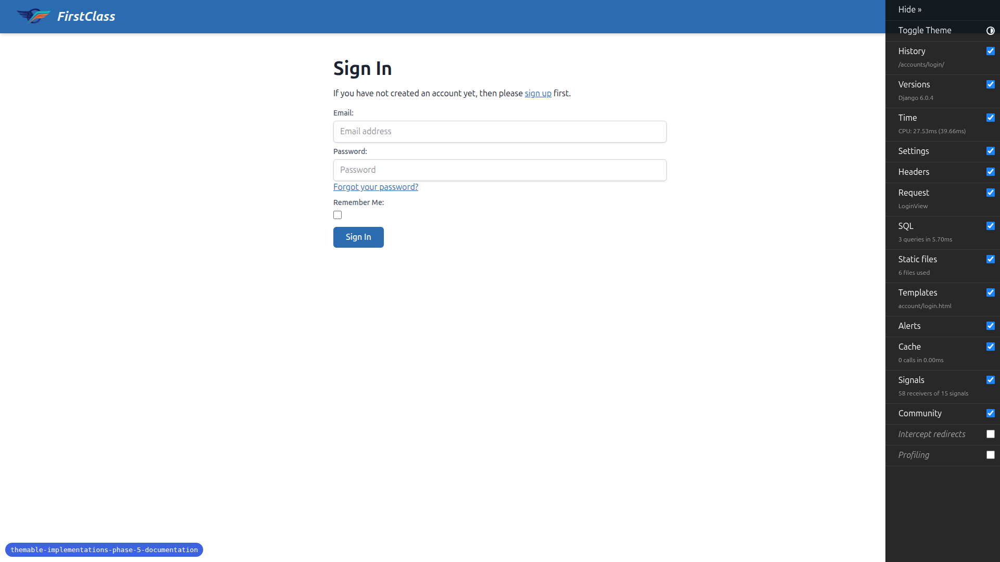

Course catalogue (blue header, five distinct accent-gradient hero tiles, status
chips, progress bars):


Course detail (side panel, progress bar, content area — all default styling):
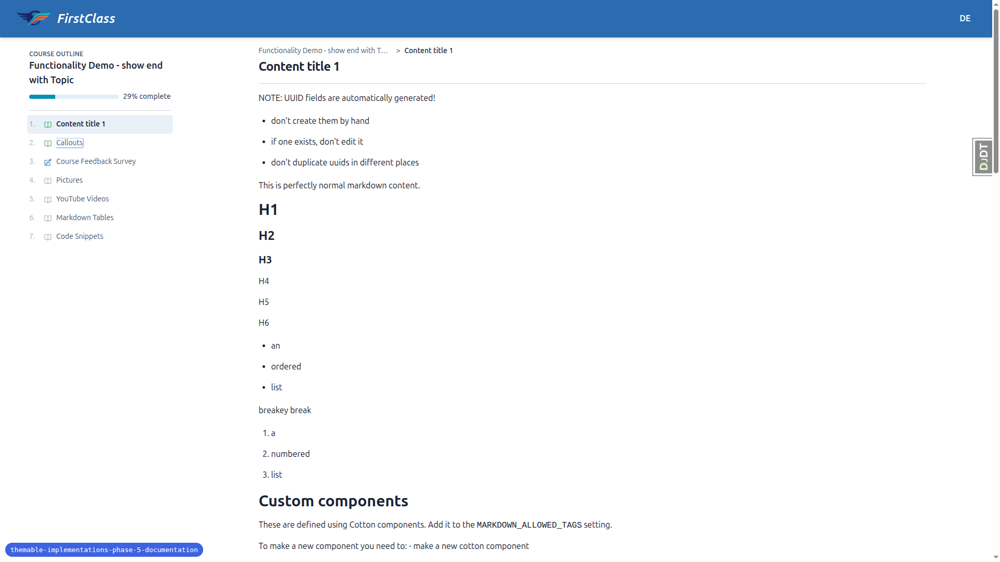

---

## Test 2 — Build a brand-new third theme by following the guide

Following the guide's "minimal Tier-1 theme" worked example (Example A), two files
were created with **no information beyond the guide**:

- `freedom_ls/themes/qa_canary/theme.md`
- `freedom_ls/themes/qa_canary/static/themes/qa_canary/theme.css`

The guide's Example A wraps tokens in an `@theme { … }` block (the test-plan
snippet loosely showed `:root { … }`; the guide is the source of truth and was
followed). `export FLS_THEME=qa_canary && npm run tailwind_build` succeeded and
regenerated `tailwind.active_theme.css` to `@import` the `qa_canary` `theme.css`,
exactly as documented.

After restarting the server and hard-refreshing, the new magenta primary / cream
surface palette propagated everywhere — header, primary button, links, the
course-outline active row and survey icon. Text on coloured backgrounds stayed
legible. The build/switch worked purely from the guide — **no documentation gaps
were hit.**

Login — magenta Sign In button and magenta links (cf. the blue baseline above):
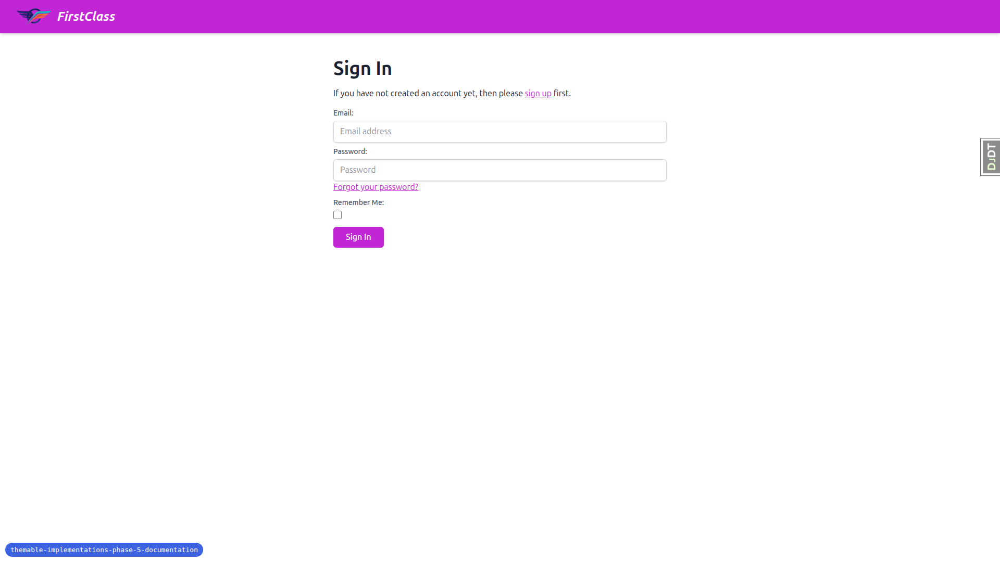

Dashboard — magenta header; course-card accent gradients correctly remain at their
defaults (they are intentionally separate tokens the theme did not override):
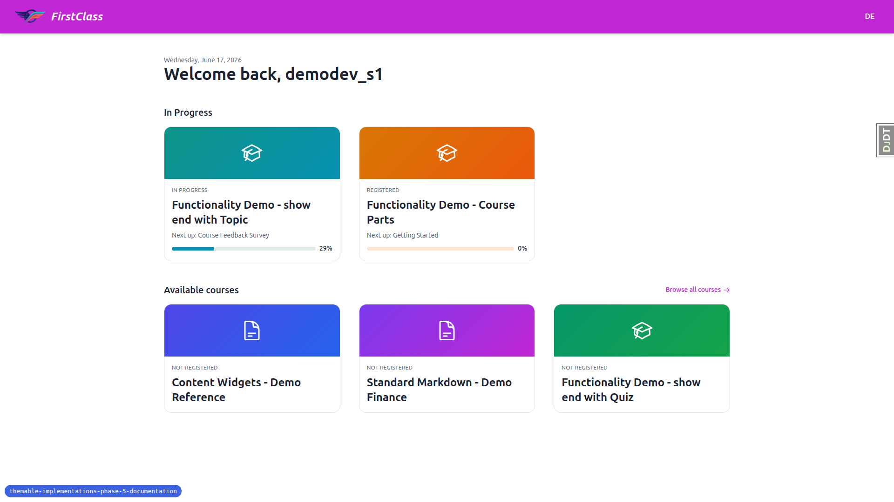

Course detail — magenta header, cream side-panel surface, magenta active outline
row / icon:
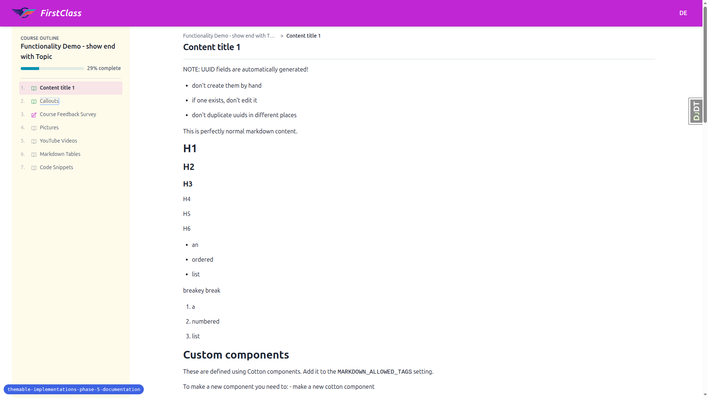

### Test 2.5 — Unknown-slug failure mode

`export FLS_THEME=does_not_exist && uv run python manage.py check` raised exactly
the documented error, naming the bad slug and the searched directories:

```
django.core.exceptions.ImproperlyConfigured: FLS theme 'does_not_exist' not found
in any of: [PosixPath('…/themes'), PosixPath('…/freedom_ls/themes')]
```

This matches the guide's "Failure mode" section.

---

## Test 3 — Tier-2 component override

Following the guide's "Tier 2 — re-opening component classes" section, an
`@layer components { .btn { @apply rounded-pill px-8; } }` block was added to
`qa_canary`'s `theme.css`. After rebuild + hard-refresh, the primary button is
pill-shaped and wider, proving the active theme's `@layer components` declarations
win over the `tailwind.components.css` defaults (cascade: default tokens →
components → active theme), exactly as the guide states.


---

## Test 4 — `first_class` still renders, then back to `default`

Under `FLS_THEME=first_class`, the "Modern Altitude" look renders correctly: Deep
Indigo (`#283593`) primary, Electric Teal secondary, grid-textured course-card
hero tiles, numbered course-outline counters (01, 02, …) and the DM Sans / Outfit
fonts. The white header with an indigo avatar pill is **intentional** — `first_class`
sets `--color-header: white` and `--color-header-action: var(--color-primary)` in
its `theme.css`, so this is by design, not a regression.

Catalogue under `first_class`:
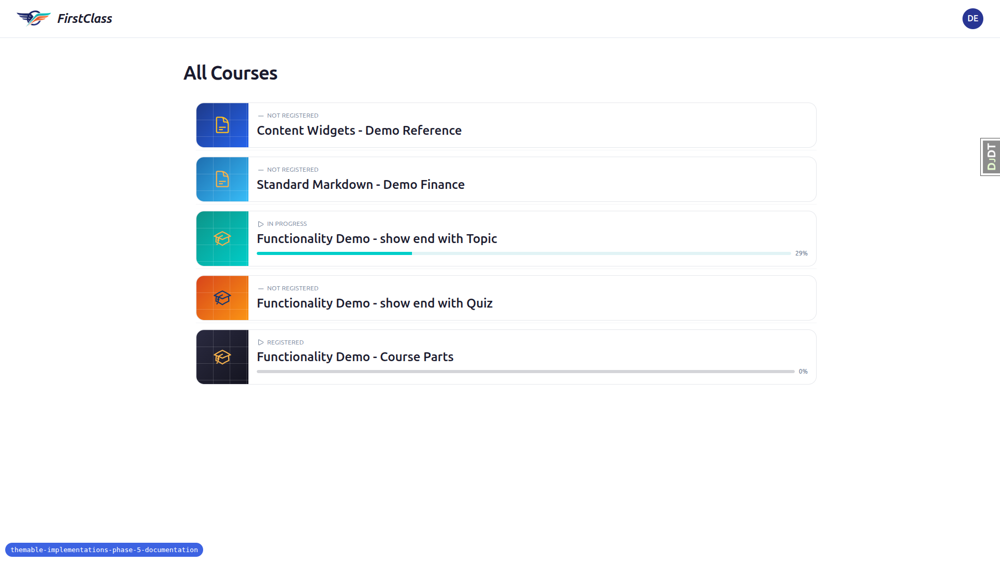

Course detail under `first_class` (numbered outline counters, teal progress):
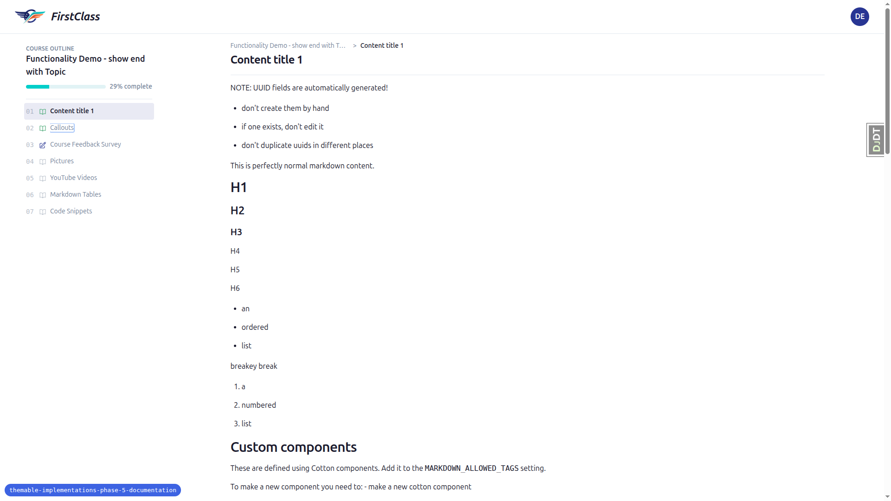

Switching back to `default` and rebuilding returns the page pixel-for-pixel to the
Test 1 blue baseline:
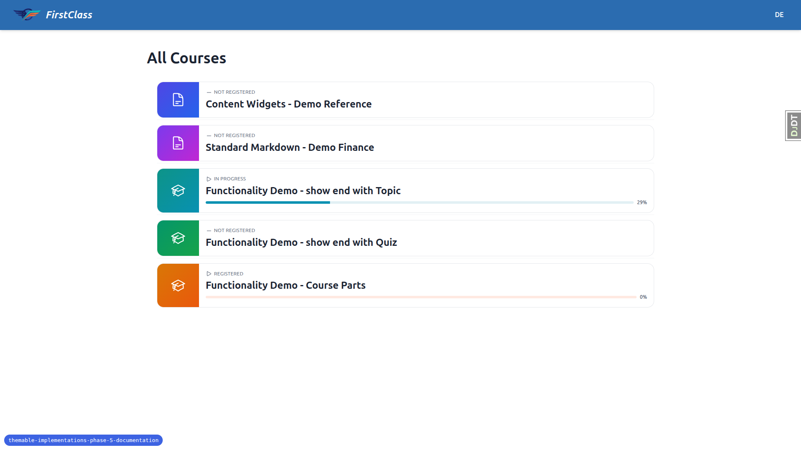

---

## Test 5 — Email colours track the active theme

A password-reset email (an FLS HTML transactional email rendered through
`base_email`) was triggered and inspected in Mailpit under two themes:

- **Under `qa_canary`**: the email's HTML contains `#C026D3` (magenta primary →
  header bar + "Reset Password" button) and `#FFFBEB` (cream body surface), with
  `#1A2332` on-surface body text — i.e. the active theme's `theme.css` values.

  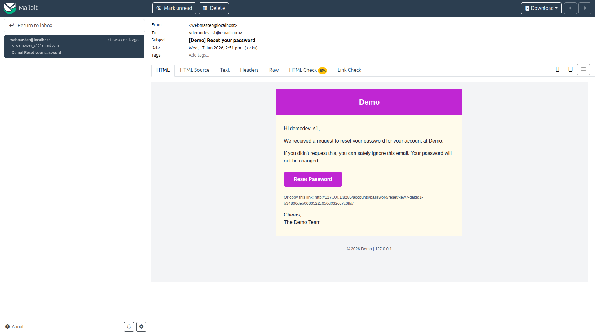

- **Under `default`**: re-sending after switching theme + rebuild + restart shows
  `#2B6CB0` (default blue primary) and a white surface instead.

  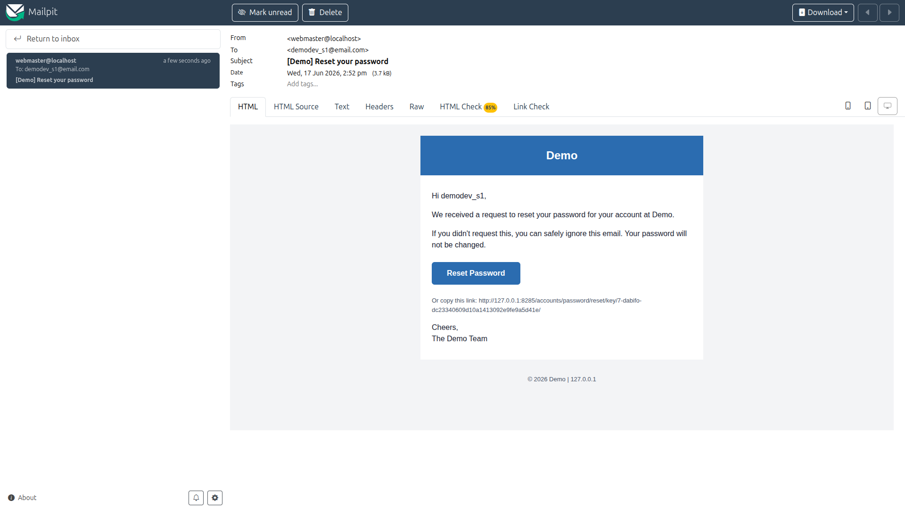

This confirms `email_templates.md`'s corrected claim that email colours are parsed
from the **active** theme's `theme.css` (`--color-primary`, `--color-on-surface`,
`--color-muted`) at Django startup — not from `tailwind.components.css` or a
`--color-foreground` token. Note (matching the doc): because the colours are parsed
at startup, a **server restart** — not just a rebuild — is required for an email
colour change to take effect.

---

## Mobile (375×812) and Tablet (768×1024)

Theming is orthogonal to layout, so these viewports were spot-checked for
usability and nav behaviour rather than re-running every theme.

- **Mobile catalogue**: course cards stack to a single column, gradients/chips/
  progress bars legible, no overflow.
  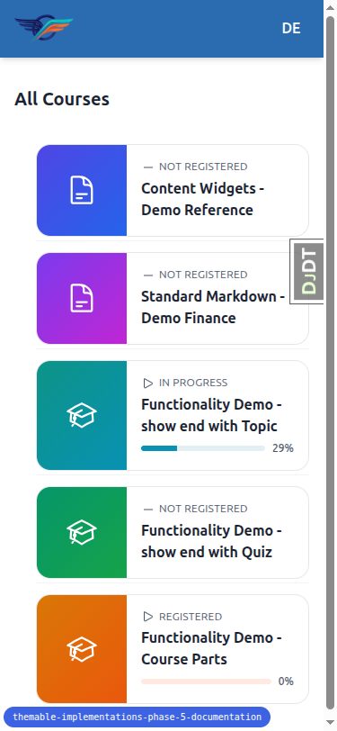
- **Mobile course detail**: the side-panel outline collapses behind an "Open course
  outline" toggle; tapping it opens a bottom-sheet drawer with a dimmed backdrop,
  showing progress + numbered items + the active row highlighted.
  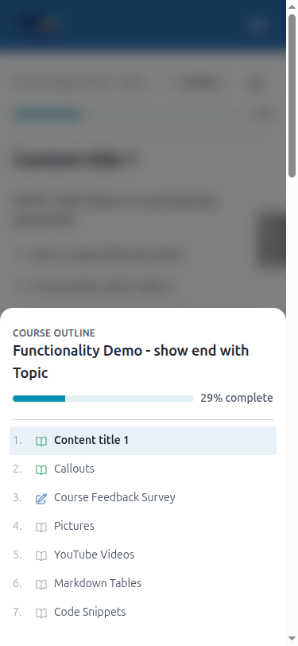
- **Tablet catalogue**: full-width desktop header, single-column card list (same as
  desktop), no crowding.
  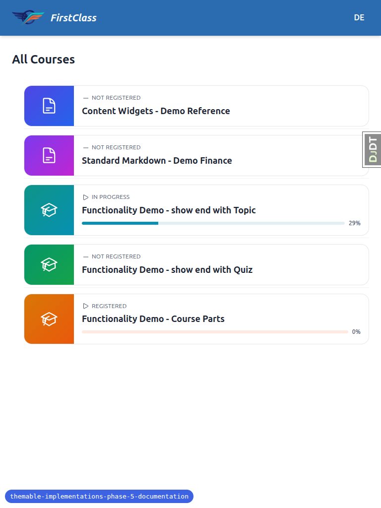
- **Tablet course detail**: still uses the drawer layout (the docked side panel
  appears at a wider breakpoint); content gets full width, no overflow.
  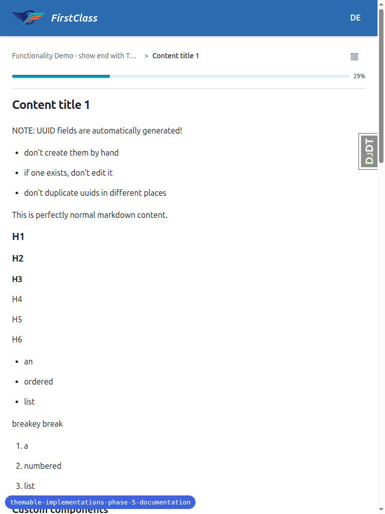

---

## Notes / observations (tangential — not theming bugs)

1. **Login is password-based, not magic-link.** The test plan's "Prerequisites"
   describe a passwordless magic-link flow via Mailpit, but the project is
   configured for standard allauth email + password
   (`ACCOUNT_LOGIN_METHODS = {"email"}`, no `LOGIN_BY_CODE`). Login was performed
   with the demo student's password (demo users have password == email, per
   `create_demo_data.py`), and Test 5's "theme-coloured email" was triggered via
   the password-reset flow (which the test plan explicitly allows: "or any flow
   that sends an FLS HTML email"). This is a wording mismatch in the QA plan's
   prerequisites, not a bug in the feature or in `theme-fls.md`.

2. **Django Debug Toolbar handle overlaps card edges** at mobile/tablet widths
   (right edge). This is the dev-only DjDT widget, unrelated to theming.

## Cleanup performed

- Killed the dev server started for this run.
- Removed the throwaway `freedom_ls/themes/qa_canary/` theme (QA scratch artifact —
  must not be committed).
- Reset `FLS_THEME=default` and rebuilt so the worktree is left on the default
  theme.
