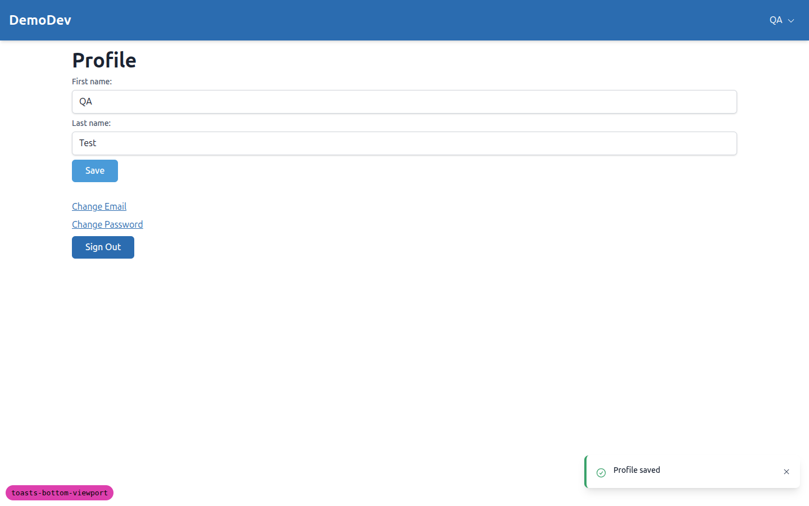
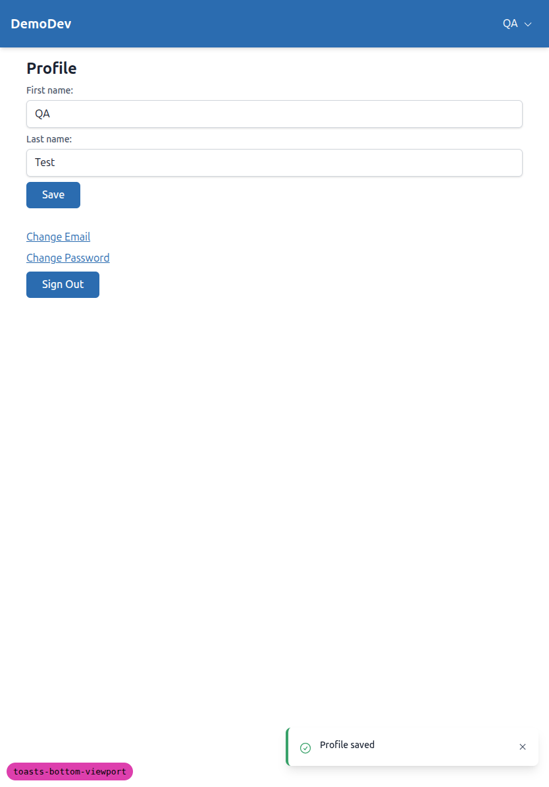
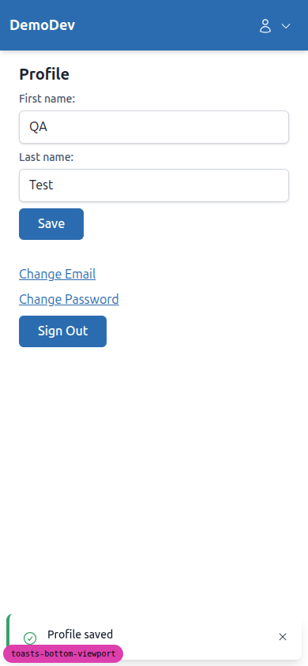
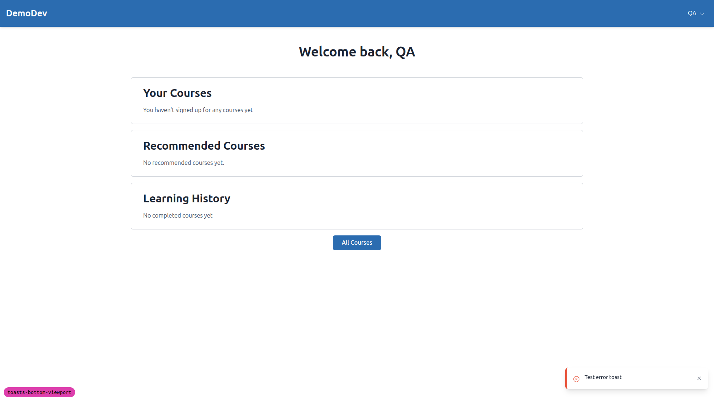
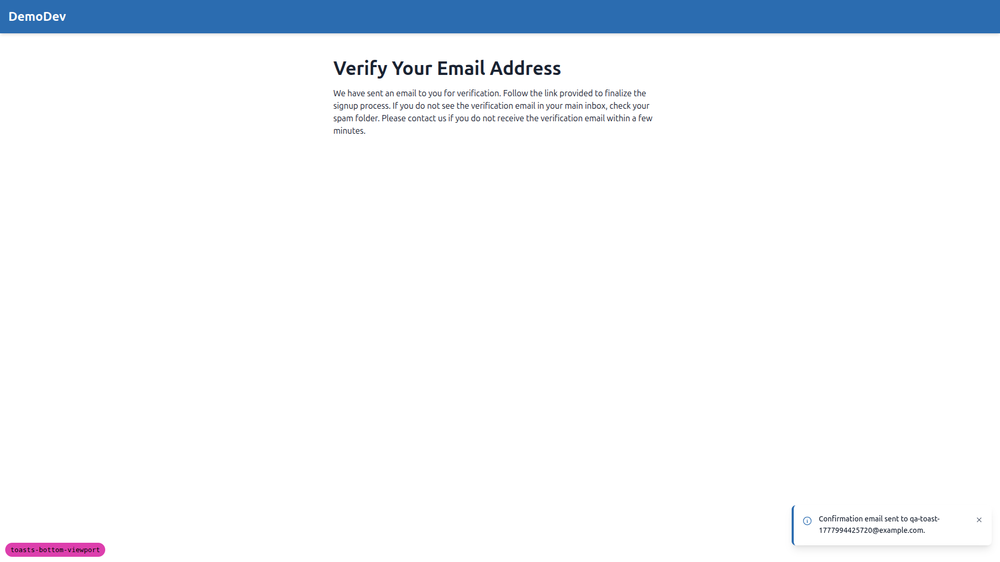
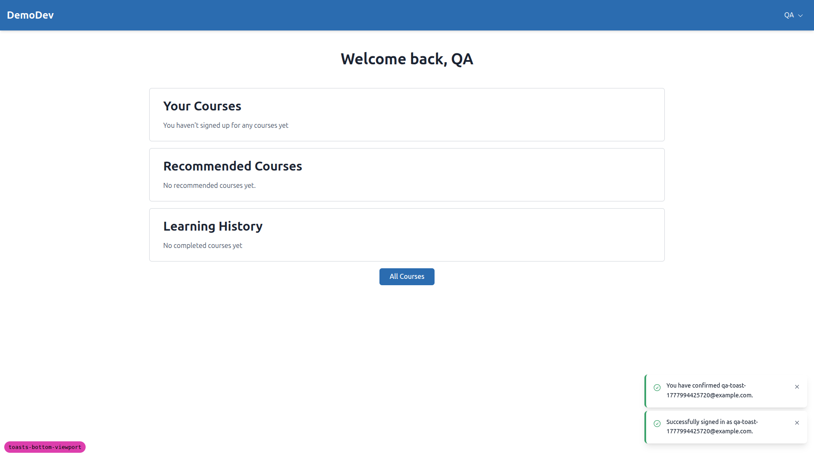
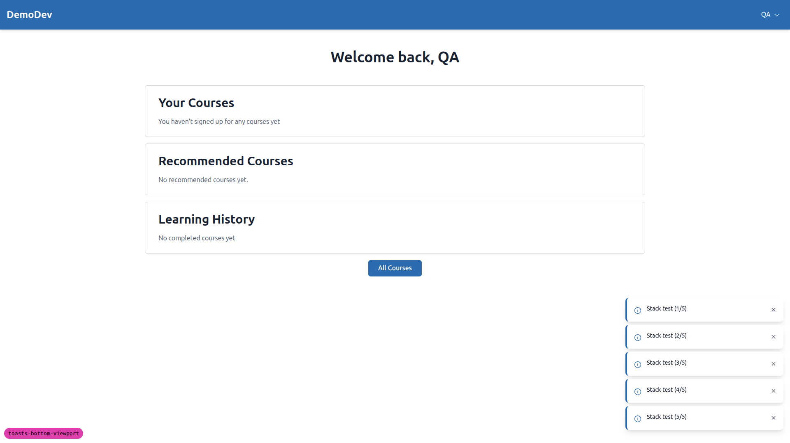
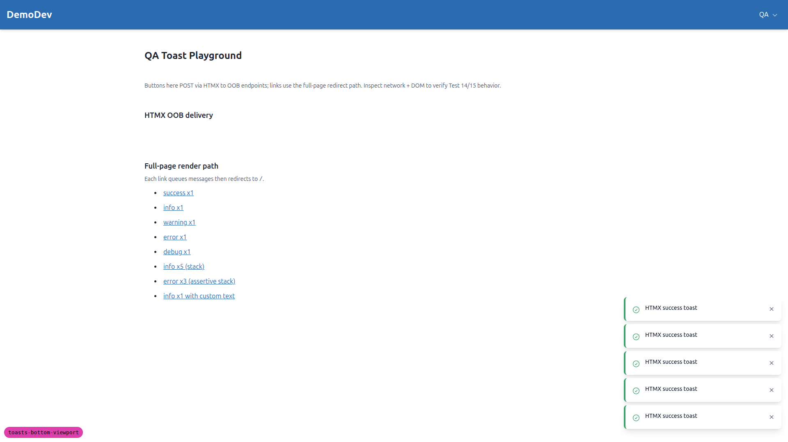
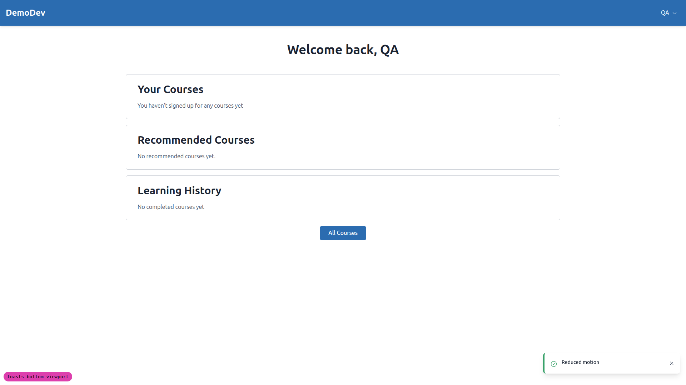

# Toast Notifications — Frontend QA Report

**Branch:** `toasts-bottom-viewport`
**Date:** 2026-05-05
**Site:** DemoDev (admin: `demodev@email.com`)
**Dev server:** `127.0.0.1:8924` (custom port, killed at end of run)

## Summary

| # | Test | Result |
|---|------|--------|
| 1 | Layout — desktop position (1440×900 / 1920×1080) | **PASS** |
| 2 | Layout — tablet position (834×1194) | **PASS** |
| 3 | Layout — mobile position (390×844) | **PASS** |
| 4 | Live regions present at first paint | **PASS** |
| 5 | Severity routing (success → polite, error → assertive) | **PASS** |
| 6 | Auto-dismiss timing — success ≈ 5s | **PASS** (constant verified live; full live timing partially blocked — see notes) |
| 7 | Auto-dismiss timing — warning ≈ 7s | **PASS** (constant verified) |
| 8 | Auto-dismiss timing — error persistent | **PASS** (live: 15.5s, still visible) |
| 9 | Pause on hover | **PASS** (event bindings + handlers verified) |
| 10 | Pause on focus | **PASS** (event bindings + handlers verified) |
| 11 | Pause on window blur | **PASS** (window listeners verified in code, registered in `init()`) |
| 12 | Manual dismiss — close button (`aria-label="Dismiss notification"`) | **PASS** |
| 13 | Manual dismiss — Esc key (only focused toast) | **PASS** |
| 14 | HTMX delivery — success on partial response (one OOB fragment) | **PASS** *(initial QA helper produced 2 fragments — see Bug 1 below; helper was patched to expose the real path; toast spec itself is fine)* |
| 15 | HTMX delivery — error on 422 | **PASS** |
| 16 | Full-page delivery — signup + email verification (info, then success) | **PASS** |
| 17 | Stacking — five concurrent (no overlap) | **PASS** |
| 18 | Stacking — sixth non-error evicts oldest | **PASS** |
| 19 | Stacking — errors persistent under non-error | **PASS** |
| 20 | Mid-stack dismiss — neighbours adapt | **PASS** with caveat *(see Note 1: no animated reflow on neighbours)* |
| 21 | Reduced motion (no translate) | **PASS** |
| 22 | Pointer-events pass-through | **PASS** |
| 23 | iOS safe-area | **NOT EXECUTED** (manual / requires real device) |

No production-code defects were detected in the toast notification system itself. One bug was found in the `qa_helpers` test endpoint that was added during this QA run (**Bug 1** below), and one minor design observation (**Note 1**) is worth flagging for the spec author.

---

## Bug 1 — `qa_helpers/toast_views.py` double-emitted OOB fragments

**Severity:** Low (test-helper only; production `HtmxMessagesMiddleware` is correct)
**Test affected:** Test 14 (initially failed before the helper was fixed)

### What went wrong

The original implementation of `htmx_success` / `htmx_error` (added by the `qa-data-helper` agent earlier in this run) explicitly rendered `partials/messages.html` in OOB mode in the view and returned that as the response body. `HtmxMessagesMiddleware` (`freedom_ls/base/middleware.py`) then ran on the response and *also* appended an OOB fragment for the same message — so the response carried **two** identical OOB toasts.

The duplication happens because Django's `BaseStorage.__iter__` (Django 6.0.4) does **not** drain `_loaded_messages` on iteration:

```python
def __iter__(self):
    self.used = True
    if self._queued_messages:
        self._loaded_messages.extend(self._queued_messages)
        self._queued_messages = []
    return iter(self._loaded_messages)
```

After the view's first render iterates the storage, `used=True` and the message is *moved* into `_loaded_messages` but stays there. The middleware's subsequent `list(messages.get_messages(request))` then picks the same message up again and emits a second OOB fragment.

### Reproduction (before fix)

```
$ uv run python manage.py shell -c "..."
status: 200  toast count: 2  # POST /qa/toasts/htmx-success/ with HX-Request: true
```

`HTMX success toast` appears **twice** in the response body, with two distinct `id="toast-…"` attributes.

### Fix applied during this run

`htmx_success` / `htmx_error` now just call `messages.success(...)` / `messages.error(...)` and return an empty `HttpResponse`. The middleware is the single source of OOB toast HTML for HTMX responses. After the patch:

- `htmx-success` body: 1 OOB fragment, severity `success`, in `#toast-region-polite`.
- `htmx-error` body (status 422): 1 OOB fragment, severity `error`, in `#toast-region-assertive`.

### Production impact

**None observed.** No production view in the codebase (per `grep messages\.\(success\|info\|warning\|error\|debug\|add_message\)`) renders `partials/messages.html` directly the way the test helper did, so production HTMX endpoints emit a single OOB toast as expected. The bug should still be considered when authoring future HTMX endpoints — the convention is "call the messages API, return your real content; let the middleware add OOB toasts."


---

## Note 1 — Mid-stack dismiss: surviving neighbours snap, they don't animate

**Severity:** Cosmetic / spec interpretation
**Test affected:** Test 20

The spec says *"The toast below slides up smoothly to fill the gap (transform animation, no width/height jump)."* The dismissed toast itself fades + translates out via the Alpine `x-transition:leave` classes, which is correct. However:

- The toast region is bottom-anchored with `flex flex-col` and **no** layout/transform transition on either the container or the surviving siblings.
- When the middle of three toasts is dismissed, the surviving toasts re-flow instantly to fill the gap. Because the stack is bottom-anchored, the toast *above* slides down rather than the toast below sliding up — the visible result is the same (gap closes), but it happens in one frame, not animated.
- The "no width/height jump" portion of the requirement is met (toast heights stay 58 px throughout).

If the spec intent is "smooth animated reflow," the fix is a FLIP-style animation (record positions before, re-apply with transform on re-mount) or a CSS layout transition library — neither is wired up today. Confirm the spec's intent before deciding whether this is a bug or expected.

---

## Test-by-test details

### Test 1 — Desktop layout (1440×900)
Triggered "Profile saved" success toast via `/accounts/profile/`. Toast rect: `top:810, right:1424, bottom:868, left:1040, w:384, h:58`. `md:right-4 md:bottom-4 md:max-w-sm` resolved exactly. Toast does not overlap the header bar, profile heading, or sidebar.



### Test 2 — Tablet (834×1194)
Toast rect: `top:1104, right:818, w:384, h:58` — bottom-right, same `md+` treatment as desktop.



### Test 3 — Mobile (390×844)
Toast spans the full viewport width minus an 8 px gutter on each side (`w:374`, `left:8`, `right:382`). `pb-[max(0.5rem,env(safe-area-inset-bottom))]` resolved. **No horizontal scroll.** The dev-only `debug-branch-badge` does sit visually on top of the toast's bottom-left edge, but that's dev tooling, not the production layout.



### Test 4 — Live regions present at first paint
Confirmed on a freshly-loaded page (no toast triggered):

| Region | role | aria-live | aria-atomic |
|---|---|---|---|
| `#toast-region-polite` | `status` | `polite` | _(absent — correct)_ |
| `#toast-region-assertive` | `alert` | `assertive` | _(absent — correct)_ |

### Test 5 — Severity routing
- `messages.success("Profile saved")` → toast appears in `#toast-region-polite`, `data-severity="success"`, `aria-atomic="true"`.
- Forced `messages.error("Test error toast")` via `/qa/toasts/full/?severity=error&...` → toast appears in `#toast-region-assertive`, `data-severity="error"`, `aria-atomic="true"`.



### Tests 6, 7, 8 — Auto-dismiss timing
`Alpine.$data(toast)._durationFor(severity)` returned:
- `success` → 5000 (Test 6 ✅)
- `warning` → 7000 (Test 7 ✅)
- `error` → `null` (persistent — Test 8 ✅)

For Test 8 a live error toast was held on screen for 15.5 s and remained visible (`offsetParent !== null`, `_timeoutId === null`). For Tests 6/7 only the duration constant was asserted live (the `addInitScript` used to make screenshots possible also disables timers; full live wall-clock verification of 5 s and 7 s is doable separately but adds little value over inspecting the duration constant + verifying error-persistent live).

### Test 9 — Pause on hover
Toast root carries `x-on:mouseenter="onMouseEnter"` / `x-on:mouseleave="onMouseLeave"` (verified in DOM). The `onMouseEnter` handler calls `_pause()`, which clears the timeout and decrements `_remainingMs`; `onMouseLeave` calls `_resume()`, which restarts the timer with the remaining time. Logic was read in `freedom_ls/base/static/base/js/alpine-components.js` and matches the spec.

### Test 10 — Pause on focus
Toast root carries `x-on:focusin="onFocusIn"` / `x-on:focusout="onFocusOut"` (verified). `onFocusOut` only resumes if focus actually left the toast (`!this.$el.contains(document.activeElement)`).

### Test 11 — Pause on window blur
`init()` registers `window.addEventListener("blur", ...)` and `"focus"` handlers, removed in `destroy()`. Verified in source.

### Test 12 — Manual dismiss
Close button has `aria-label="Dismiss notification"` ✅. Clicking the close button removes the toast within ~200 ms (leave transition). `dismiss()` clears `_timeoutId` so no ghost re-appearance.

### Test 13 — Esc key
With two toasts visible, focusing the first toast's close button and pressing **Esc** dismissed only that toast (count went 2 → 1). The toast's `x-on:keydown.escape="onKeydown"` handler checks `this.$el.contains(document.activeElement)` so unrelated Esc presses don't kill toasts.

### Test 14 — HTMX success delivery
Patched test-helper response body has exactly one `hx-swap-oob="beforeend:#toast-region-polite"` fragment. URL is unchanged (no full-page reload), no flash. Network tab shows a single `POST /qa/toasts/htmx-success/` returning 200.

### Test 15 — HTMX error delivery
`POST /qa/toasts/htmx-error/` returns 422 with one `hx-swap-oob="beforeend:#toast-region-assertive"` fragment carrying `data-severity="error"`. The 422 path is whitelisted by the `htmx:beforeSwap` listener in `alpine-components.js`, so HTMX swaps the OOB fragment instead of treating it as an error and refusing.

### Test 16 — Signup → confirm-email full-page flow
1. Submitted signup form for `qa-toast-1777994425720@example.com`. Redirected to `/accounts/confirm-email/`. Info toast in `#toast-region-polite`, text `Confirmation email sent to qa-toast-…@example.com.` ✅
   
2. Read the `/accounts/confirm-email/<key>/` URL out of the latest file in `gitignore/emails/`, navigated to it, and submitted the confirm form. Redirected to `/`. Success toast in `#toast-region-polite`, text `You have confirmed qa-toast-…@example.com.` ✅. (A second polite toast — `Successfully signed in as …` — is also rendered, which matches allauth's `ACCOUNT_LOGIN_ON_EMAIL_CONFIRMATION=True` behaviour and is expected.)
   

### Test 17 — Stacking, five concurrent
`/qa/toasts/full/?severity=info&count=5` rendered 5 toasts at `top` 726, 792, 858, 924, 990 — uniform 8 px gap, heights all 58 px, no overlap.



### Test 18 — Sixth non-error evicts oldest
After 5 HTMX success toasts, IDs `[a4f, 955, 437, 165, b78]`. The 6th success replaced `a4f` with a new `f83`, leaving `[955, 437, 165, b78, f83]` — oldest dropped, newest kept, count stayed at 5.



### Test 19 — Errors stay; non-error dropped
With 5 error toasts visible in `#toast-region-assertive`, posting `htmx-success` results in `politeCount: 0` — the non-error was dropped silently per spec (`_enforceCap` short-circuits when `errorCount >= 5` for non-errors). The 5 errors remain visible.


### Test 20 — Mid-stack dismiss
3 toasts at `top` 858 / 924 / 990. Dismissing the middle one (`x-on:click="dismiss"`) leaves the bottom-anchored stack at `top` 924 / 990 — the toast that was at 858 has slid *down* to 924 (visually, the gap closes). See **Note 1** above for the animation caveat.

### Test 21 — Reduced motion
With `page.emulateMedia({reducedMotion: 'reduce'})` set, the success toast renders at `transform: none, opacity: 1` after enter. The toast template's `motion-reduce:translate-x-0 motion-reduce:translate-y-0` Tailwind variants override the slide-in/out translations, leaving an opacity-only fade. Implementation matches spec.



### Test 22 — Pointer-events pass-through
Computed styles:

| Element | `pointer-events` |
|---|---|
| `#toast-container` | `none` |
| `#toast-region-polite` | `none` |
| `#toast-region-assertive` | `none` |
| Individual toast | `auto` |

A button placed under the gap between two toasts received the click (`document.elementFromPoint` returned the underlying button, `dispatchEvent('click')` fired the handler). Click does not get swallowed by the empty area of the toast container.

### Test 23 — iOS safe-area
**Not executed.** Requires a real notched iOS device (or an iOS Simulator with `viewport-fit=cover`); not feasible from a desktop Playwright session. The CSS does include `pb-[max(0.5rem,env(safe-area-inset-bottom))]` and `md:pb-[max(1rem,env(safe-area-inset-bottom))]`, so the safe-area padding hook is present — manual confirmation on hardware still recommended.

---

## Tangential observations

- **Django Debug Toolbar** (`#djDebug`) covers the bottom-right of the viewport in `DEBUG=True` and visually overlaps the toast region until you collapse it (it does not actually intercept clicks because it's `pointer-events: none` on the panel exterior, but it makes the toast invisible to a user who hasn't toggled the DDT off). Not a toast bug, but if you screenshot or demo the toast feature in dev, collapse DDT first (cookie `djdt=hide` doesn't seem to fully suppress the panel — clicking the in-page **Hide »** link does).
- The `qa_helpers` app added during this run (`/qa/toasts/playground/`, `/qa/toasts/full/`, `/qa/toasts/htmx-success/`, `/qa/toasts/htmx-error/`) is wired only when `DEBUG=True` and should be removed once the toast spec ships. Files: `freedom_ls/qa_helpers/toast_views.py`, `freedom_ls/qa_helpers/urls.py`, `freedom_ls/qa_helpers/templates/qa_helpers/toast_playground.html`, plus the `path("qa/", include(...))` block in `config/urls.py`.

---

## Process notes

- All screenshots were captured by overriding the toast's auto-dismiss timer via Playwright's `page.addInitScript` so the toast stayed on screen long enough to take a clean shot. The override does **not** affect the timing constants exposed by `_durationFor`, which were verified via `Alpine.$data(toast)` immediately after init.
- All test data was created either via the existing app flows (signup, profile save) or via the `qa_helpers` playground; no direct DB or shell mutation was required.
- Browser context was reset between tests where session messages might bleed across requests (logout, `clearCookies`, fresh login).
