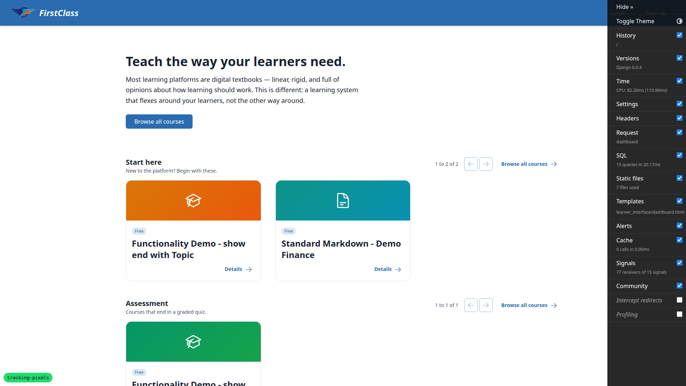
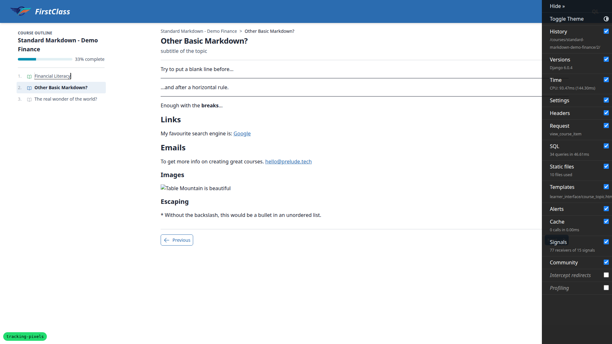
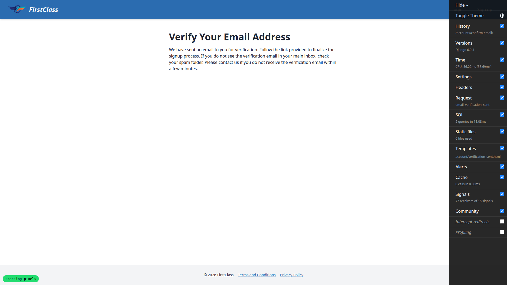
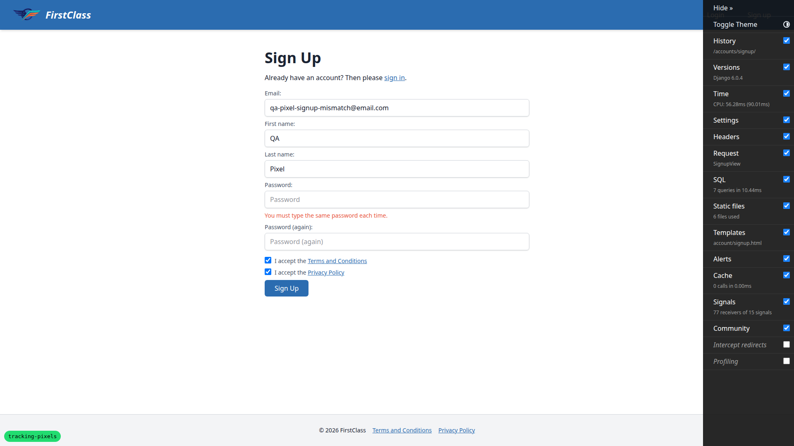
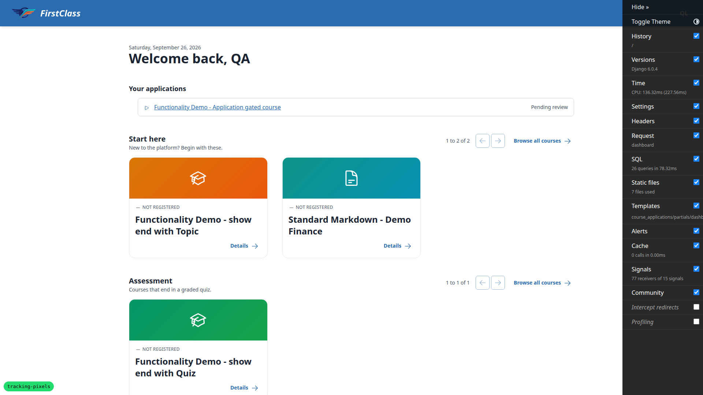
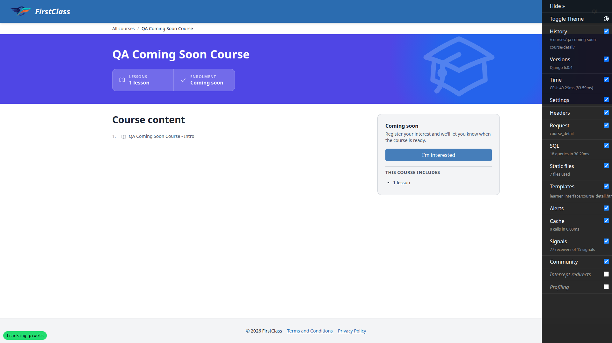
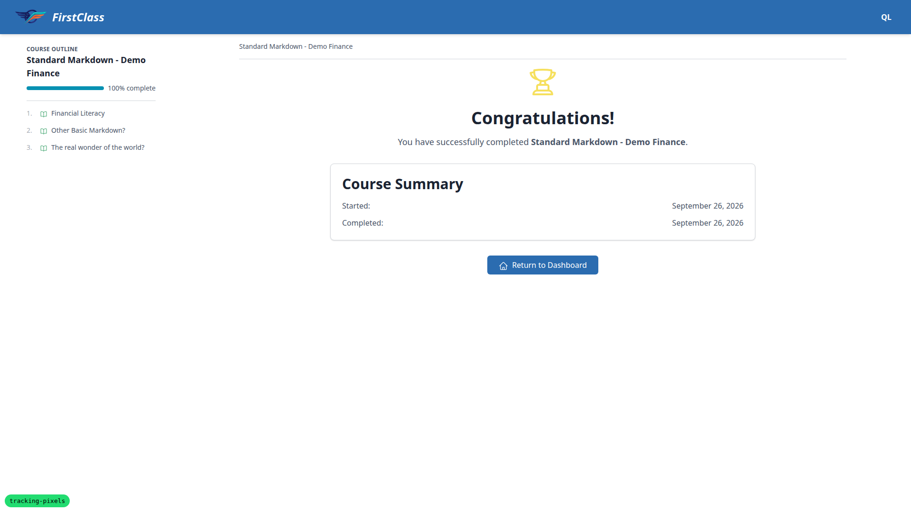
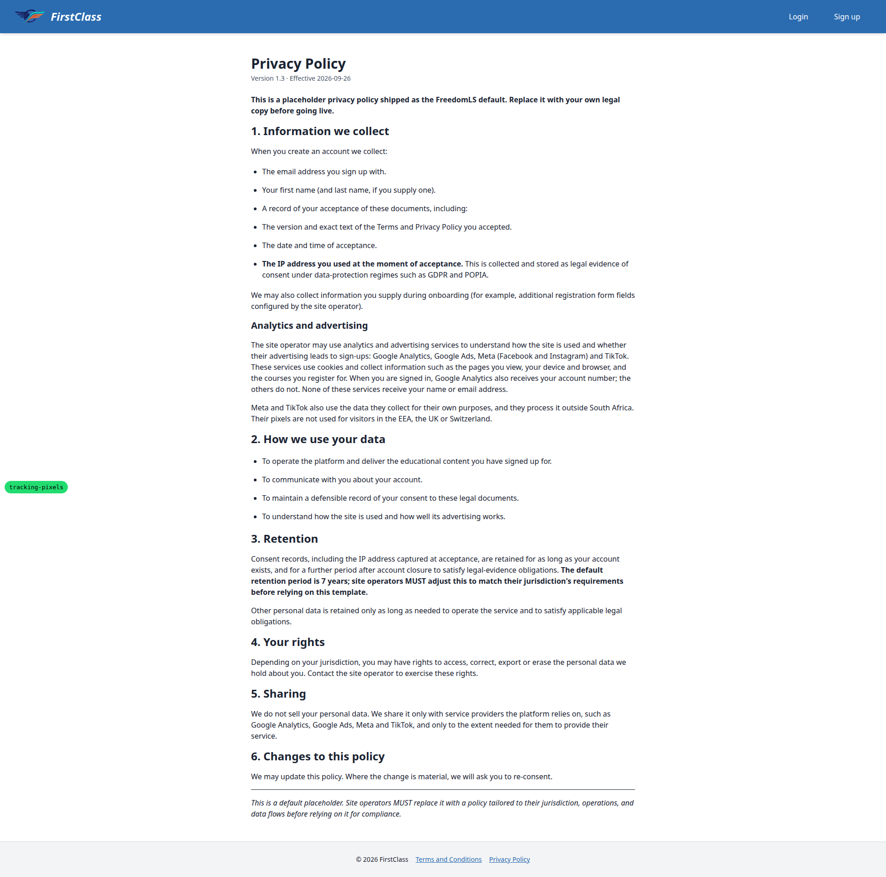
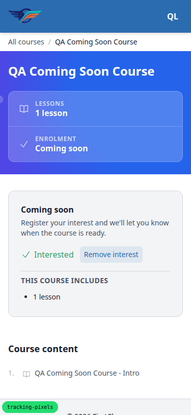
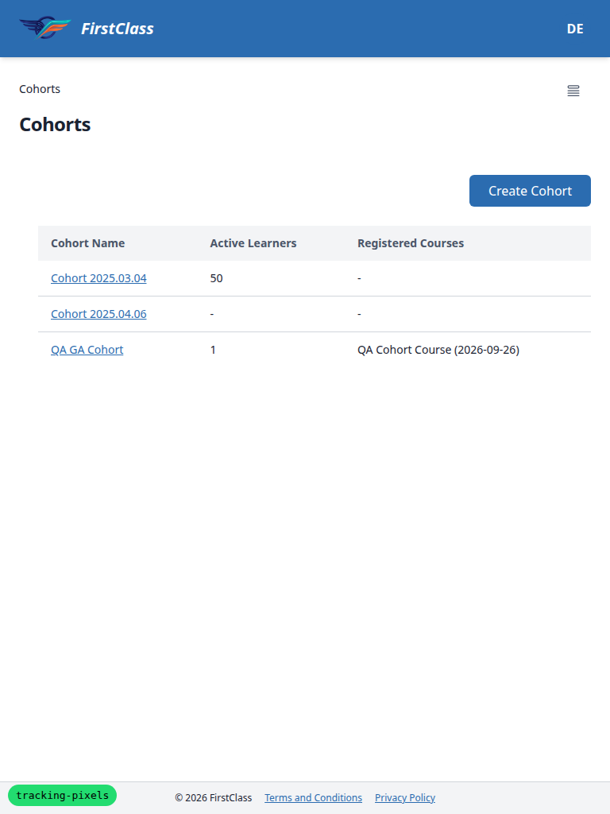

# Frontend QA report: Meta and TikTok pixels

## Methodology

Manual QA with Playwright MCP against a dev server on port 8370. Three viewports:

- Desktop: 1920x1080
- Mobile: 375x812
- Tablet: 768x1024

The visitor-country header was set for the whole browser context with
`page.context().setExtraHTTPHeaders({ 'X-Visitor-Country': '<value>' })`, changed the same way, and
cleared with `setExtraHTTPHeaders({})`. Every request after a call was checked against the new
value.

Fake pixel IDs were used throughout: `META_PIXEL_ID=100000000000001`,
`TIKTOK_PIXEL_ID=QATEST0000000000`. No real test pixels were available, so Meta Events Manager and
TikTok Events Manager Test Events (layer 3) could not be checked; see §3.5 below.

For each navigation, two things were captured: the server-rendered page source
(`document.documentElement.outerHTML`, since event scripts remove themselves from the live DOM) and
the network request list (`browser_network_requests`), read for pixel loader scripts, `/tr/?ev=`
requests and TikTok POSTs.

Screenshots were collected into `screenshots/` beside this report. Every screenshot referenced
below was confirmed to exist in that directory by listing it. The directory also holds three
Playwright `.yml` snapshot files and one console `.log` left by the collection script; none of
those are referenced by this report.

## Diff scoping

Scoping class: **FULL**. Triggering template files:

- `freedom_ls/base/templates/_base.html`
- `freedom_ls/base/templates/_base_interface.html`
- `freedom_ls/base/templates/partials/analytics_events.html`
- `freedom_ls/course_interest/templates/course_interest/partials/express_interest_cta.html`
- `freedom_ls/google_tag/templates/partials/google_analytics.html`
- `freedom_ls/google_tag/templates/partials/google_analytics_events.html`
- `freedom_ls/meta_pixel/templates/partials/meta_pixel.html`
- `freedom_ls/meta_pixel/templates/partials/meta_pixel_events.html`
- `freedom_ls/tiktok_pixel/templates/partials/tiktok_pixel.html`
- `freedom_ls/tiktok_pixel/templates/partials/tiktok_pixel_events.html`

Nothing was skipped because of scoping: desktop, mobile and tablet all ran in full.

## Smoke gate

Outcome: **pass**. Pages checked:

- `/`
- `/educator/` (redirects to `/educator/organisations/demodev/cohorts`)

## Results

### §0.3 System checks

| Test ID | Viewport | Status | Note |
| --- | --- | --- | --- |
| 0.3.1 | shell | PASS | `META_PIXEL_ID=1`, header unset -> `freedom_ls_meta_pixel.W001` |
| 0.3.2 | shell | PASS | `TIKTOK_PIXEL_ID=1`, header unset -> `freedom_ls_tiktok_pixel.W001` |
| 0.3.3 | shell | PASS | `VISITOR_COUNTRY_HEADER=HTTP_X_VISITOR_COUNTRY` -> `freedom_ls_base.E003`, hint names `X-Visitor-Country` |
| 0.3.4 | shell | PASS | Full valid config -> no issues |

### §1 The pixels load only for an allowed visitor

| Test ID | Viewport | Status | Note |
| --- | --- | --- | --- |
| 1.1 | desktop | PASS | ZA, anon `/`: both base codes present (autoConfig before init, no noscript, no disablePushState); `fbevents.js`, one `/tr/?ev=PageView`, `events.js?sdkid=QATEST0000000000`, TikTok POSTs to `/api/v2/pixel` and `/pixel/act` fired even with the fake ID (contrary to the plan's note); `gtag/js?id=G-QATEST0000` |
| 1.2 | desktop | PASS | Header `za` lower case: same as ZA |
| 1.3 | desktop | PASS | Header DE: 0 facebook/tiktok strings, 0 requests to either host; GA4 loads, consent default region list includes "DE" |
| 1.4 | desktop | PASS | GB, CH, NO: nothing from either pixel; GA4 loads |
| 1.5 | desktop | PASS | XX, empty string, header cleared: nothing from either pixel each time; GA4 loads each time |
| 1.6 | desktop | PASS | ZAF: nothing from either pixel |
| 1.7 | desktop | PASS | Superuser, ZA, `/educator/` + two sidebar links (hx-boost): no pixel strings/requests; GA4 present on all |
| 1.8 | desktop | PASS | Superuser on `/`: both pixels back, one PageView |

### §1.1 Token-bearing pages

| Test ID | Viewport | Status | Note |
| --- | --- | --- | --- |
| 1.1.1 | desktop | PASS | Confirmation link (Mailpit): 0 facebook/tiktok/googletagmanager strings or requests |
| 1.1.2 | desktop | PASS | After confirming, redirected to `/`: Meta, TikTok and GA4 all back |
| 1.1.3 | desktop | PASS | Password reset for Learner B: set-password page has no pixel/GA strings or requests; password reset back to the email address |

### §1.2 Unconfigured deployment

| Test ID | Viewport | Status | Note |
| --- | --- | --- | --- |
| 1.2.1-2 | desktop | PASS | Restarted minus `VISITOR_COUNTRY_HEADER`; header ZA, `/`: no facebook/tiktok in source, 0 pixel requests, GA4 present |
| 1.2.3-4 | desktop | PASS | Restarted minus `META_PIXEL_ID` and `TIKTOK_PIXEL_ID`; `/`: nothing from either pixel, GA4 present |

### §2 Page views

| Test ID | Viewport | Status | Note |
| --- | --- | --- | --- |
| 2.1 | desktop | PASS | Learner A, full load of course item 1: exactly one `ev=PageView`, one TikTok POST, one `fbevents.js`, one `events.js` load |
| 2.2 | desktop | PASS | Boosted Next -> item 2: one new `ev=PageView` and one new TikTok POST, no second loader load; no `fbq('track', 'PageView')` inside `#interface-main` |
| 2.3 | desktop | PASS | Course-name breadcrumb is a plain link (full document load), not `hx-push-url` as the plan describes; exactly one PageView per platform |
| 2.4 | desktop | PASS | Back: full reload from history, one PageView per platform, no event script in the DOM |
| 2.5 | desktop | PASS | Distinct pixel hosts this run: `connect.facebook.net`, `www.facebook.com`, `analytics.tiktok.com`; no `analytics-ipv6.tiktokw.us`, no unexpected host |
| 2.6 | desktop | PASS | No CSP report-only violation naming a facebook or tiktok host; only report-only entry is an unrelated demo-content image; TikTok logs "Invalid pixel ID" warnings, expected with the fake ID |

### §3.1 `sign_up`

| Test ID | Viewport | Status | Note |
| --- | --- | --- | --- |
| 3.1.1 | desktop | PASS | Sign-up (ZA): verify-email source has exactly one `fbq('trackCustom', 'SignUp', {"method": "email"})` and one `ttq.track('SignUp', ...)`, beside GA4 `sign_up` and conversion `AW-QATEST000/QAsignup`; network `ev=SignUp` once; event scripts gone from live DOM |
| 3.1.2 | desktop | PASS | Reload: no SignUp in source or network |
| 3.1.3 | desktop | PASS | Re-submitting sign-up with the same email lands on verify-email page with no SignUp |
| 3.1.4 | desktop | PASS | Mismatched passwords: form re-renders with the validation error; no SignUp |
| 3.1.5 | desktop | PASS | DE sign-up: GA4 `sign_up` + conversion only, 0 fbq/ttq, 0 pixel requests; header back to ZA, `/`: only PageView, no SignUp replay |

### §3.2 `course_access_requested`

| Test ID | Viewport | Status | Note |
| --- | --- | --- | --- |
| 3.2.1 | desktop | PASS | Learner B applies to `functionality-demo-application-gated-course` (3-page form): dashboard has exactly one `fbq('track', 'SubmitApplication', ...)` and one matching `ttq.track`, beside GA4 `course_access_requested`; network `ev=SubmitApplication` once |
| 3.2.2 | desktop | PASS | Reload dashboard: only PageView |
| 3.2.3 | desktop | PASS | `qa-application-gated-course-no-form`: one SubmitApplication per platform on the status page; revisiting the apply URL redirects with no second event |
| 3.2.4 | desktop | PASS | `qa-coming-soon-course` "I'm interested": fragment has GA4 `course_access_requested` with `request_kind: interest`, 0 fbq/ttq, no `/tr/` request; "Remove interest" has no events. TikTok's own auto-collected click POSTs fire on the button click regardless (see General notes) |

### §3.3 `course_registered`

| Test ID | Viewport | Status | Note |
| --- | --- | --- | --- |
| 3.3.1 | desktop | PASS | Learner B "Enrol for free" on `qa-free-course-self-registration`: exactly one `fbq('track', 'CompleteRegistration', ...)` and one matching `ttq.track`; no Meta/TikTok call for `course_started` (GA4-only) |
| 3.3.2 | desktop | PASS | Reload: only PageView |
| 3.3.3 | desktop | PASS | Data helper set `is_active=False` on B's registration; re-enrolling reactivates with no CompleteRegistration |

### §3.4 `course_completed`

| Test ID | Viewport | Status | Note |
| --- | --- | --- | --- |
| 3.4.1 | desktop | PASS | Learner A first item: GA4 `course_started` only, nothing for Meta or TikTok |
| 3.4.2 | desktop | PASS | Boosted Next through to Finish Course: swapped content has exactly one `fbq('trackCustom', 'CourseCompleted', ...)` and one matching `ttq.track`, none left in live DOM; network `ev=CourseCompleted` once |
| 3.4.3 | desktop | PASS | Back, Forward (htmx history restore) and reload: only PageView each time, no second CourseCompleted |
| 3.4.4 | desktop | PASS | Data helper nulled Learner A's `completed_time`; typed `/finish/` URL: one CourseCompleted per platform, not one per include point |

### §3.5 Test Events (real IDs only)

| Test ID | Viewport | Status | Note |
| --- | --- | --- | --- |
| 3.5 | desktop | SKIP | Fake pixel IDs were used and no real test pixels were available, so Meta/TikTok Test Events dashboards could not be checked, nor TikTok's handling of custom parameters (the spec's open question) |

### §4 One queue, partial configurations

| Test ID | Viewport | Status | Note |
| --- | --- | --- | --- |
| 4.1-4.2 | desktop | PASS | Full config minus `META_PIXEL_ID`: fresh sign-up has GA4 `sign_up` + conversion and `ttq.track('SignUp', ...)`, 0 fbq, no `ev=` request; reload has no events |
| 4.3 | desktop | PASS | Full config minus `TIKTOK_PIXEL_ID`: fresh sign-up has GA4 `sign_up` + conversion and `fbq('trackCustom', 'SignUp', ...)`, 0 ttq, network `ev=SignUp`; reload has only PageView |
| 4.4 | desktop | SKIP | Restart with full config was not needed: every later test had already run and there were no fixes to re-verify; the server was stopped at the end of the run |

### §5 GA4 did not change

| Test ID | Viewport | Status | Note |
| --- | --- | --- | --- |
| 5.1 | desktop | PASS | Anonymous `/`: consent default, then `config G-QATEST0000 {}`, then `config AW-QATEST000`; signed-in pages add `user_id`, unchanged from main |
| 5.2 | desktop | PASS | GA4 entries seen once each: `sign_up` -> conversion `QAsignup`; `course_registered` -> conversion `QAregistered` -> `course_started`; `course_access_requested` and `course_completed` with no conversion |
| 5.3 | desktop | PASS | Header DE, `/`: GA4 loads, consent default region list includes "DE", no pixel requests |
| 5.4 | desktop | PASS | Superuser on `/educator/` pages: GA4 loads |
| 5.5 | desktop | SKIP | No landing page in FLS core or demo content sets `content_group` (only `_base.html`'s block and the GA partial reference it), so there was no page to check; the template line is unchanged from main |

### §6 Nothing else broke

| Test ID | Viewport | Status | Note |
| --- | --- | --- | --- |
| 6.1 | desktop | PASS | Superuser `/admin/`: 200, no pixel and no GA4 strings, 0 requests to any analytics host |
| 6.2 | desktop | PASS | Nonexistent URL: 404 (DEBUG technical page), no pixel/GA; console shows only the two 404 resource loads |
| 6.3 | desktop | PASS | No JavaScript errors from the pixel blocks; only console noise is an unrelated blocked cross-origin demo-content image; TikTok logs expected "Invalid pixel ID" warnings |
| 6.4 | desktop | PASS | Privacy policy version 1.3: "Analytics and advertising" names Google Analytics, Google Ads, Meta (Facebook and Instagram) and TikTok; account-number sentence scoped to Google Analytics; Meta/TikTok data use and processing location sentence present; EEA/UK/Switzerland exclusion sentence present; Section 5 Sharing names the same four |
| 6.5 | desktop | PASS | `POSTHOG_API_KEY` not set this run; `posthog.init(` absent from `/` source |

### Mobile

| Test ID | Viewport | Status | Note |
| --- | --- | --- | --- |
| M.1 | mobile | PASS | 375x812, Learner A, ZA: `/`, and two course detail pages each 200 with one PageView and one TikTok loader; no horizontal overflow; no visible pixel elements in the body |
| M.2 | mobile | PASS | "I'm interested" swaps in place to "Interested / Remove interest"; fragment has GA4 `course_access_requested` only, no fbq/ttq, no `/tr/` request; no overflow; Remove interest restores the button |

### Tablet

| Test ID | Viewport | Status | Note |
| --- | --- | --- | --- |
| T.1 | tablet | PASS | 768x1024, ZA: `/` and course item 1 load both pixels with one PageView each, no horizontal overflow; superuser `/educator/` cohorts table fits, 0 pixel requests, GA4 present |

## Per-bug sections

No test failed in this run. There are no bugs to document.

## Bug status

No bugs found in this run.

## General notes

- Pixel IDs: fake IDs used throughout (`META_PIXEL_ID=100000000000001`,
  `TIKTOK_PIXEL_ID=QATEST0000000000`). Layers 1 (source) and 2 (network) were checked; layer 3
  (Test Events) was not possible. Contrary to the plan's note, TikTok's loader did return a script
  with the fake ID and sent `/api/v2/pixel` POSTs (PageView) plus "[TikTok Pixel] - Invalid pixel
  ID" console warnings; `ttq.track` events did not appear as separate network POSTs with the fake
  ID.
- TikTok auto-collected clicks: the TikTok pixel sends `/api/v2/pixel/act` and `/pixel/inter` POSTs
  on button clicks site-wide, carrying the button's tag, class, inner text and xpath (e.g. "Submit
  application"). This is TikTok's default automatic click collection, not an FLS event. Meta's
  equivalent is switched off by `autoConfig false`; the spec leaves TikTok's automatic settings to
  Events Manager. Worth a look by whoever owns the TikTok account settings.
- Test plan drift: §2.3 describes the course-name breadcrumb as `hx-push-url`, but it is a plain
  link that does a full page load. §3's live-DOM check (no script whose text includes `fbq('track`)
  also matches the head base code's `fbq('track', 'PageView')`; the check was run excluding that
  base code.
- Environment: the dev DB had no DemoDev site at start; ran `create_demo_data --yes`, `content_save
  demo_content DemoDev` and `qa_create_ga_setup_seed` before testing. The Django debug toolbar
  covered course buttons and was hidden with an injected style for the run.
- Unrelated console noise: demo content embeds an image from `www.sanparks.org` that is blocked
  cross-origin (`ERR_BLOCKED_BY_RESPONSE.NotSameOrigin`) and trips the report-only `img-src` CSP.
- Screenshots dir also contains 3 Playwright snapshot `.yml` files and one console `.log` moved by
  the collect script; they are not referenced by this report.
- Not exercised in the browser, per the plan: `generate_lead`, unmapped downstream events,
  recording with no platform app, removing a platform app from `INSTALLED_APPS` (all unit-tested).

**Skip reasons:**

- **3.5** (Test Events): fake pixel IDs were used because no real test pixels were available, so
  Meta and TikTok's Test Events dashboards could not be checked, and TikTok's handling of the
  custom parameters (the spec's open question) could not be observed.
- **5.5** (`content_group` on a landing page): no landing page in FLS core or demo content sets
  `content_group`, so there was no page to run the check against; the relevant template line is
  unchanged from main.
- **4.4** (restart with full configuration): skipped because every later test in the run had
  already executed and there were no fixes needing re-verification; the server was stopped at the
  end of the run instead.

---

status: ok · reason: report rendered, 0 bugs documented
