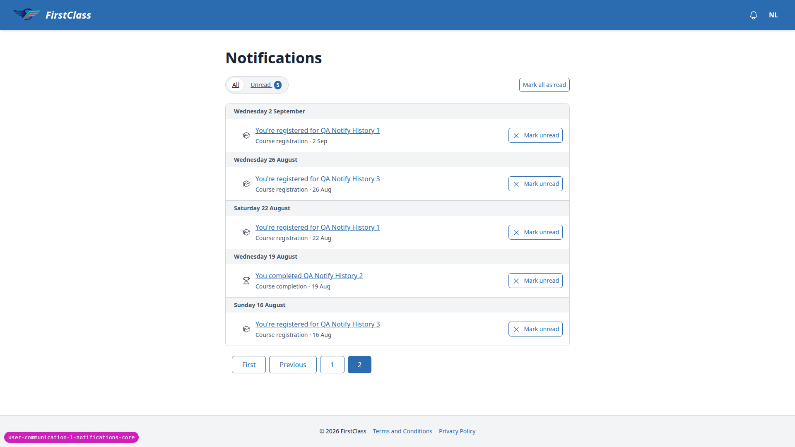
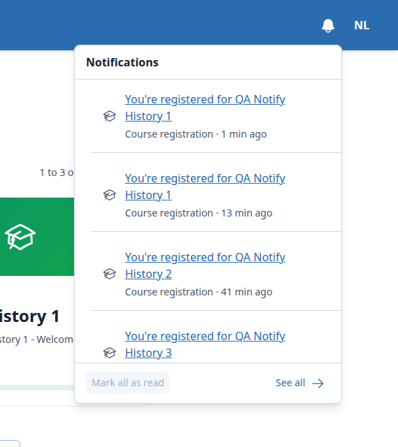
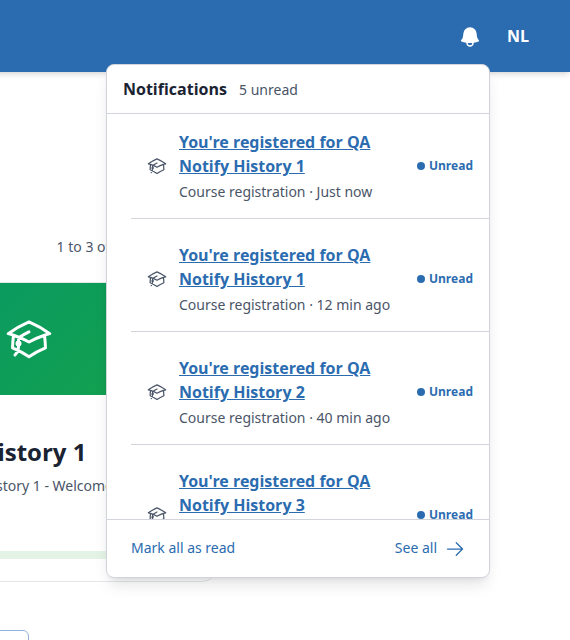
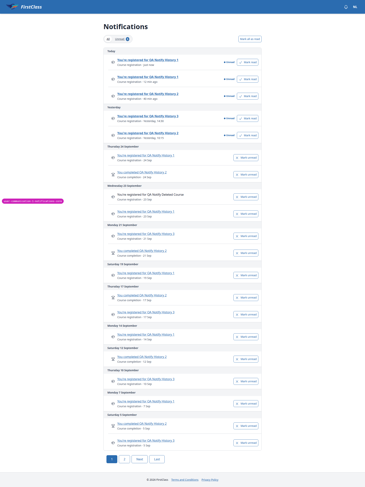
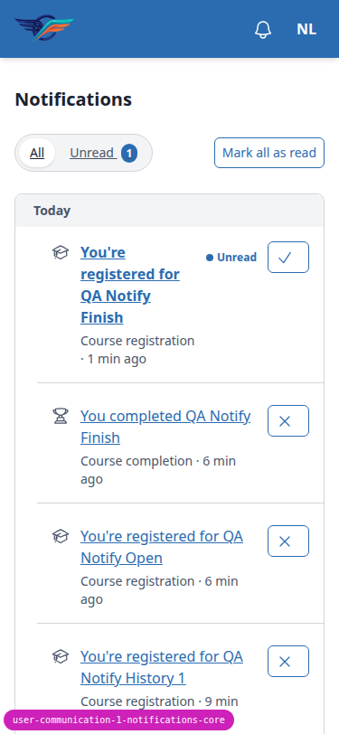

# Frontend QA report: notifications-core

## 1. Methodology

Manual walkthrough with the Playwright MCP by a depth-0 QA agent, following
`3. frontend_qa.md`. Three viewports were exercised: desktop at 1920x1080 (dropping to
1280x1080 for §8, the accessibility pass, per the test plan), mobile at 375x812, and tablet
at 768x1024. Screenshots were collected into `screenshots/` beside this report; every image
referenced below exists in that folder.

Harness notes from the run:

- The Django debug toolbar was removed via the init script before interaction (it otherwise
  sits over parts of the header on narrow viewports); this produces a harmless `toolbar.js`
  TypeError in the console, not a product bug.
- The dev DB had no `DemoDev` site at the start of the run, causing a 500 on the home page
  (`FORCE_SITE_NAME=DemoDev` matched no `Site`). This was a data problem, fixed per the
  harness's data rules by running `create_demo_data --yes` via the QA data helper, which also
  added the `qa_create_notification_scenarios` management command used to seed the
  notification fixtures.
- Seed data was rebuilt three times with `qa_create_notification_scenarios`, because opening
  the centre or panel marks rows seen, so sections that needed unseen/unread state had to be
  re-seeded between sections.
- Tab hiding for the §2.3 polling check was simulated: Playwright keeps background tabs
  reporting `visible`, so the test overrode `document.visibilityState` and dispatched a
  `visibilitychange` event by hand rather than truly switching tabs.
- Learner B initially lacked a `Learner` profile, which blocked the admin autocomplete used in
  §5.6; the QA data helper added the profile and updated the seed command.

## 2. Diff scoping

Scoping class: **FULL**.

Changed files that triggered FULL scope:
- `freedom_ls/base/templates/_base.html`
- `freedom_ls/base/templates/partials/header_bar.html`
- `freedom_ls/comms/static/comms/js/alpine-components.js`
- `freedom_ls/comms/templates/comms/*.html`
- `freedom_ls/comms/*.py`
- `freedom_ls/learner_interface/views.py`
- `freedom_ls/learner_progress/signals.py`
- `config/settings_base.py`
- `config/urls.py`

Desktop, mobile, and tablet all ran in full. Nothing was skipped.

## 3. Smoke gate

Result: **pass**. Pages checked: `/`, `/notifications/`.

## 4. Results summary

| test_id | viewport | status | note |
| --- | --- | --- | --- |
| 1.1 | desktop | pass | Bell left of avatar, badge 3, accessible name "Notifications, 3 new" |
| 1.2 | desktop | pass | Course player for QA Notify Finish still shows bell with badge 3 |
| 1.3 | desktop | pass | Educator interface (/educator/) shows bell with badge 1 |
| 1.4 | desktop | pass | Learner C badge "99+", accessible name "Notifications, 120 new" |
| 1.5 | desktop | pass | Anonymous home page 200, no bell rendered |
| 1.6 | desktop | pass | Avatar menu opens/closes with Escape, Profile link works, bell unaffected |
| 2.1 | desktop | pass | Badge 3->4 ~38s after shell raise, no reload, one badge request |
| 2.2 | desktop | pass | Badge refreshed to 5 with focus retained on the same bell DOM node |
| 2.3 | desktop | pass | Hidden tab (simulated): 0 requests in 50s; on visible, badge 5->6 within 112ms |
| 2.4 | desktop | pass | Server down 50s: badge holds last count (6), no error text, not 0 |
| 3.8 | desktop | pass | Failure branch: "Couldn't load your notifications." + Try again; retry loads rows |
| 3.1 | desktop | pass | Panel opens under bell, single request, badge clears same swap (stale CSS build noted separately) |
| 3.2 | desktop | pass | Rows show icon, message, label, relative time, Unread marker/weight; deleted-course row plain text |
| 3.3 | desktop | pass | Escape closes panel and returns focus to bell; outside click closes it |
| 3.4 | desktop | pass | Badge stays hidden after reload (opening the panel marked rows seen) |
| 3.5 | desktop | pass | Enter opens the panel from the bell; Space toggles it |
| 3.6 | desktop | pass | Mark all as read clears markers/heading/enables-disables button (focus loss flagged in B3) |
| 3.7 | desktop | pass | See all navigates to /notifications/ |
| 4.1 | desktop | pass | Centre heading and toolbar (All/Unread/Mark all as read) present |
| 4.2 | desktop | fail | Day headings and pagination correct, but URL stays /notifications/ on page 2 (B2) |
| 4.3 | desktop | fail | Unread filter works and paginates correctly, but URL never carries filter=unread (B2) |
| 4.4 | desktop | pass | Mark read/unread toggle works, keeps focus on the toggle |
| 4.4b | desktop | fail | Mark unread on centre page 2 swaps back to page 1, losing place and focus (B1) |
| 4.5 | desktop | pass | Badge stays 0 after mark unread and after reload |
| 4.6 | desktop | pass | Message link resumes the course; row is read on return |
| 4.7 | desktop | pass | Deleted-course row is plain text; its /open/ redirects to /notifications/ and marks it read |
| 4.8 | desktop | pass | Mark all as read shows up-to-date banner, disables button; repeat POST is a no-op |
| 4.9 | desktop | pass | Unread filter shows "No unread notifications." |
| 4.10 | desktop | pass | Fresh signup: "Nothing yet." empty state, no Mark all as read button |
| 5.1 | desktop | pass | Self-registration raises exactly one course.registered notification, shown in panel |
| 5.2 | desktop | pass | Re-visiting the register URL raises no second notification |
| 5.3 | desktop | pass | Reactivating a deactivated registration is silent, no notification |
| 5.4 | desktop | pass | Finishing a course raises a course.completed notification |
| 5.5 | desktop | pass | Reloading the finish page twice still leaves exactly one completion notification |
| 5.7 | desktop | pass | WebhookEvent rows still created for both events; notifications didn't replace webhooks |
| 5.6 | desktop | pass | Admin-created registration raises exactly one notification for Learner B |
| 6.1 | desktop | pass | Cross-user /open/ on another learner's UUID: 404 |
| 6.2 | desktop | pass | Cross-user POST read/ and unread/: 404 each |
| 6.3 | desktop | pass | Other learner's rows unchanged by the failed cross-user attempts |
| 6.4 | desktop | pass | Learner B's own read-all doesn't affect Learner A's unread rows |
| 6.5 | desktop | pass | GET on a user's own read/ URL: 405 |
| 6.6 | desktop | pass | Zero-UUID and non-UUID /open/: 404 both |
| 6.7 | desktop | pass | Logged out: redirect to login with next; HTMX badge/panel return 204 + HX-Redirect |
| 6.8 | desktop | pass | Expired session: clicking the bell navigates to login, no login form swapped in |
| 8.1 | desktop | pass | Bell has focus-visible ring, correct accessible name, badge region role=status |
| 8.2 | desktop | fail | Keyboard-activated Mark all as read drops focus to body inside the open panel (B3) |
| 8.3 | desktop | pass | sr-only "Unread." precedes each unread row's link (audibly doubled with the visible marker) |
| 8.4 | desktop | pass | All <time> elements have datetime (ISO) and a title with the absolute time |
| 7.1 | mobile | pass | No horizontal overflow; panel is a full-screen sheet with Close button, focus returns to bell |
| 7.2 | mobile | pass | Row actions are correctly labelled icon buttons, focus ring visible (touch-target size noted, see below) |
| 7.3 | mobile | pass | Mobile pagination shows Previous/Page X of Y/Next form |
| T.1 | tablet | pass | Gets the desktop dropdown panel (384x514, internal scroll), no overflow |
| T.2 | tablet | pass | Toolbar on one line, no horizontal overflow |
| 3.2v | desktop | fail | Row `<ul>` picks up the global list-disc/ml-6 base style, 24px left indent (B4) |

## 5. Bugs

### B1: Mark read/unread on page 2+ of the centre jumps back to page 1

Manifestations:
- 4.4b (desktop)

Expected: marking a row read/unread re-renders the page the user is on (e.g. page 2) with the
row's new state, keeping the user's place.

Actual: the list swaps to page 1; the acted-on row disappears from view and focus drops to
`<body>`. `notification_row.html` builds `hx-post` URLs with `?filter=unread` but never the
current page, and `_list_context` paginates from `request.GET['page']`, so the mark response
always renders page 1.

No dedicated screenshot was captured for this bug.

### B2: Centre page and filter changes do not update the address bar

Manifestations:
- 4.2 (desktop)
- 4.3 (desktop)

Expected: per the QA plan, after clicking page 2 the URL carries `?page=2`, and after Unread
it carries `filter=unread` (so reload/back/share keep the view).

Actual: the list swaps in place but the URL stays `/notifications/`. Neither `c-pagination`
nor the filter links set `hx-push-url`. The spec for `notification_list` only requires the
fragment swap, and `c-pagination` never pushes URLs anywhere else in FLS, so whether to push
is a product decision.

### B3: Keyboard focus is lost to `<body>` after Mark all as read (panel and centre)

Manifestations:
- 8.2 (desktop)
- 3.6 (desktop)

Expected: after activating Mark all as read (or Mark read in the Unread view, which removes
the row) with the keyboard, focus lands somewhere sensible inside the surface (e.g. the panel
heading or list).

Actual: the HTMX swap replaces the focused button (which is now disabled anyway), focus falls
to `<body>` while the panel stays open, and the next Tab leaves the panel for the user menu.
Where focus should go is a UX decision.

### B4: Notification row lists indented 24px by the global `ul` base style

Manifestations:
- 3.2v (desktop)
- 7.2 (mobile)
- T.2 (tablet)

Expected: rows and their dividers span the panel/card width like the day headings, as other
FLS lists do via `list-none ml-0`.

Actual: the `<ul class="divide-y divide-border">` in `notification_panel.html` and
`notification_list.html` inherits `ml-6` (24px) and `list-disc` from
`tailwind.components.css`, so rows are inset on the left only while dividers and headings
span full width.

## Bug status

- **FIXED** (commit: c380b9f6) — Mark read/unread on page 2+ of the centre jumps back to page 1 (B1). Re-verified in the browser: the row's hx-post carries `?page=2` and the list stays on "Page 2 of 2".
- **UNRESOLVED** — Centre page and filter changes do not update the address bar (B2) (reason: product decision, since the spec doesn't require URL push and `c-pagination` never pushes)
- **UNRESOLVED** — Keyboard focus is lost to `<body>` after Mark all as read (panel and centre) (B3) (reason: UX decision on where focus should land)
- **UNRESOLVED** — Notification row lists indented 24px by the global `ul` base style (B4) (reason: visual-only, red lane; likely fix is `list-none ml-0` on both lists)

## 6. General notes

- **Stale Tailwind build.** `static/vendor/tailwind.output.css` (a gitignored build artefact)
  was stale at the start of the run, missing `sm:max-h-[32rem]`. The first panel open rendered
  1020px tall with its footer below the fold at 1080px. Running `npm run tailwind_build` fixed
  it: the panel is 514px with an internal scroller. This is a build artefact problem, not a
  code defect; anyone QAing this branch needs to rebuild Tailwind first.
- **Minor observations, no action taken:**
  - At 375px, row icon buttons (Mark read/unread) are 46x35, under the 44px touch-target
    height guideline.
  - Unread rows expose both a visible "Unread" marker and an sr-only "Unread." prefix on the
    link, so screen reader users hear "unread" twice per row.
  - `login_required_htmx` always sends `next=/notifications/`, not the page the user was
    actually on, per the view's own docstring — deliberate, not a bug.
  - `notification_badge.html` has a comment referencing a "slice 5" plan history.
- **Untracked file.** `freedom_ls/qa_helpers/management/commands/qa_create_notification_scenarios.py`
  was added by the QA data helper during this run to seed the notification test fixtures and
  is currently untracked in git.

---
status: ok
reason: 4 bugs — 1 fixed, 3 unresolved; report rendered, screenshots verified
