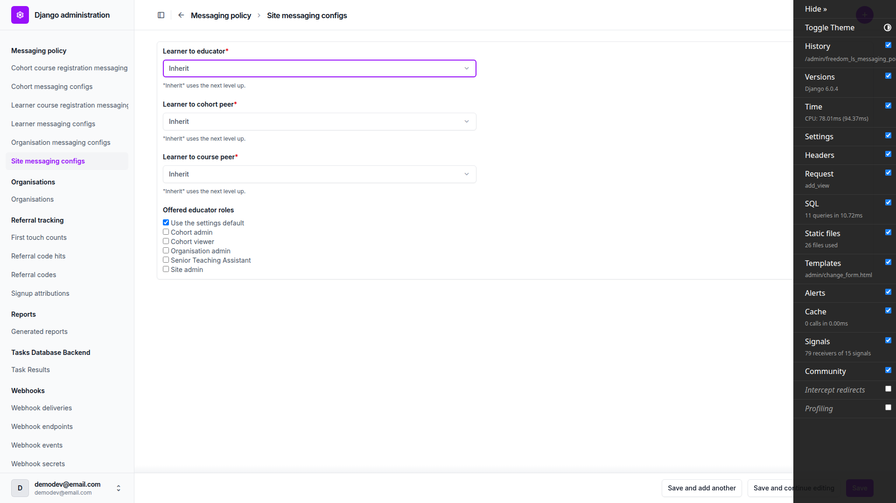
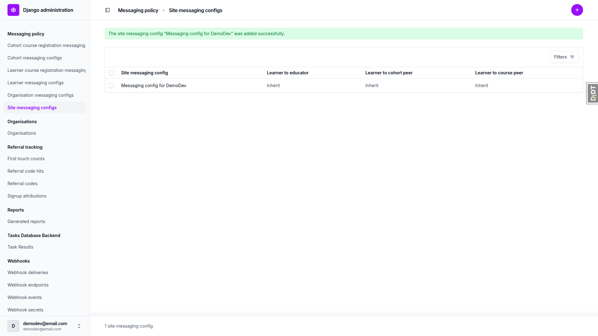
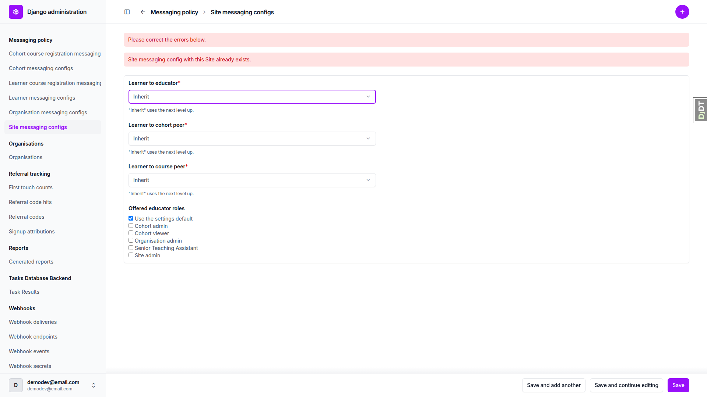
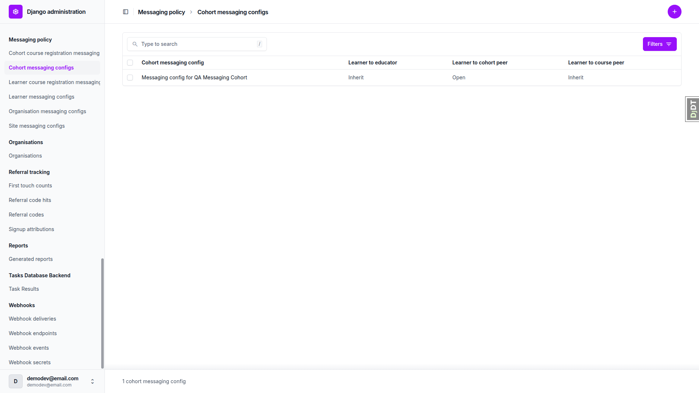
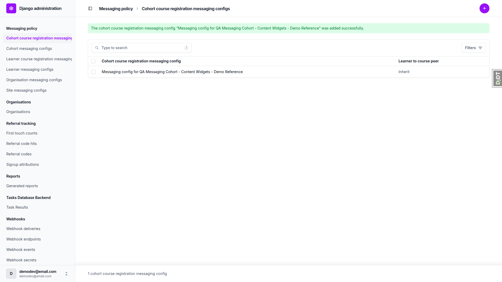
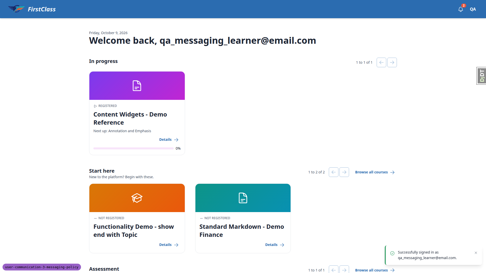
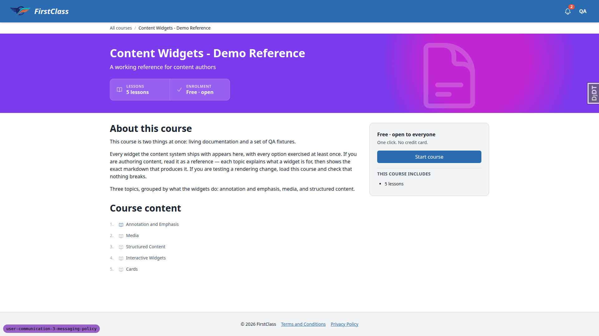
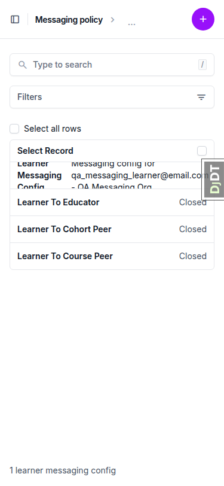
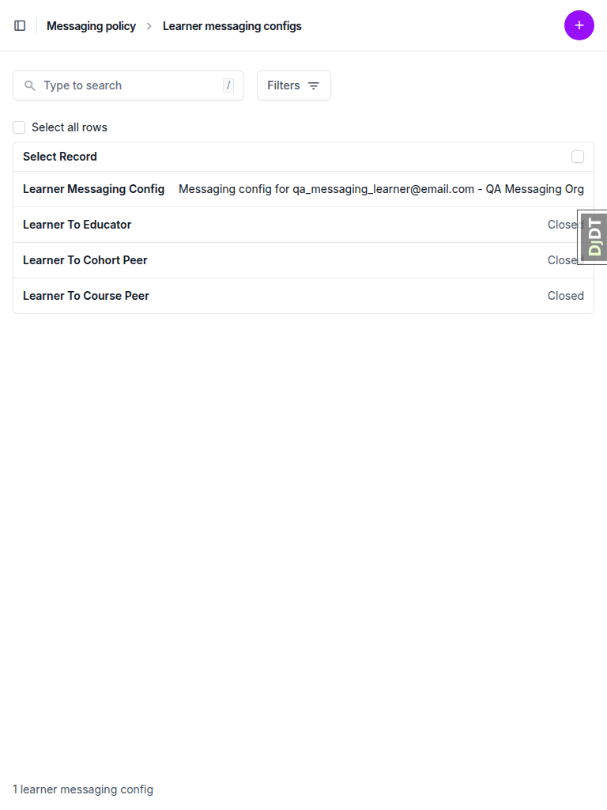

# Frontend QA Report: user-communication-3-messaging-policy

Run date: 2026-10-09. Branch: user-communication-3-messaging-policy. Dev server port: 8804. Tool: Playwright MCP. Viewports: desktop 1920x1080, mobile 375x812, tablet 768x1024. Step 0 (rebase) was skipped at the user's request.

Summary: the feature surface is Django admin only. The smoke gate passed and all tests passed except one mobile changelist test, which is documented as bug B1.

## Methodology

Screenshots were collected into `screenshots/` beside this report, and every referenced image was checked to exist. Seed data was created by the qa-data-helper agent. The dev DB was empty, so it ran `create_demo_data` and then `content_save`.

## Diff scoping

Class: FULL. Rule 4 fired because non-.py files changed (.md, .toml, `.secrets.baseline`), so the safe default of FULL applied. No templates or static files changed. Changed areas: `freedom_ls/messaging_policy/*`, `freedom_ls/comms/*`, `learner_management/capabilities.py` and `queries.py`, `config/settings_base.py`, `test_organisation/import_contracts.toml`, docs, spec and skill files. Not run: nothing.

## Smoke gate

Status: pass. Pages checked:
- http://127.0.0.1:8804/ (logged in as demodev)
- http://127.0.0.1:8804/admin/freedom_ls_messaging_policy/sitemessagingconfig/add/

No failure URL or reason.

## Results

| Test | Viewport | Status | Notes | Screenshot |
|---|---|---|---|---|
| 1.1 | desktop | pass | Admin index shows "Messaging policy" section with all six models, each with an add link. | none |
| 1.2 | desktop | pass | All six changelists return 200 with zero rows and an Add link. | none |
| 2.1 | desktop | pass | Three flag dropdowns default to Inherit with help text; no Site field; offered roles as expected (Senior Teaching Assistant is a DemoDev custom role). Saved row shows Inherit x3. |   |
| 2.2 | desktop | pass | Second add stays on form with "Site messaging config with this Site already exists."; no server error. |  |
| 2.3 | desktop | pass | Cohort admin + Cohort viewer ticked, Learner to educator Open; persisted on reload. |  |
| 2.4 | desktop | pass | All boxes unticked saves and reloads empty (does not snap back to default). |  |
| 2.5 | desktop | pass | Default + Site admin rejected with "Choose either the settings default or specific roles, not both."; reload shows 2.4 state. |  |
| 2.6 | desktop | pass | Injected value made_up_role rejected with "Select a valid choice"; row unchanged on reload. |  |
| 2.7 | desktop | pass | Ticking only the settings default saves and reloads with only the default ticked. | none |
| 3.1-3.3 | desktop | pass | Organisation autocomplete finds "QA Messaging Org"; three flag dropdowns present; saved Inherit/Closed/Inherit. |  |
| 3.4 | desktop | pass | Duplicate rejected: "Organisation messaging config with this Organisation already exists." | none |
| 3.5 | desktop | pass | Organisation change page has only name/logo plus cohort and learner inlines; no messaging fields or inline. |  |
| 4.1-4.2 | desktop | pass | Cohort autocomplete picks "QA Messaging Cohort"; saved Inherit/Open/Inherit. | none |
| 4.3 | desktop | pass | Filter =Open shows the row; =Closed shows "No results found". |  |
| 4.4 | desktop | pass | Delete via confirmation works; changelist empty; cohort change page still 200. | none |
| 5.1-5.2 | desktop | pass | Learner autocomplete shows email and organisation; saved with Closed x3. |  |
| 5.3 | desktop | pass | Duplicate rejected: "Learner messaging config with this Learner already exists." | none |
| 6.1 | desktop | pass | Form has only Registration autocomplete + "Learner to course peer"; saved Open; changelist shows the row. |  |
| 6.2 | desktop | pass | Only Registration + "Learner to course peer"; cohort course registration picked, Inherit saved. |  |
| 7.1-7.3 | desktop | pass | Delete first refused by a pre-existing PROTECT from a CourseProgress record; qa-data-helper deleted it. Confirmation then listed "Learner course registration messaging configs: 1"; changelist empty after delete. Registration recreated (new pk 0acc32e7-a874-43dd-8dd2-9150356491f7). |  |
| 8.1 | desktop | pass | Learner, Cohort, LearnerCourseRegistration, CohortCourseRegistration changelists and forms have no messaging fields or inlines. | none |
| 8.2 | desktop | pass | /admin/freedom_ls_comms/ returns 404; comms has no admin module on main or this branch, so unchanged (see General notes). | none |
| 8.3 | desktop | pass | As qa_messaging_learner, dashboard and course detail show no messaging/chat/inbox entry point. |   |
| 2.x-form | mobile | pass | Site config form at 375px: no horizontal overflow, selects full width, buttons stack. Offered-roles checkboxes are unstyled browser defaults (cosmetic). |  |
| 5.x-changelist | mobile | fail | First card row clipped top and bottom (fixed-height, overflow-hidden Unfold cells). Same on site and cohort-course-registration config changelists and on the existing Course changelist. See B1. |  |
| 5.x-changelist | tablet | pass | 768px: table layout, no clipped cells, no horizontal overflow. |  |
| 2.x-form | tablet | pass | 768px: form fits, selects 672px wide, no overflow. |  |

## Design check

No design states tested.

## B1: Messaging config names clipped in mobile changelist cards

Manifestations:
- 5.x-changelist, mobile

Expected: at 375px the changelist card shows the full config name (or a readable truncation) for each row.

Actual: the first card row (long column label plus long "Messaging config for <owner>" `__str__`) wraps to 3+ lines inside a fixed-height overflow-hidden cell, so the text is cut off top and bottom. It affects the learner, site and cohort-course-registration messaging config changelists. The existing Course changelist clips the same way, so the root cause is the shared Unfold mobile card styling.

## Bug status

| Bug | Title | Status |
|---|---|---|
| B1 | Messaging config names clipped in mobile changelist cards | **FIXED** (shared FLS admin stylesheet lets changelist card cells grow below lg; also fixes the Course changelist) |

## General notes

- (a) Test-plan error in 8.2: `/admin/freedom_ls_comms/` 404s because comms has no admin module on main or this branch. The plan should drop or correct that step.
- (b) Section 7 needed a pre-existing protected CourseProgress record deleted before the registration could be deleted. The plan's section 7 should mention that, or section 0.2 should seed the registration without progress.
- (c) Offered-roles checkboxes use plain Django CheckboxSelectMultiple, rendering unstyled browser-default checkboxes (13px, 17px-tall rows) unlike the Unfold-styled controls around them. They work correctly; cosmetic only.
- (d) On organisation, cohort and learner config forms the owner autocomplete renders after the three flags, while on the two registration config forms "Registration" renders first. The field order is inconsistent; cosmetic.
- (e) The DemoDev site lists a custom "Senior Teaching Assistant" role in offered roles (from `config/role_based_permissions/demodev.py`). This is expected; the plan's list of four is the base set.
- (f) The Django debug toolbar overlapped the Save button at 1920x1080 until hidden; dev-only.

status: ok
reason: 1 bug — 0 fixed, 1 unresolved; report rendered, screenshots verified
