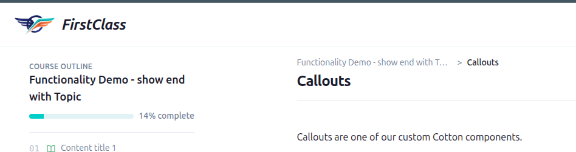

This is a list of bugs that I've found. There might be more. Fix them using TDD.

1. When opening up a course as a student the screen loads in a weird way
http://127.0.0.1:8181/courses/functionality-demo-show-end-with-topic/2/

Current behavior: On first load: the main content appears in the left hand panel, the main content area is empty. Then the main content moves over to where it should be and the the table of contents gets populated
What we want: Things should render where they are supposed to be. They shouldn't jump around so much.

2. In the course player, there is too much whitespace under the header area of the main content
http://127.0.0.1:8181/courses/functionality-demo-show-end-with-topic/2/

There is a bottom border under the header area and then a big gap before the content starts. Make it smaller.

3. Educator interface create cohort doesn't update table immediately
http://127.0.0.1:8181/educator/cohorts

I choose to create a cohort, then chose "Save and add another". When I close the modal then the new cohort is not present in the cohorts table until I refresh the page.
