# QA Report: Visual Bug Hunt

**Date:** 2026-06-09
**Branch:** `visual-bug-hunt` (confirmed via debug-branch-badge)
**Site:** DemoDev (dev `FORCE_SITE_NAME = "DemoDev"`)
**Server:** local `runserver` on port 8979
**Account:** `demodev@email.com`
**Viewports tested:** Desktop 1920×1080, Mobile 375×812, Tablet 768×1024

## Summary

All three fixes were verified in the browser via Playwright MCP. **All three tests pass.
No bugs were found.** The course player and educator cohorts behave as the spec
describes across desktop, mobile, and tablet.

| Test | Bug | Result |
|------|-----|--------|
| 1 | No layout shift on cold course-player load | ✅ Pass |
| 2 | Reduced whitespace under the player header | ✅ Pass |
| 3 | "Save and add another" refreshes the cohorts table | ✅ Pass |

### Test data note

The DemoDev site started with **no courses** (`/courses/` showed "No courses
available yet."), so the student-player tests could not run as-is. As required by
the QA process, test data was created by the **`fls:qa-data-helper`** agent (not by
hand): it loaded the standard demo course `functionality-demo-show-end-with-topic`
onto DemoDev via the canonical `content_save` loader and enrolled `demodev@email.com`
in it. Educator cohorts data already existed, so Test 3 needed no new data.

---

## Test 1 — Bug 1: no layout shift on cold course-player load ✅

Loaded a topic page cold (`/courses/functionality-demo-show-end-with-topic/2/`,
"Callouts") at each viewport.

- **Desktop:** main content renders **full-width in the content area** on load; the
  outline is docked in the left column. Content is not trapped in, nor does it jump
  out of, the narrow outline column.
  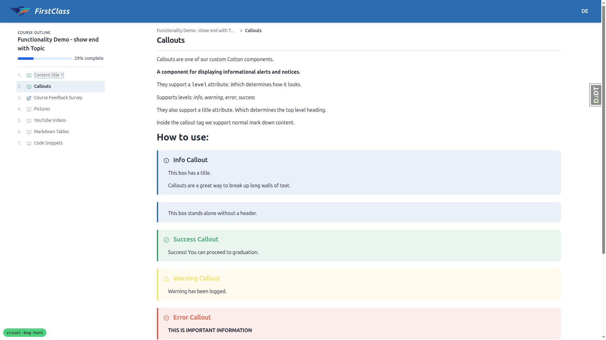
- **Mobile:** content renders full-width; the outline is collapsed behind a
  table-of-contents toggle in the header. Tapping the toggle opens the outline as a
  bottom-sheet **overlay** with a dimmed backdrop and the current item highlighted;
  pressing Escape closes it cleanly.
  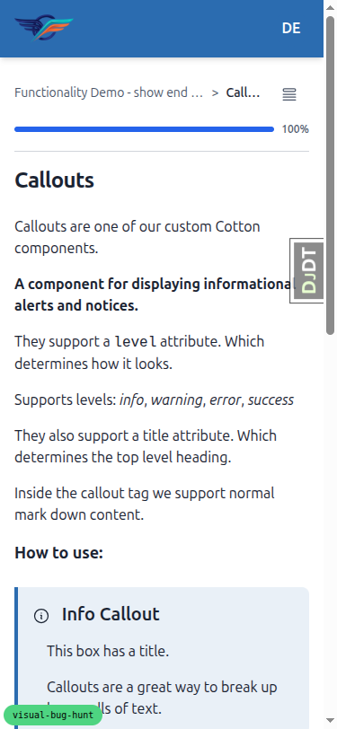
  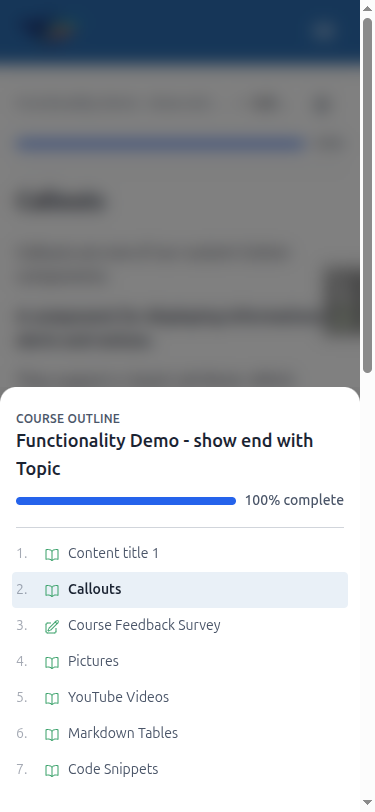
- **Tablet:** uses the collapsed-outline + toggle layout (mobile-style nav); content
  full-width, no shift.
  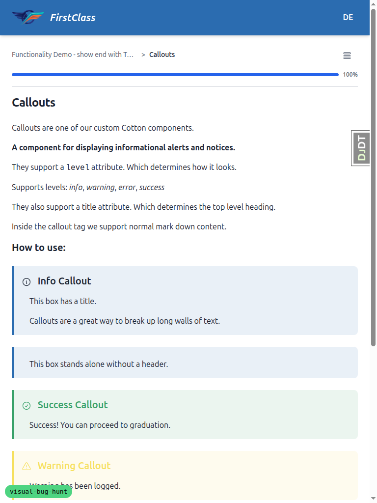
- **HTMX navigation:** clicking **Next** swapped the content and the outline together
  correctly (topic → form intro), the outline highlight tracked the active item, and
  content stayed full-width — no regression.
  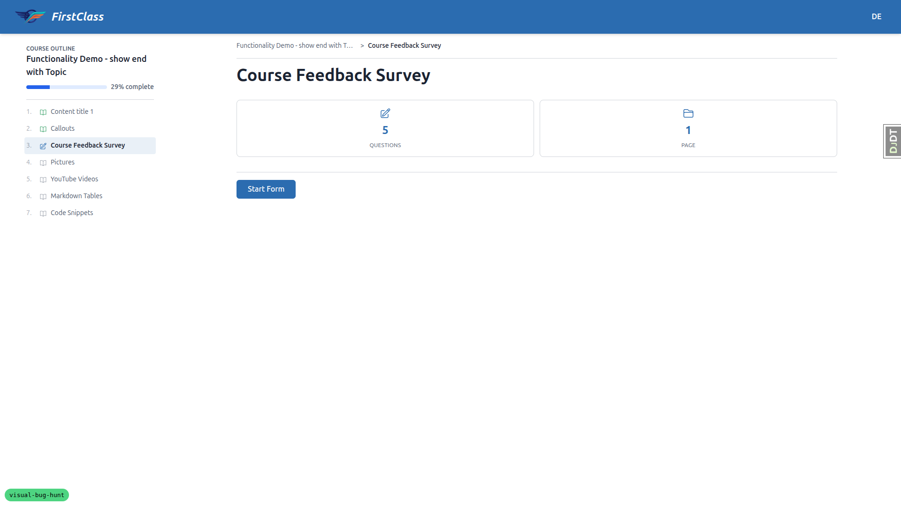

**Expected:** content full-width on first paint, outline in the second column /
overlay. **Actual:** matches expected. No flash of content inside the outline column
was observed.

---

## Test 2 — Bug 2: reduced whitespace under the player header ✅

Checked the gap between the header's bottom border and the first line of body content
across the player screens.

- **Topic page** (desktop + mobile + tablet): the gap below the header border is
  tight and looks intentional — roughly the header's own padding — with content
  sitting high on the page. (See the Test 1 screenshots above.)
- **Form intro page:** same reduced gap.
  
- **Form-complete screen** (`/3/complete`): same reduced gap.
  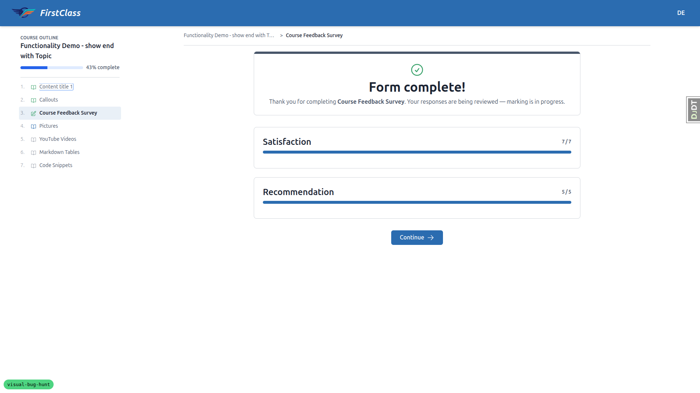
- **Course-finish screen** (`/finish/`): same reduced gap.
  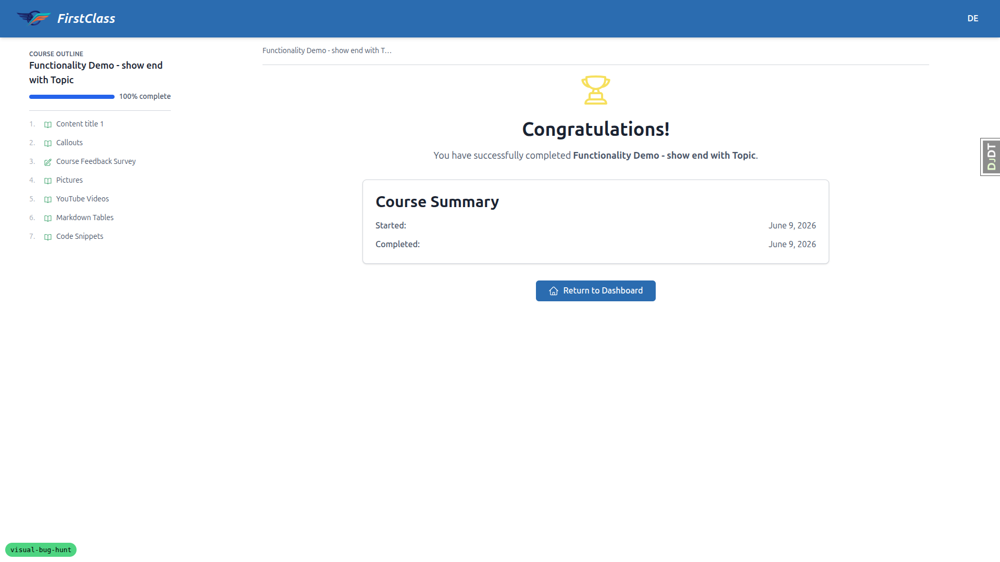
- **Control / no-regression — educator interface:** the educator cohorts header has
  its standard, unchanged spacing — the fix is confined to the player.
  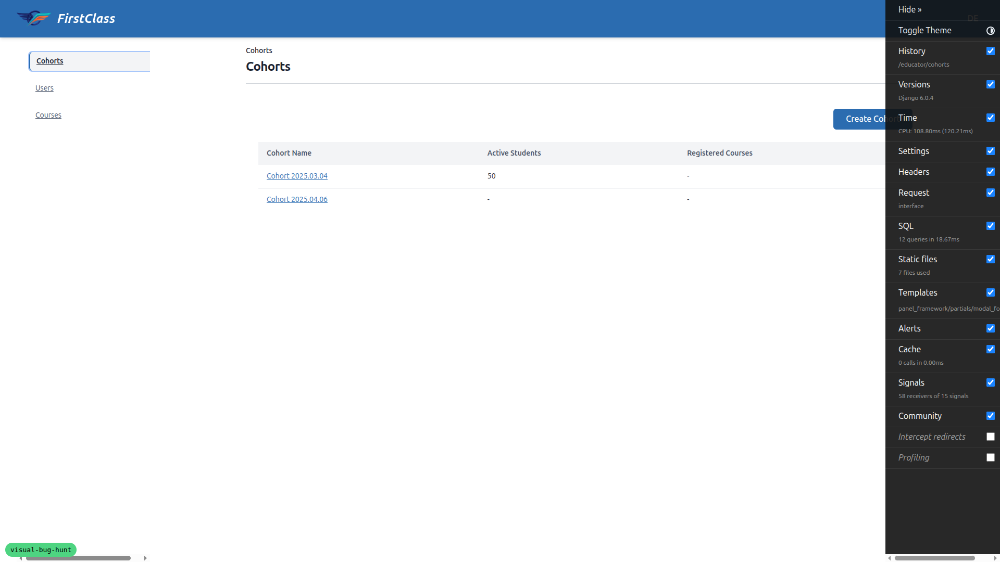

**Expected:** a tight, balanced gap on the player; educator unchanged. **Actual:**
matches expected on every player screen; educator spacing unchanged.

---

## Test 3 — Bug 3: "Save and add another" refreshes the cohorts table ✅

On `/educator/cohorts`:

1. Opened **Create Cohort**, entered "QA Cohort Alpha", clicked **Save and add
   another** → the modal stayed open with an empty form and the new row **appeared in
   the table behind it without a page reload**.
2. Repeated for "QA Cohort Bravo" and "QA Cohort Charlie" → each new cohort appeared
   in the table immediately on save.
3. Closed the modal → all three new cohorts present, and there is exactly **one**
   "Create Cohort" button/modal trigger (not duplicated after the refreshes).
   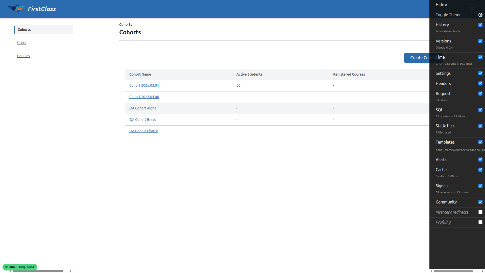
4. **No-regression — plain Save:** clicked **Create Cohort** → entered a name →
   **Save** → redirected to the new cohort's detail page (`/educator/cohorts/<uuid>`),
   as before.

**Responsive:** the cohorts table remains readable and the Create button/pagination
work at mobile (375×812) and tablet (768×1024) widths.
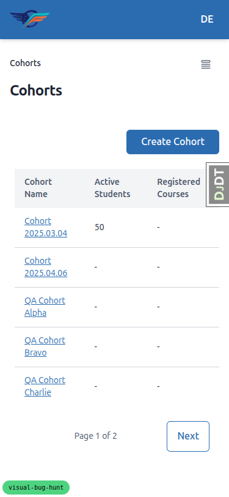
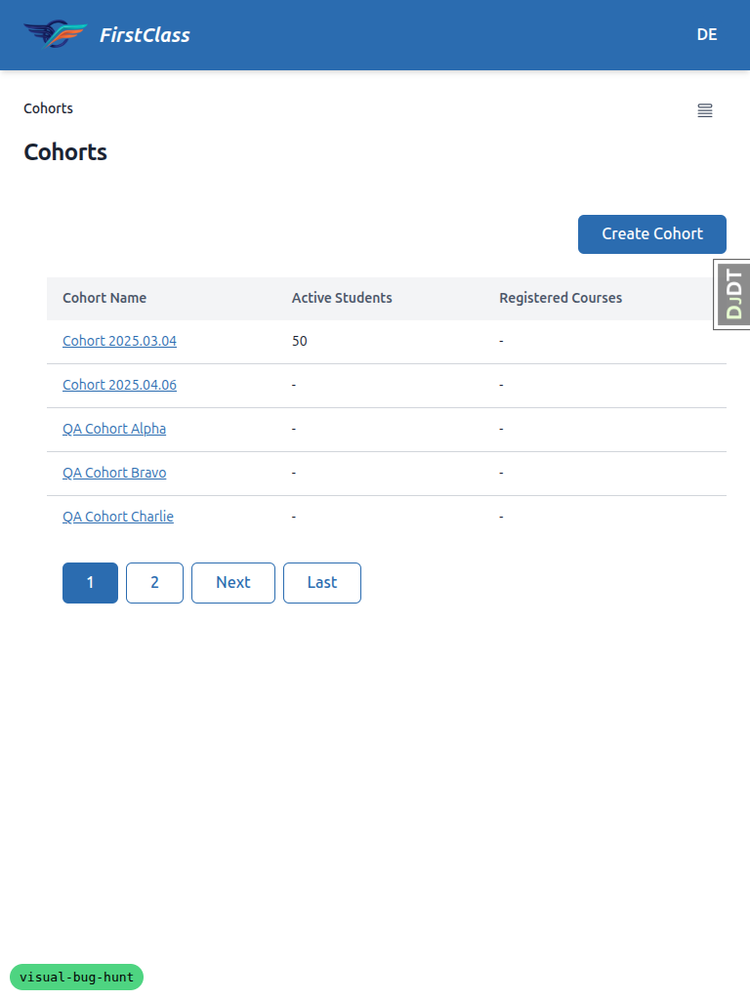

**Expected:** table updates live on "Save and add another", single create button,
plain Save redirects. **Actual:** matches expected.

---

## Console / tangential observations

No JavaScript **errors** related to the three fixes were observed during any flow.
The following messages appeared and are **pre-existing / unrelated** to this work:

- `404 favicon.ico` — no favicon configured for the site.
- A `404` for a relative image resource on the demo "Callouts"/"Pictures" content —
  the demo content deliberately includes a "missing image" example
  (`images/does-not-exist.jpg`) to demonstrate the error box.
- `Unrecognized feature: 'web-share'` warning originating from the htmx/CDN script /
  embedded media — benign third-party noise.

None of these affect the bugs under test.

## Not tested / limitations

- The cold-load **flash** in Test 1 is inherently sub-second; Playwright screenshots
  capture the settled state, which is correct (content full-width, outline docked).
  No mid-load jump was observed, but a frame-by-frame capture of first paint was not
  performed.
