# Frontend QA Report — Course-player visual fixes & header branding

**Branch:** `visual-fixes` (PR #118)
**Date:** 2026-06-08
**Tester:** Claude (Playwright MCP, manual walk-through)
**Site / user:** DemoDev · learner `demodev_s1@email.com`
**Viewports:** Desktop 1920×1080, Mobile 375×812, Tablet 768×1024

## Verdict

**No product bugs found.** All eight visual fixes behave per spec across desktop,
mobile, and tablet once the `first_class` theme is active.

There is **one test-plan / dev-setup documentation issue** (the `first_class` theme is
*not* active out of the box, contradicting test-plan §1) and **one by-design observation**
(the multi-page form-fill pagination is intentionally *not* boosted). Details below.

Test data (course registrations + partial progress for `demodev_s1`) was created via the
`fls:qa-data-helper` agent; no test was skipped for missing data.

---

## Pass-criteria checklist

| # | Criterion | Result |
|---|---|---|
| 1 | FirstClass logo + favicon + italic title; title hides at ~375px when a logo is present | ✅ Pass |
| 2 | Header gutter and player breadcrumb line up with the content column at all widths | ✅ Pass |
| 3 | Previous/Next/Finish swap content only (no full-page flash), update URL/back/forward/title, OOB outline update, panel state preserved | ✅ Pass |
| 4 | "Start Form" / "Continue Form" swap in the fill-form page and push a `…/fill_form/…` URL | ✅ Pass |
| 5 | Boosted click that redirects out of the player (session expiry) falls back to a full navigation, landing on the real page | ✅ Pass |
| 6 | Player nav buttons & "Open image" trigger are compact and keyboard-accessible; lightbox opens | ✅ Pass |
| 7 | Outline conveys status by type-icon colour + `sr-only` word, no trailing status icon; part row toggles on whole-row click with chevron at right | ✅ Pass |
| 8 | first_class top-level counters read `01, 02, 03…` (mono) while child counters stay `2.1`; card grid lines prominent | ✅ Pass |
| 9 | (Default-theme regression) `1.` / `1.1` counters, icons normal, no first_class treatment leaking | ✅ Pass |

---

## Findings

### Finding 1 (Test plan / dev setup) — the `first_class` theme is NOT active out of the box

**Severity:** Documentation / setup (not a product bug).

Test-plan §1 states:

> "The dev settings (`config/settings_dev.py`) already wire the FirstClass branding
> (logo, favicon, italic title) **and the `first_class` theme**, so branding and theme
> polish are testable out of the box."

This is inaccurate. `config/settings_dev.py` wires only the **branding**
(`HEADER_LOGO_STATIC_PATH`, `FAVICON_STATIC_PATH`, `HEADER_TITLE`, `HEADER_TITLE_STYLE`).
The active theme is driven by the `FLS_THEME` env var, which **defaults to `"default"`**
(`config/settings_base.py`), and the active theme's CSS is compiled into
`static/vendor/tailwind.output.css` by `npm run tailwind_build` (via the
`write_active_theme_css` management command). `.env.example` does not mention `FLS_THEME`.

**Observed out-of-the-box state** (running `uv run python manage.py runserver` +
`npm run tailwind_build` with no env var): the **default** theme is served — blue header
(`--color-header: #2B6CB0`), `--fls-course-accent-pattern` empty, and the outline
counters render `1.` / `1.1` in `ui-sans-serif`. The FirstClass *branding* still shows
on top (logo + italic title), producing a branding/theme mismatch. The screenshot below
is the as-shipped dev default — note the **blue** header bar:

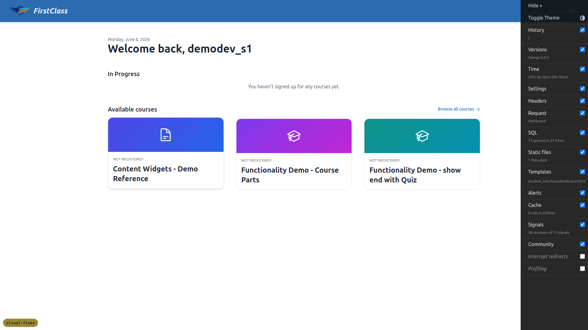

**This blocked §7 (theme polish) until worked around.** I rebuilt and restarted with the
theme active:

```bash
FLS_THEME=first_class npm run tailwind_build
FLS_THEME=first_class uv run python manage.py runserver $PORT
```

After that, the header is white and all `first_class` polish renders correctly (see §2/§7
below). The spec (the source of truth, §1) only ever claims branding is wired in dev — so
the product is consistent with the spec; it is the **QA test plan** that is wrong, and
arguably `settings_dev.py` should also set `FLS_THEME=first_class` to match the FirstClass
branding it already wires (otherwise local QA shows branded-default by default).

### Finding 2 (By design, noted for clarity) — multi-page form *fill* pagination is not boosted

**Severity:** None (matches spec) — flagged only because the §4 QA wording is ambiguous.

Test-plan §4 says: *"Step through the form's Previous/Next/submit controls (the
`c-player-nav` wrapper on `course_form.html`) → same no-flash boosted behaviour."*

Observed: stepping **within** a multi-page form (page 1 → page 2 on `course_form_page.html`,
and the "Continue" on the form-complete page `course_form_complete.html`) performs a **full
page reload**, not a boosted swap (verified — a `window` marker set before the click is gone
after it). Only the nav controls on `course_topic.html` and `course_form.html` are boosted.

This is **correct per spec §3**, which scopes the boost explicitly: *"It wraps only the
navigation controls in `course_topic.html` and `course_form.html`."* `course_form_page.html`
(plain `<form method="post">`) and `course_form_complete.html` are intentionally out of scope.
The **"Start Form" → `/fill_form/…`** swap itself *is* boosted and passes (§4). No action
needed beyond optionally tightening the QA-plan wording so it doesn't imply intra-form
pagination is boosted.

---

## Detailed results

### §2 Header branding — ✅

- Logo `/static/images/first_class_logo.png` renders at **32px** tall, vertically centred.
- Favicon `<link rel="icon">` points at the FirstClass logo (not the Django default).
- Title reads **"FirstClass"** with inline `font-style: italic;` (computed `font-style: italic`).
- **Responsive:** at 375px the `<h1>` title is `display:none` (logo-only), no horizontal
  overflow; title returns at desktop/tablet.
- first_class theme gives the white header + indigo avatar pill:

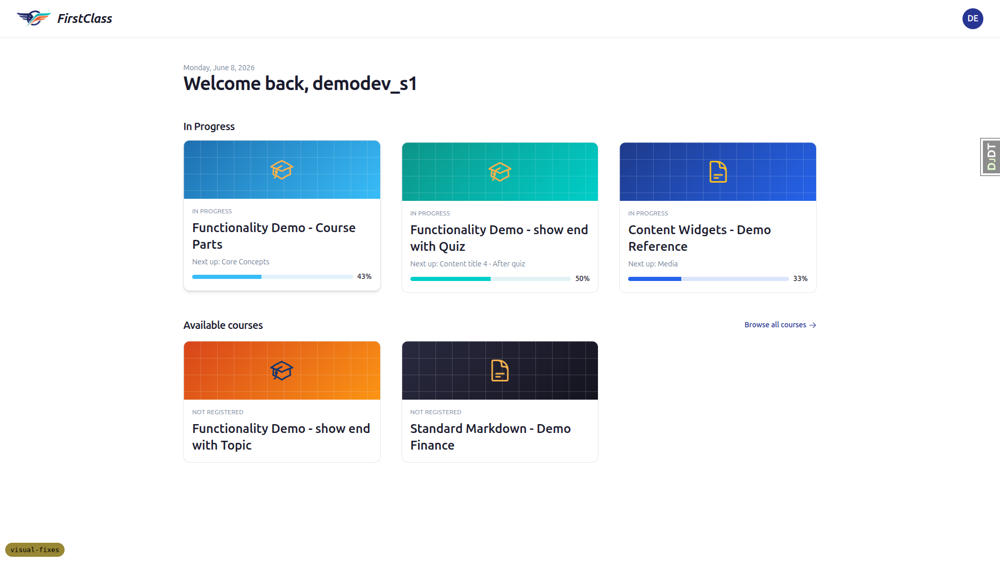

Mobile (title hidden, logo only):

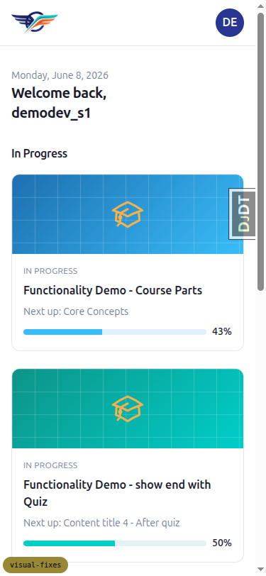

### §3 Header & player alignment — ✅

Header horizontal padding equals the content-wrapper gutter at every width, and the
breadcrumb shares the content column's left edge:

| Viewport | Header gutter | Content gutter | Breadcrumb / H1 left |
|---|---|---|---|
| 1920px | 32px | 32px | aligned (504 = 504) |
| 768px | 24px | 24px | aligned (24 = 24) |
| 375px | 16px | 16px | aligned (16 = 16) |

No horizontal overflow at any width.

### §4 Boosted player navigation — ✅

- **No full-page flash:** a `window.__qaMarker` set before clicking **Next** survived the
  navigation → DOM swapped, document not reloaded.
- **URL + title + history:** Next moved `…/3/ → …/4/`, `<title>` updated ("Going Deeper");
  browser **Back** returned to `…/3/` with the correct title.
- **OOB outline update:** the current-item highlight moved to the new item, and the item
  just completed ("Key Ideas") flipped to **Completed** in the sidebar — all without reload,
  panel state preserved.
- **Forms:** "Start Form" boosted-swapped to `…/2/fill_form/1` (marker survived), form rendered.

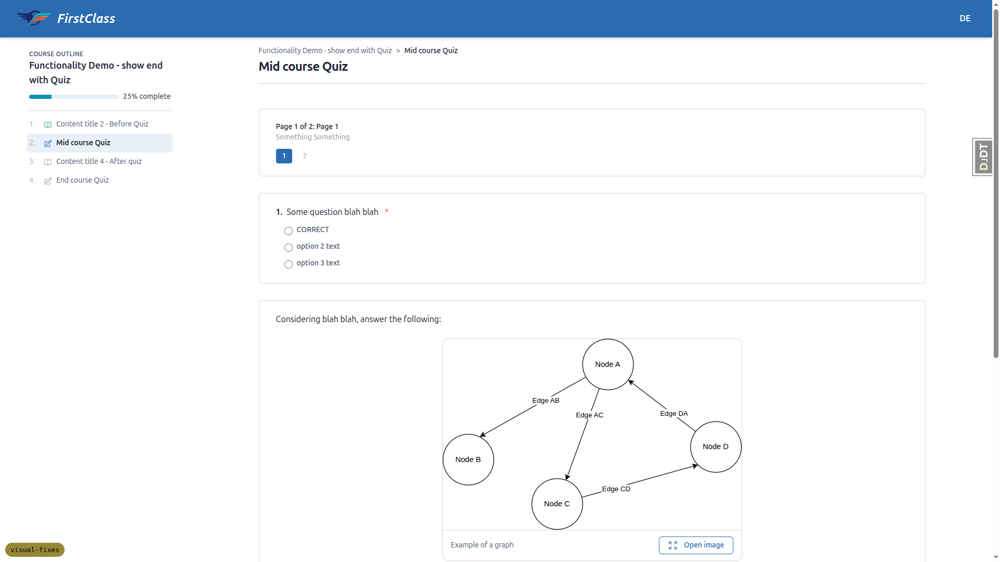

- **Fallback (session expiry):** after clearing the session cookie, a boosted **Next**
  performed a **full navigation to `/accounts/login/?next=…`** (real Sign-In page rendered,
  password field present, no `#interface-main`) — not a blank swap. `interface-swap-fallback.js`
  works.

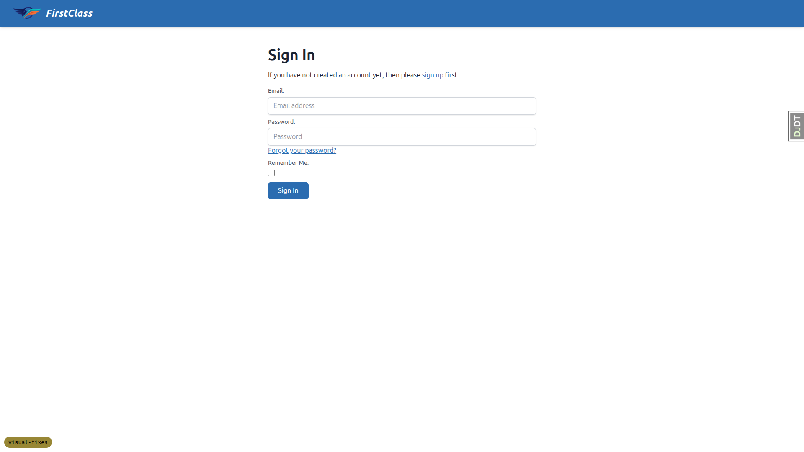

### §5 Compact buttons & lightbox — ✅

- Player **Previous/Next/Finish** carry `btn-sm` (height ~32–34px, 14px text, 6px vertical
  padding) — visibly compact vs a standard button.
- The **"Open image"** trigger is the same `btn-sm` size, keeps its fullscreen icon + label.
- **Keyboard:** focusing the trigger and pressing **Enter** opens the lightbox (fixed
  `inset-0` backdrop-blur overlay with the image); clicking opens it too.

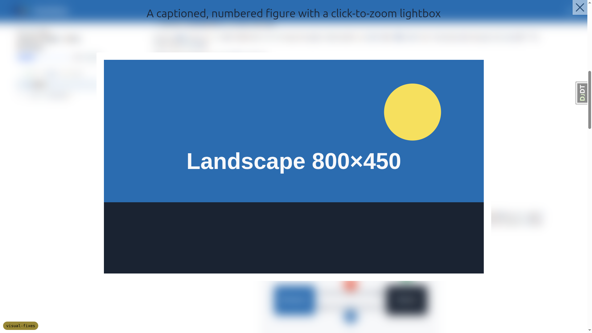

Mobile: image grids stack to one column and every "Open image" button is tappable, no overflow:

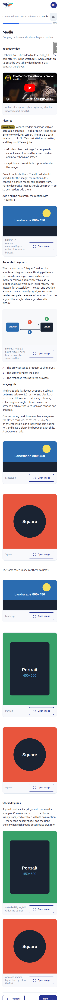

### §6 Course-outline redesign — ✅

- Type-icon is **colour-coded by status**: completed `text-success` (green), in-progress /
  ready primary (blue), locked muted (~50% opacity grey). **No separate trailing status icon.**
- Each row still announces a status word via `sr-only` ("Completed" / "In progress" /
  "Locked" / "Not started").
- Part rows expose only the **chevron at the right end** (`xFromRight: 0`); the chevron is an
  expand/collapse pair toggled by state.
- **Whole-row click** toggles a part (`aria-expanded` flips, nested list appears).
- Nested child list has **no left border rule** (`border-left: 0`).

Default theme (also serves §8 regression — counters `1.`/`1.1`, sans-serif):

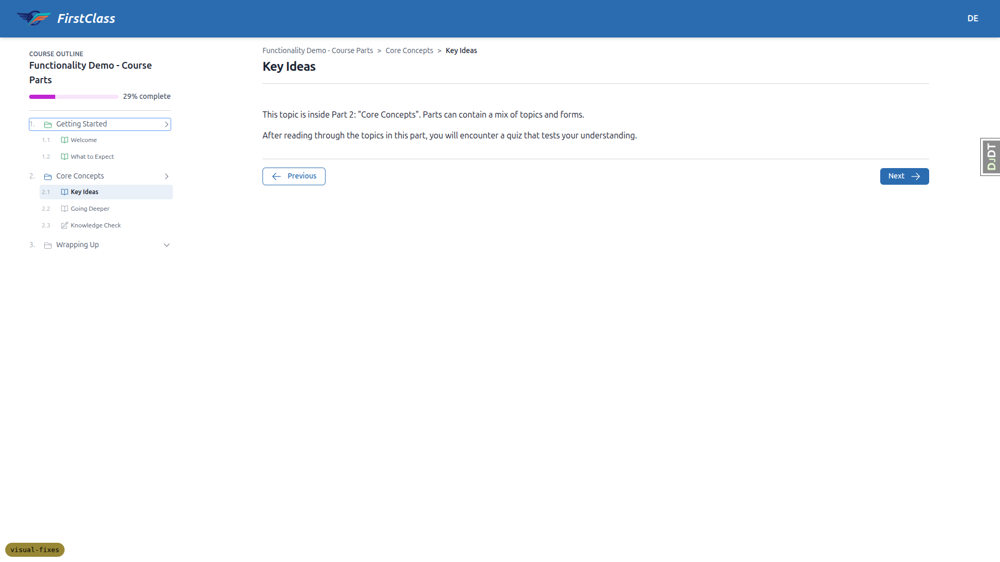

Mobile / tablet outline drawer (bottom sheet) keeps the full redesign + touch-friendly rows:

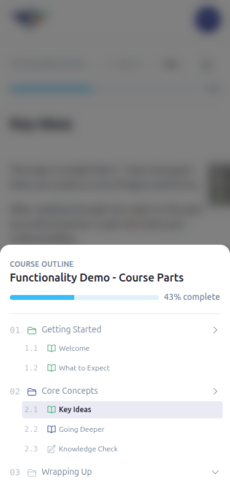
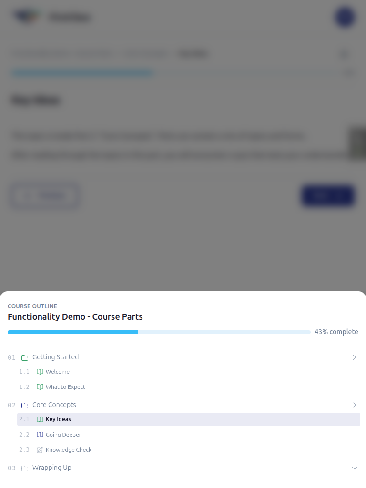

### §7 first_class theme polish — ✅ (after activating the theme; see Finding 1)

- **Counters:** top-level rows hide the server value (`.toc-counter-value { display:none }`)
  and render `::before { content: counter(toc-top, decimal-leading-zero) }` → **01, 02, 03**
  in **IBM Plex Mono**; child rows keep the `2.1` / `3.1` form (also mono, not zero-padded).

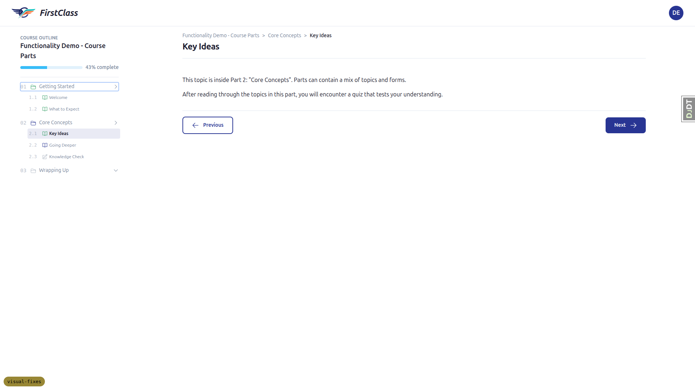

- **Card grid lines:** the white accent grid (now `rgba(255,255,255,0.16)`, up from the old
  faint `0.07`) is clearly prominent on the course cards, especially the dark navy/black accents:

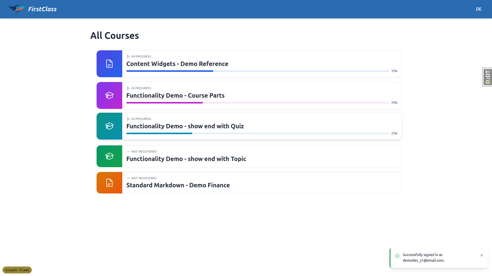
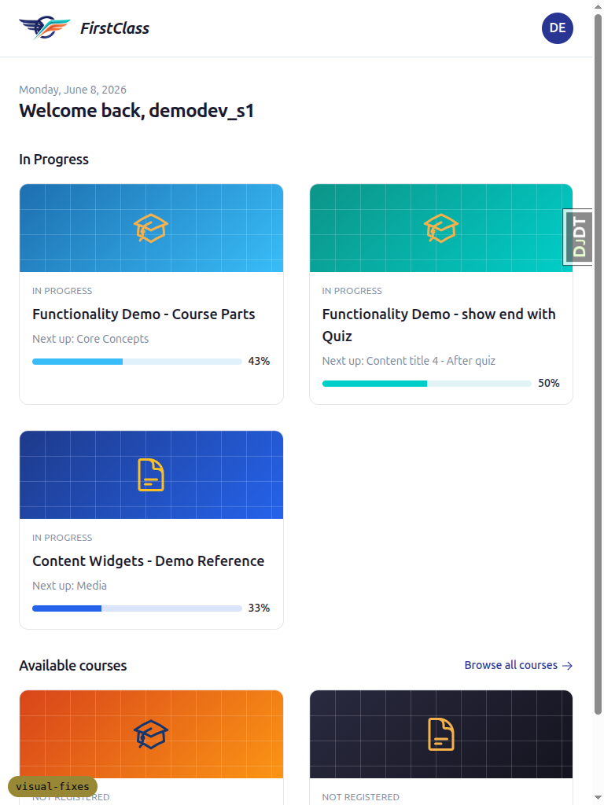

### §8 Default-theme regression — ✅

With the default theme active (the as-shipped dev default), top-level counters stay `1.` /
`1.1` in `ui-sans-serif` (no `::before` counter, value span visible), the outline type-icons
render normally, and none of the first_class mono/zero-pad treatment leaks in. See the
default-theme outline screenshot under §6.

---

## Tablet notes (768px)

- The player uses the **drawer** outline (toggle button), not the docked desktop sidebar —
  the docked column appears at the larger desktop breakpoint. The drawer is fully usable.
- Header title **shows** at 768px (it only hides at the small/375px breakpoint).
- Dashboard cards fall to a **2-column** grid; gutters 24px; no overflow.

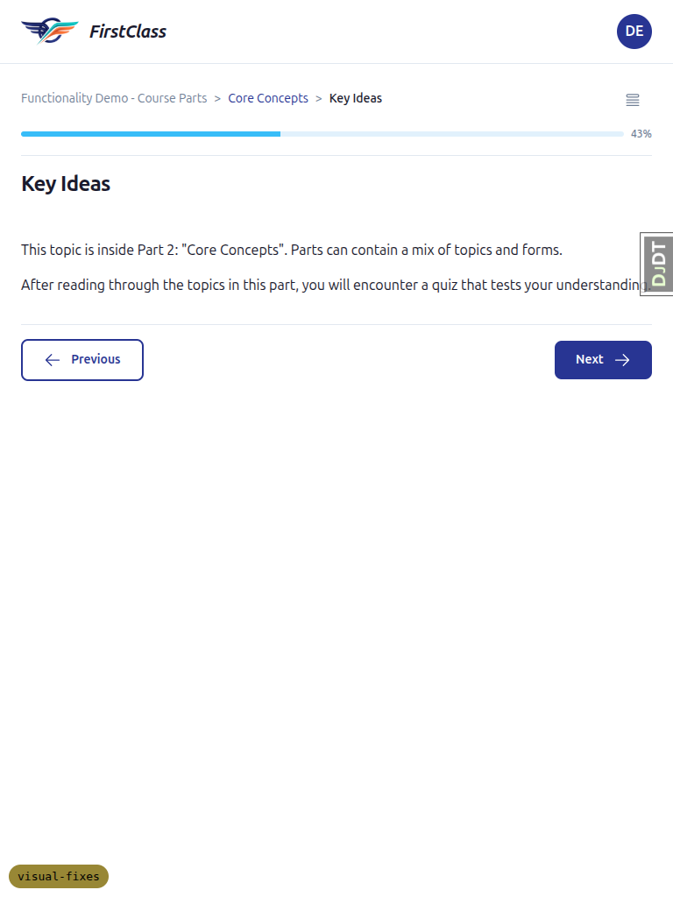

---

## Notes / difficulties

- The **Django Debug Toolbar** handle (`DJDT`) sits at the right edge and slightly overlaps
  content text in a couple of screenshots (e.g. `tablet_3_player.png`). This is the dev
  toolbar, unrelated to the feature — not a layout defect.
- I had to log in again mid-run after the §4 session-expiry fallback test (expected — that
  test deliberately clears the session cookie).
- Screenshot compression step found no files over the 1 MB threshold; nothing to compress.
