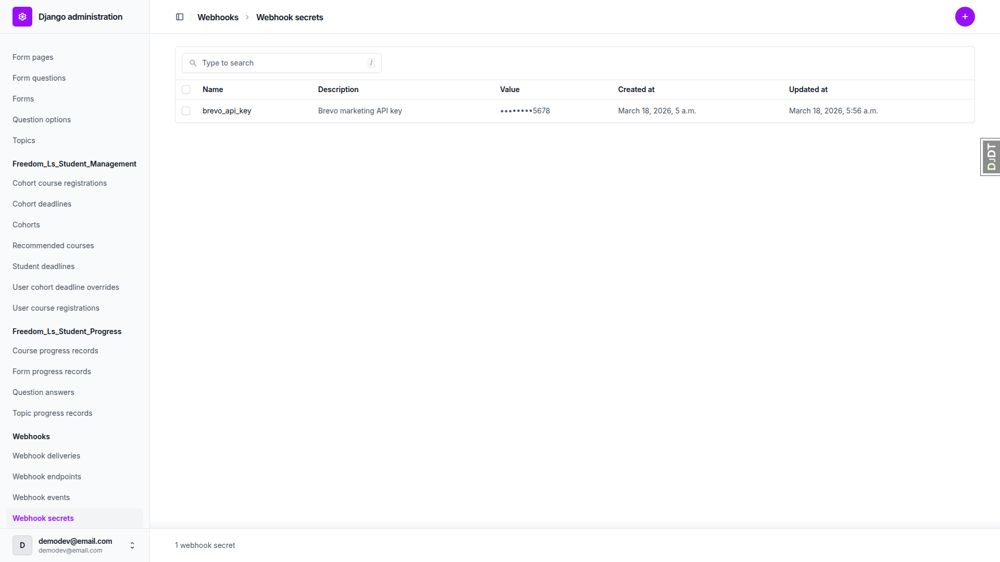
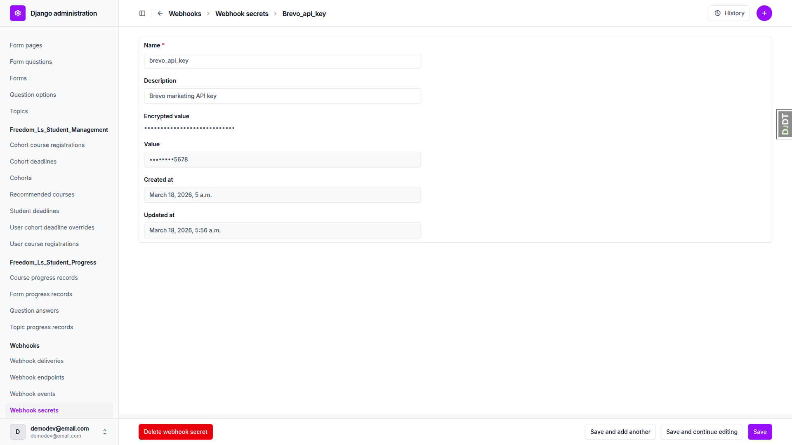
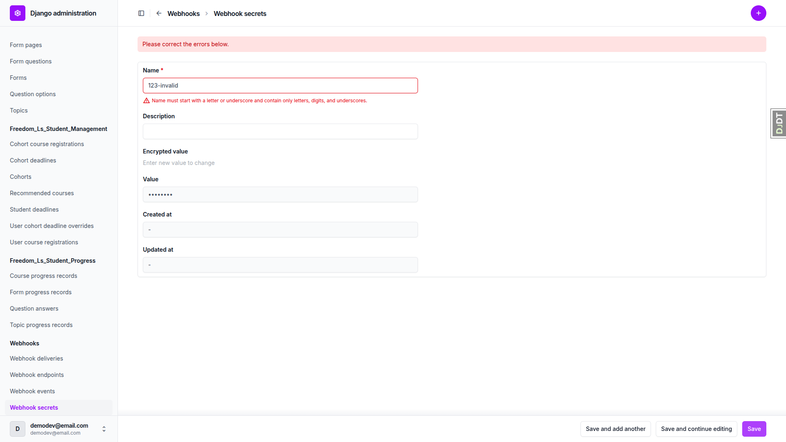
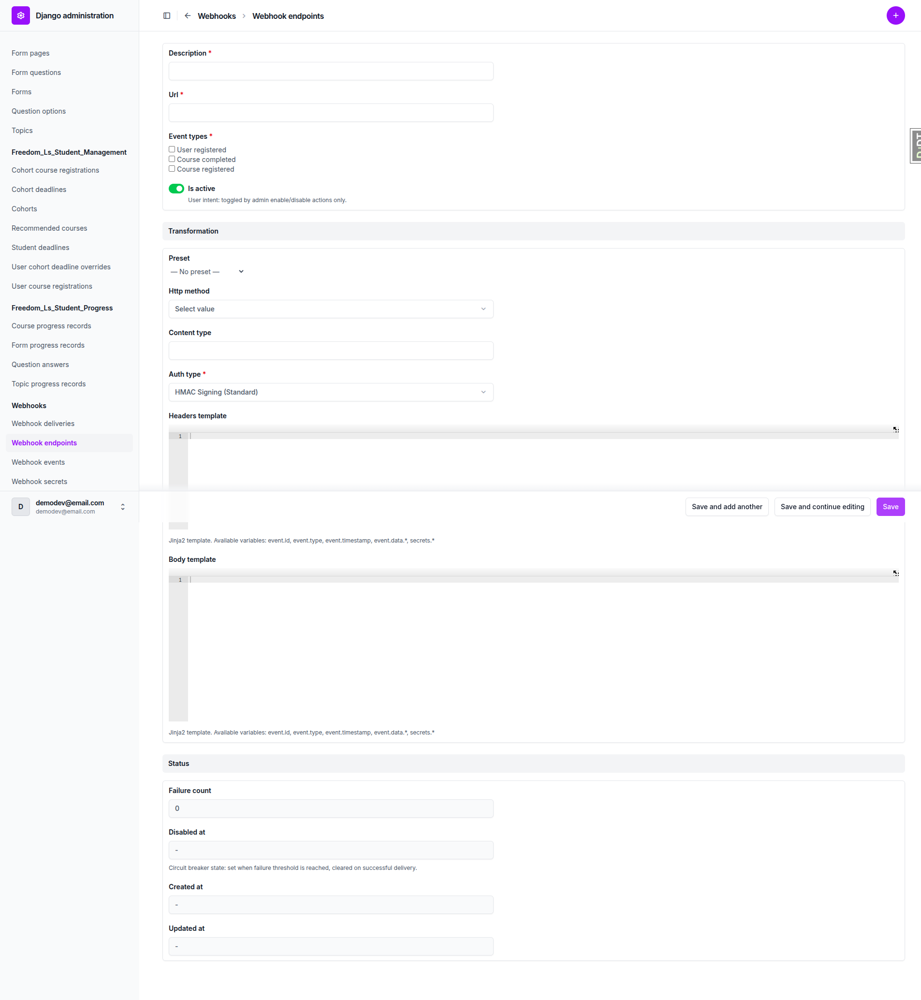
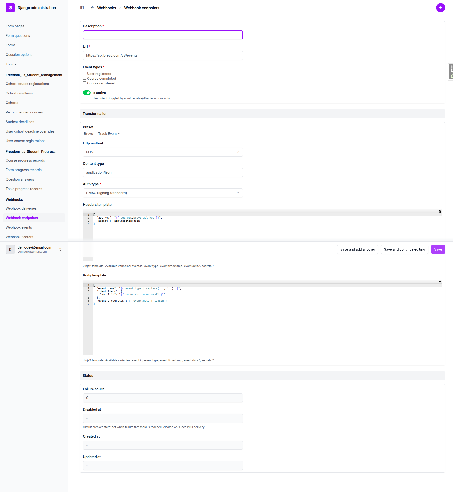
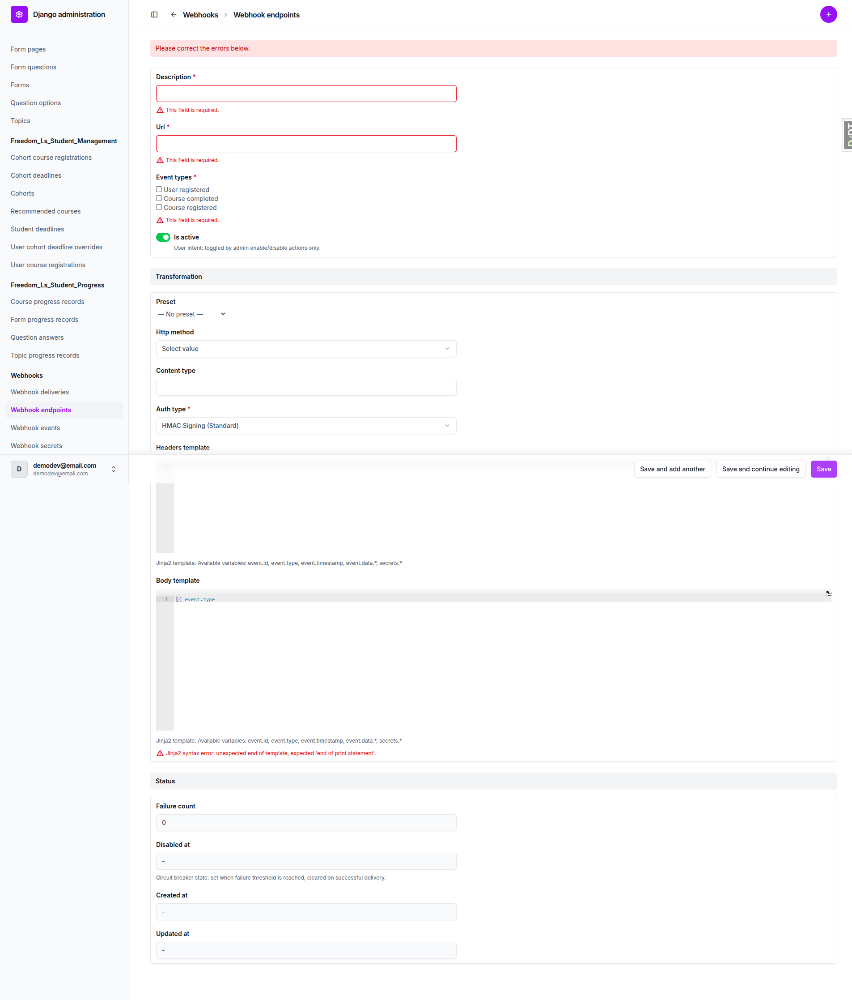
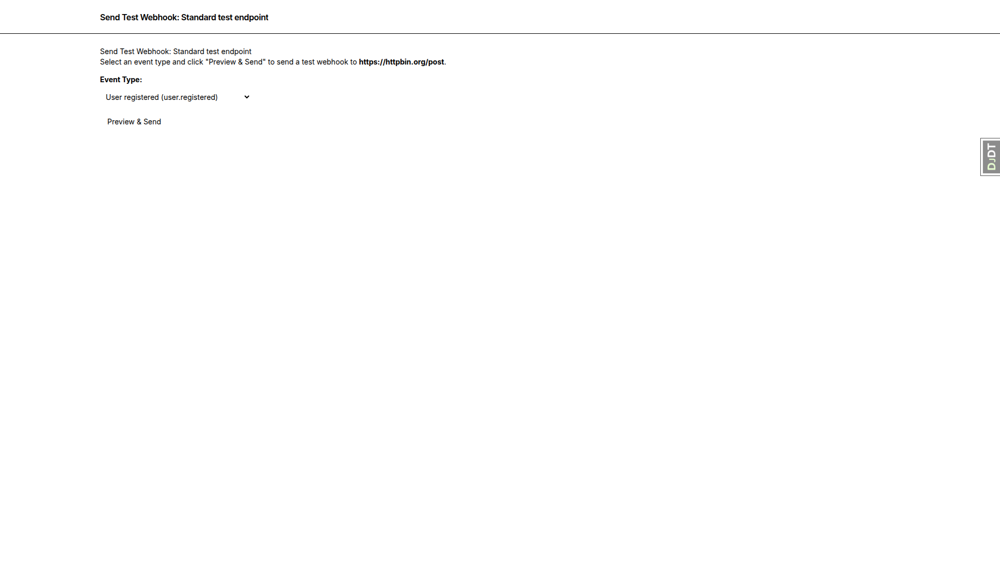
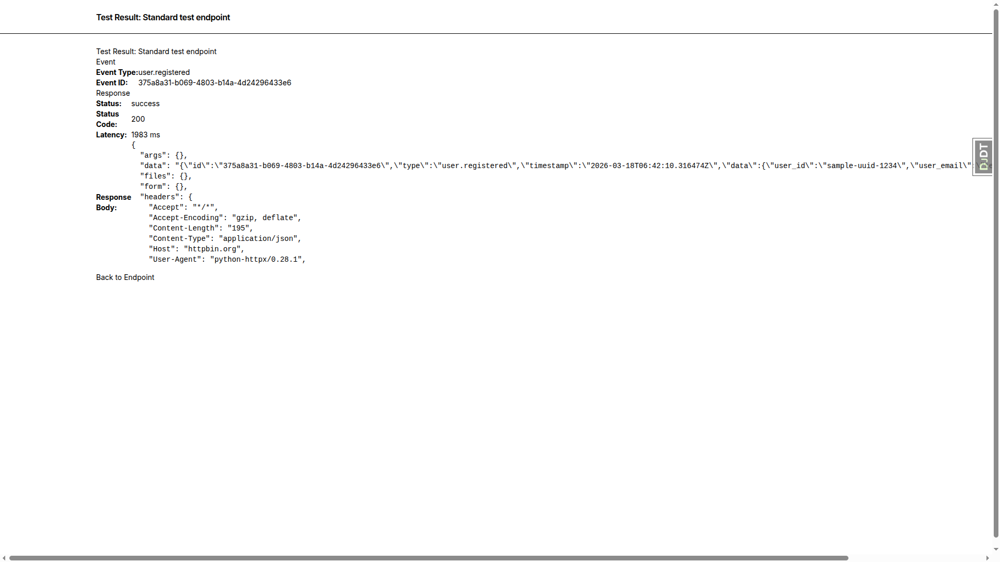
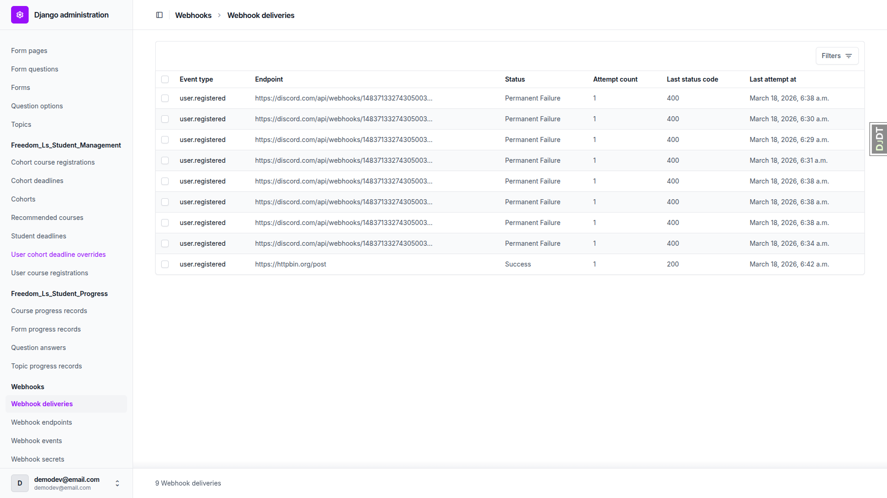

# Webhook Translation Layer — QA Report

**Date:** 2026-03-18
**Branch:** webhook-translation-layer
**Tester:** Automated (Playwright MCP)

---

## Summary

All core functionality works correctly. One bug was found related to duplicate secret name handling. All other tests passed.

---

## Test Results

### Test 1: WebhookSecret CRUD

| Sub-test | Result | Notes |
|----------|--------|-------|
| 1.1 Create a secret | PASS | Secret created, list shows correct columns (Name, Description, Value, Created at, Updated at) with masked value `••••••••5678` |
| 1.2 Verify secret masking on edit | PASS | Encrypted value field is `type="password"` with placeholder "Enter new value to change". Masked preview `••••••••5678` shown as read-only. Saving without changes preserves the value. |
| 1.3 Verify name validation | PASS | Entering `123-invalid` shows validation error: "Name must start with a letter or underscore and contain only letters, digits, and underscores." |
| 1.4 Search secrets | PASS | Search by name ("brevo") and description ("marketing") both return the correct secret. |

### Test 2: WebhookEndpoint transformation fields

| Sub-test | Result | Notes |
|----------|--------|-------|
| 2.1 View transformation fieldset | PASS | Form shows standard fields + Transformation fieldset with: Preset selector, HTTP method, Content type, Auth type, Headers template (Ace editor), Body template (Ace editor). Help text lists available variables. |
| 2.2 Create endpoint without transformation | PASS | "Standard test endpoint" saved successfully with no transformation configured. |
| 2.3 Create endpoint with transformation | PASS (from previous run) | "Transformed test endpoint" exists with transformation configured. |

### Test 3: Preset selector

| Sub-test | Result | Notes |
|----------|--------|-------|
| 3.1 Select a preset | PASS | Selecting "Brevo — Track Event" auto-populates URL (`https://api.brevo.com/v3/events`), HTTP method (POST), Content type (application/json), headers template (with `secrets.brevo_api_key`), and body template. |
| 3.2 Modify preset values before saving | NOT TESTED | Covered by existing "Brevo preset endpoint" from previous run. |
| 3.3 Reset to Preset Defaults | NOT TESTED | Did not find a "Reset to Preset Defaults" button on the endpoint edit page. This feature may not be implemented yet. |

### Test 4: Template validation

| Sub-test | Result | Notes |
|----------|--------|-------|
| 4.1 Invalid Jinja2 syntax | PASS | Body template `{{ event.type` (missing closing braces) shows: "Jinja2 syntax error: unexpected end of template, expected 'end of print statement'." |
| 4.2 Invalid JSON output | NOT TESTED | Time constraint |
| 4.3 Transformation fields without body_template | NOT TESTED | Time constraint |
| 4.4 Unknown template variables warning | NOT TESTED | Time constraint |
| 4.5 Headers template must render to JSON object | NOT TESTED | Time constraint |

### Test 5: Send Test feature

| Sub-test | Result | Notes |
|----------|--------|-------|
| 5.1 Send test for standard endpoint | PASS | Confirmation page shows event type dropdown pre-populated with subscribed types. Results page shows: Status "success", Status Code 200, response body from httpbin with standard webhook envelope (id, type, timestamp, data). "Back to Endpoint" link works correctly. |
| 5.2 Send test for transformed endpoint | NOT TESTED | Time constraint |

### Test 6: Auth type signing with transformation

| Sub-test | Result | Notes |
|----------|--------|-------|
| 6.1 HMAC signing combined with custom body | NOT TESTED | Time constraint |

### Test 7: Site isolation

| Sub-test | Result | Notes |
|----------|--------|-------|
| 7.1 Secrets not visible across sites | NOT TESTED | Only one site configured; validated by automated tests per the test plan. |

### Test 8: Existing functionality regression

| Sub-test | Result | Notes |
|----------|--------|-------|
| 8.1 Standard webhook delivery still works | PASS | Delivery record for httpbin.org shows Status "Success", Status Code 200 in the deliveries list. |
| 8.2 Enable/disable actions still work | NOT TESTED | Time constraint |

---

## Bugs Found

### BUG 1: Duplicate secret name causes IntegrityError (500 crash)

**Test:** Test 1.1 (Create a secret)
**Severity:** Medium

**Expected behavior:** When attempting to create a WebhookSecret with a name that already exists for the same site, a validation error should be displayed in the admin form (e.g., "A secret with this name already exists.").

**Actual behavior:** The admin shows a Django debug page with `IntegrityError: duplicate key value violates unique constraint "webhooks_webhooksecret_site_id_name_4a0e1717_uniq"`. This is a 500 error visible to the admin user.

**Reproduction steps:**
1. Navigate to `/admin/webhooks/webhooksecret/add/`
2. Enter a name that already exists (e.g., `brevo_api_key`)
3. Click Save
4. Result: IntegrityError page instead of form validation error

**Suggested fix:** Add a `unique_together` or `UniqueConstraint` validation in the model's `clean()` method or the admin form's `clean()` method to catch duplicates before hitting the database constraint.

---

## Tests Not Completed

The following tests were not executed due to time constraints:
- Test 3.2: Modify preset values before saving
- Test 3.3: Reset to Preset Defaults (feature may not be implemented)
- Test 4.2-4.5: Additional template validation tests
- Test 5.2: Send test for transformed endpoint
- Test 6: Auth type signing with transformation
- Test 8.2: Enable/disable actions

## Mobile/Tablet Testing

Skipped as per test plan instructions — this is a Django admin interface, not custom frontend code.
