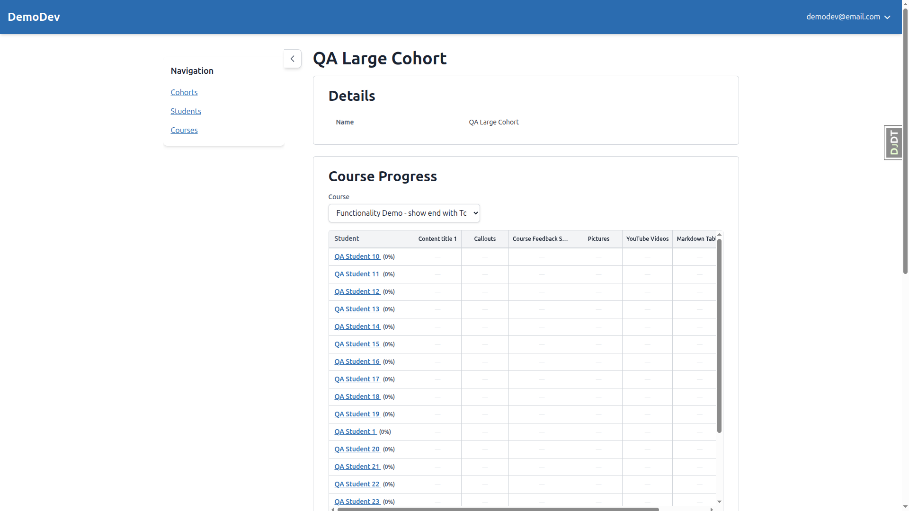

# QA Report: Cohort Course Progress Panel

**Date:** 2026-02-21
**Tester:** Automated QA via Playwright MCP
**Viewport (Desktop):** 1920x1080
**Viewport (Mobile):** 375x812

---

## Desktop Results Summary

| Test | Description | Result |
|------|-------------|--------|
| 1 | Panel appears on cohort detail page | PASS |
| 2 | Course selection dropdown | PASS |
| 3 | Empty states | PASS |
| 4 | Progress grid layout | PASS |
| 5 | Course part headers | PASS |
| 6 | Student sorting | PASS |
| 7 | Topic cell content | PASS |
| 8 | Quiz form cell content | PASS |
| 9 | Non-quiz form cell content | PASS |
| 10 | Column pagination | PASS |
| 11 | Student (row) pagination | PASS |
| 12 | Cohort deadlines in headers | PASS |
| 13 | Student deadline overrides | PASS |
| 14 | Overdue highlighting | PASS |
| 15 | Student name links | PASS |

**All 15 desktop tests passed.**

---

## Desktop Screenshots

### Test 1: Panel on Cohort Detail Page

### Test 2: Course Selection & Dropdown

### Test 3: Empty States

### Tests 4-7: Grid Layout and Cell Content

### Test 8: Quiz Form Cells

### Test 10: Column Pagination (Page 2)

### Test 11: Row Pagination

### Test 13: Deadline Override Cell

### Test 14: Overdue Cell

---

## Mobile Results Summary

| Test | Description | Result | Notes |
|------|-------------|--------|-------|
| 1 | Panel appears on cohort detail page | PASS | Sidebar must be manually collapsed |
| 2 | Course selection dropdown | PASS | Dropdown text truncated but functional |
| 3 | Empty states | PASS | |
| 4 | Progress grid layout | PASS | Horizontal scroll works via overflow-auto |
| 5 | Course part headers | PASS | Two-row headers render, visible via scroll |
| 6 | Student sorting | PASS | |
| 7 | Topic cell content | PASS | Visible when scrolling horizontally |
| 8 | Quiz form cell content | PASS | Visible when scrolling horizontally |
| 9 | Non-quiz form cell content | PASS | Visible when scrolling horizontally |
| 10 | Column pagination | PASS | Pagination controls visible below grid |
| 11 | Student (row) pagination | PASS | "Students 1-20 of 25" with Next button |
| 12 | Cohort deadlines in headers | PASS | Visible when scrolling |
| 13 | Student deadline overrides | PASS | Override icon visible when scrolling |
| 14 | Overdue highlighting | PASS | Visible when scrolling |
| 15 | Student name links | PASS | Links work on mobile |

**All 15 mobile tests passed functionally**, but with mobile responsiveness observations below.

---

## Mobile Responsiveness Observations

These are not test failures but UX observations for mobile viewports.

### 1. Sidebar Does Not Auto-Collapse on Mobile

**Affected tests:** All mobile tests
**Observed behavior:** When navigating to any page on a mobile viewport, the sidebar navigation is expanded by default. It overlaps the main content area, making the page content unreadable until the user manually clicks "Toggle sidebar".
**Expected behavior:** On small viewports, the sidebar should either be collapsed by default or use a mobile-friendly hamburger menu pattern.

### 2. Course Dropdown Text Truncation

**Observed behavior:** The course selection dropdown shows truncated text (e.g., "Functionality Demo - show" instead of the full course name "Functionality Demo - show end with Topic"). This makes it difficult to distinguish between similarly named courses.
**Impact:** Low - users can still select courses, and the full name is visible once the dropdown is opened.

### 3. Grid Shows Only Student Column Without Scrolling

**Observed behavior:** On mobile, the progress grid initially shows only the Student name column and a sliver of the next column. Users must scroll horizontally to see any progress data.
**Impact:** Medium - the grid is functional with horizontal scroll, but users may not immediately realize there is more content to the right. A visual indicator (e.g., a scroll hint or fade effect on the right edge) could improve discoverability.

---

## Mobile Screenshots

### Course Progress Panel on Mobile

### Empty State on Mobile

### Quiz Course on Mobile

### Large Cohort Pagination on Mobile

### Remote Pilot (Course Parts) on Mobile

---

## Test Setup Notes

- The QA test plan references cohort name "Demo Cohort" in setup commands, but the actual cohort name in the database was "Cohort 2025.03.04". The commands were re-run with the correct cohort name.
- Cohorts used for testing:
  - **Cohort 2025.03.04** (11 members, 3 course registrations) - main test cohort
  - **Cohort 2025.04.06** (0 members, 0 registrations) - empty state test
  - **QA Large Cohort** (25 members, 1 registration) - row pagination test
  - **QA Empty Students Cohort** (0 members, 1 registration) - empty students test

## Peripheral Observations

- The Django Debug Toolbar (DJDT) tab is visible on the right edge of the screen on both desktop and mobile. This is expected in development but should be disabled in production.
- The sidebar "Toggle sidebar" button state does not persist across page navigations. When using HTMX to switch courses (which doesn't trigger a full page load), the sidebar state is preserved. But full page navigations reset it to expanded.
