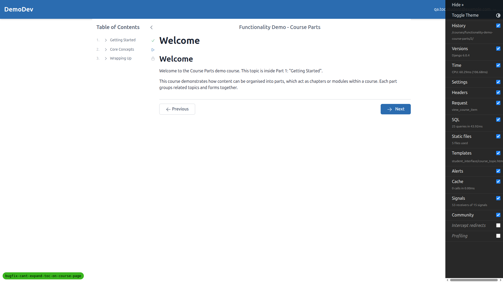
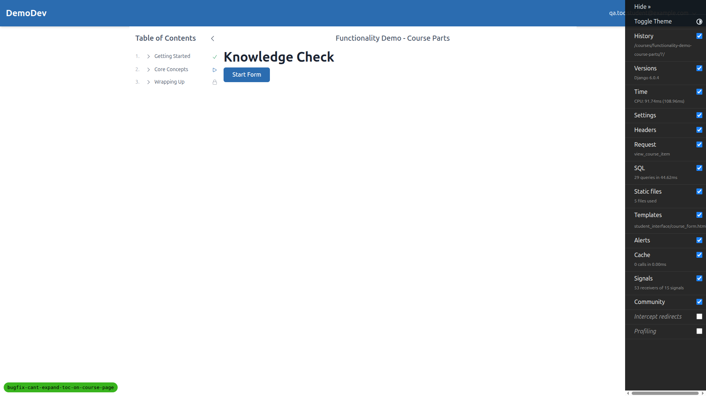
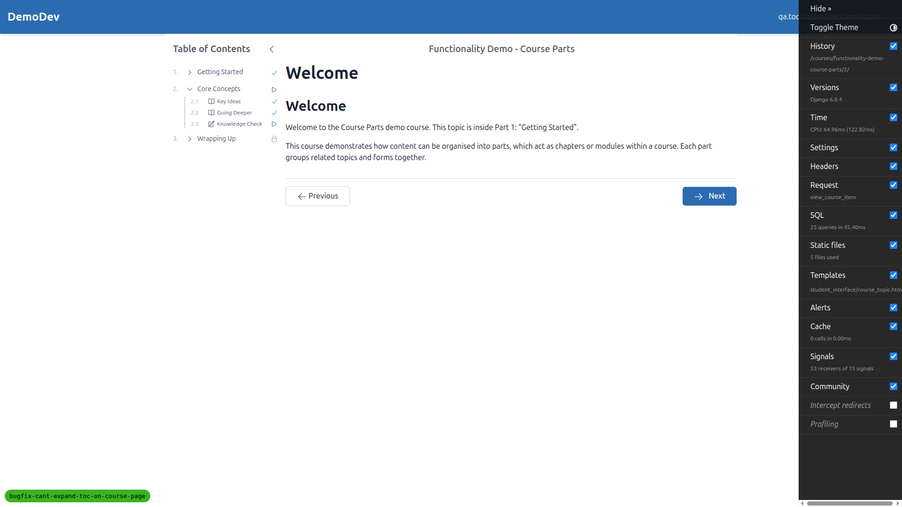
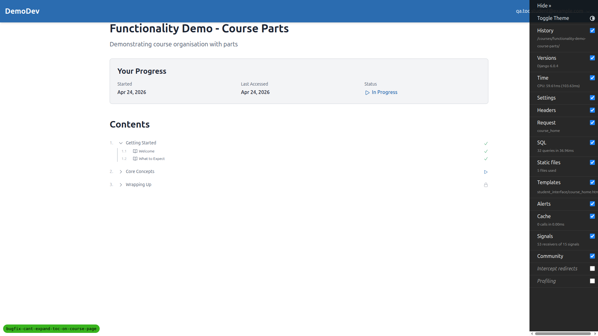
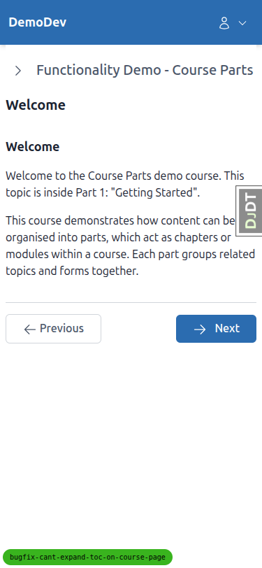
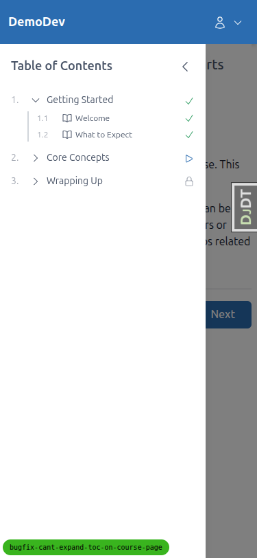
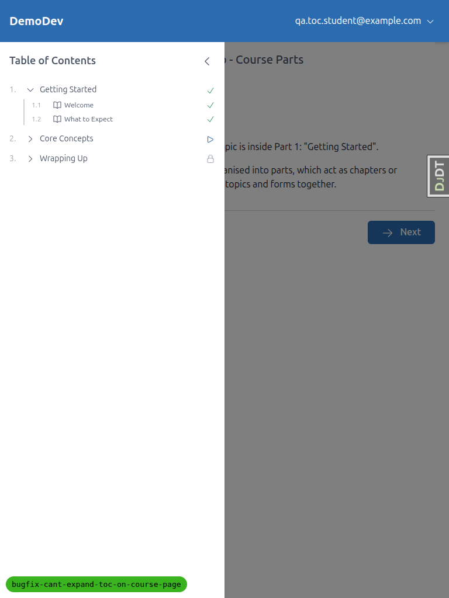

# QA Report: TOC expand/collapse on course detail pages (re-run)

**Branch:** `bugfix-cant-expand-toc-on-course-page`
**Date:** 2026-04-24
**Tester:** Claude (Playwright MCP)
**Test student:** `qa.toc.student@example.com` on DemoDev site, registered for `functionality-demo-course-parts`

## Summary

All four tests in `3. frontend_qa.md` **PASS**. This is a re-run after the persistence follow-up fix (`alpine-components.js` — capture `storageKey` during `init()` rather than during the click handler). The previously-failing Test 3 (persistence across navigation) now passes: expanding a TOC part, navigating to another course detail page, and observing that the part remains expanded works correctly, and a `coursePart_<slug>_<id>` key is written to `localStorage` as expected.

No `Alpine Expression Error` messages in the browser console on any page. Only console error observed is a favicon 404, which is environment-level and unrelated.

## Test results

| Test | Result |
| --- | --- |
| **Test 1** — TOC expand/collapse on course topic page (`/courses/.../2/`) | PASS |
| **Test 2** — TOC expand/collapse on course form page (`/courses/.../7/`, Knowledge Check) | PASS |
| **Test 3** — Expand/collapse state persists across navigation | PASS |
| **Test 4** — No regression on course home page (`/courses/functionality-demo-course-parts/`) | PASS |
| Console — no `Alpine Expression Error` about `toggleExpanded` | PASS |

Desktop (1920x1080), mobile (375x812) and tablet (768x1024) viewports were all exercised for the topic-page expand/collapse flow and behaviour is consistent across sizes.

## Test 1 — Topic page expand/collapse (PASS)

Navigated to `/courses/functionality-demo-course-parts/2/` (the `Welcome` topic, `course_topic.html`).

Initial — sidebar TOC loaded with 3 collapsed parts:

After clicking the "Getting Started" toggle — children ("Welcome", "What to Expect") become visible:

After clicking again — children hidden:

`localStorage` key `coursePart_functionality-demo-course-parts_1` was observed toggling between `"true"` and `"false"` as expected.

## Test 2 — Form page expand/collapse (PASS)

Knowledge Check form at `/courses/functionality-demo-course-parts/7/` (`course_form.html`).

Before click:

After clicking "Core Concepts" — children ("Key Ideas", "Going Deeper", "Knowledge Check") become visible:

## Test 3 — Persistence across navigation (PASS — regression fixed)

With `Core Concepts` expanded and `Getting Started` explicitly collapsed on `/7/`, navigating to `/2/` preserved both states: `Core Concepts` remained expanded and `Getting Started` remained collapsed. `localStorage` contains both keys with correct values.

This is the scenario that previously failed in the first QA run. The fix captures `storageKey` during `init()` (while `$el` is the root component element) so the click handler can write to `localStorage` regardless of what `$el` resolves to at event time.

## Test 4 — No regression on course home page (PASS)

`course_home.html` at `/courses/functionality-demo-course-parts/` still toggles as before.

Initial:

After expanding "Getting Started":

## Console check (PASS)

Across every page tested, the only console error recorded was a favicon 404 (`GET /favicon.ico → 404`). No `Alpine Expression Error`, no `toggleExpanded is not a function`, no other errors or warnings.

## Mobile testing (375x812) — PASS

The sidebar is closed by default on mobile and opens via the menu button. Once opened, clicking "Getting Started" correctly expands to show its children; layout is clean.

Sidebar closed (default):

Sidebar opened, TOC collapsed:

After expanding "Getting Started":

## Tablet testing (768x1024) — PASS

At 768px the sidebar is open and overlays the page content (same responsive behaviour noted in the first QA run — not caused by this fix). Toggle expand/collapse works correctly.

Initial:

After expanding "Getting Started":

## Tangential observations (not caused by this fix)

1. **Tablet sidebar overlaps main content** — at 768px the sidebar opens over the page content rather than alongside it. Same observation as the first QA run; outside the scope of this bugfix.
2. **Favicon 404** — `/favicon.ico` returns 404 on every page. Unrelated to this ticket.

## Setup notes

- QA student `qa.toc.student@example.com` / `testpass123` (verified email, registered for `functionality-demo-course-parts`) was reused from the previous QA run — still present in the dev DB.
- Server was run on port 8261 via `uv run python manage.py runserver 8261`.
