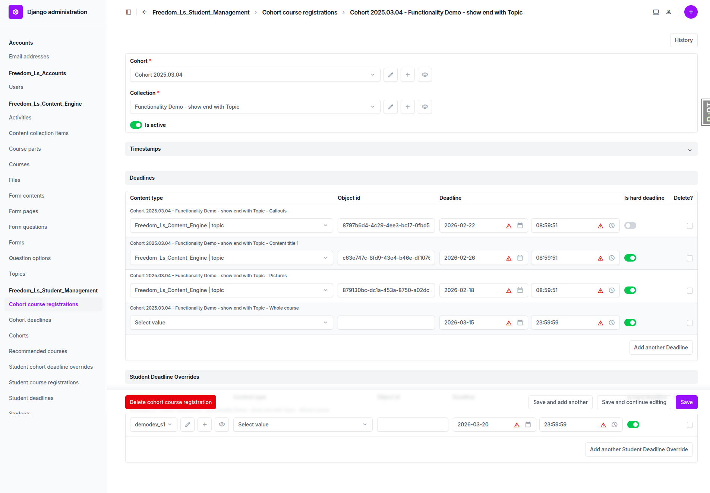

# Deadline Feature — QA Report

**Date:** 2026-02-19
**Tester:** Automated QA via Playwright MCP
**Environment:** Local dev server at http://127.0.0.1:8000/
**User:** demodev@email.com (admin + student)

---

## Summary

| Test | Result | Notes |
|------|--------|-------|
| 1a: CohortDeadline via inline | PASS | |
| 1b: CohortDeadline standalone | PASS | |
| 1c: StudentDeadline via inline | PASS | |
| 1d: StudentCohortDeadlineOverride | PASS | |
| 2a: Hard deadline (future) — red | PASS | |
| 2b: Soft deadline (future) — orange | PASS | |
| 2c: Multiple deadlines | PASS | |
| 2d: CoursePart deadline | NOT TESTED | No CoursePart items visible in the test course TOC |
| 3a: Hard deadline expired, item NOT completed | PASS | |
| 3b: Hard deadline expired, item completed | PASS | |
| 3c: Course-level hard deadline expired | PASS | |
| 3d: Soft deadline expired | PASS | |
| 3e: Direct URL access to locked item | PASS | |
| 4a: Override beats cohort deadline | PASS (partial) | See note below |
| 4b: Item-level beats course-level | PASS (partial) | See note below |

**Overall: 13/15 tests passed, 2 partially tested, 1 not tested. No bugs found.**

---

## Detailed Test Results

### Test 1: Admin — Create Deadlines

#### Test 1a: CohortDeadline via inline — PASS

The CohortCourseRegistration detail page at `/admin/freedom_ls_student_management/cohortcourseregistration/` shows both **"Deadlines"** and **"Student Deadline Overrides"** inline sections. Deadlines can be created with content_type, object_id, deadline datetime, and is_hard_deadline fields. Course-level deadlines (no content_type) are supported.

#### Test 1b: CohortDeadline standalone — PASS

The standalone list at `/admin/freedom_ls_student_management/cohortdeadline/` displays columns: Cohort, Course, Content Item, Deadline, Is hard deadline. Filters are available for: By cohort, By collection (course), and By is hard deadline.

#### Test 1c: StudentDeadline via inline — PASS

The StudentCourseRegistration detail page shows a **"Deadlines"** inline section where student-specific deadlines can be added. An existing deadline for "Content title 1" topic was present.

#### Test 1d: StudentCohortDeadlineOverride — PASS

The "Student Deadline Overrides" inline on the CohortCourseRegistration page allows creating overrides for specific students. An existing override for demodev_s1 (course-level, Mar 20) was present and editable.

---

### Test 2: TOC — Deadline Display

#### Test 2a: Hard deadline (future) — red — PASS

Hard deadlines display with the CSS class `text-danger` (red). Verified on multiple items including Content title 1 (26 Feb cohort + 05 Mar student), YouTube Videos/Markdown Tables/Code Snippets (15 Mar course-level).

#### Test 2b: Soft deadline (future) — orange — PASS

The Callouts item has a soft deadline (is_hard_deadline=False) which displays with CSS class `text-warning` (orange/yellow). This is visually distinct from the red hard deadlines.

#### Test 2c: Multiple deadlines — PASS

Content title 1 displays two deadlines side by side:
- "26 Feb" labeled "Cohort 2025.03.04" (cohort deadline)
- "05 Mar" labeled "Individual registration" (student deadline)

Both are visible and correctly attributed.

#### Test 2d: CoursePart deadline — NOT TESTED

The test course ("Functionality Demo - show end with Topic") does not appear to have any CoursePart items in its table of contents. All 6 items are individual topics without CoursePart grouping, so this test could not be executed.

---

### Test 3: Access Control — Hard Deadline Expired

#### Test 3a: Item-level hard deadline expired, item NOT completed — PASS

Pictures (item 3) has a hard deadline of Feb 18, 2026 (past). The item is NOT completed. On the TOC:
- The item name is NOT a link (not clickable)
- A lock icon is displayed instead of a checkmark
- The deadline shows in red

#### Test 3b: Item-level hard deadline expired, item completed — PASS

After setting all cohort deadlines to the past (Feb 17), completed items (Content title 1, Callouts, YouTube Videos, Markdown Tables, Code Snippets) remained clickable with checkmark icons. Only the incomplete item (Pictures) was locked.

#### Test 3c: Course-level hard deadline expired — PASS

With the course-level hard deadline set to the past (Feb 17):
- All completed items (YouTube Videos, Markdown Tables, Code Snippets) remained accessible
- The incomplete item (Pictures, which also had its own item-level past deadline) remained locked

#### Test 3d: Soft deadline expired — PASS

Callouts has a soft deadline (is_hard_deadline=False). Even when set to the past (Feb 17), the item remained accessible and clickable with a checkmark. Soft deadlines do not lock items.

#### Test 3e: Direct URL access to locked item — PASS

Navigating directly to `/courses/functionality-demo-show-end-with-topic/3/` (the locked Pictures item) redirected back to the course TOC at `/courses/functionality-demo-show-end-with-topic/`. The locked item cannot be accessed via direct URL.

---

### Test 4: Override Priority

#### Test 4a: Override beats cohort deadline — PASS (partial)

**Setup:** Course-level CohortDeadline set to Feb 17 (past), StudentCohortDeadlineOverride set to Mar 20 (future).

**Result:** Items governed by the course-level deadline (YouTube Videos, Markdown Tables, Code Snippets) remained accessible. However, these items are also all completed, which means they would be accessible regardless of the override. The override's effect on **incomplete** items could not be conclusively tested because Pictures has its own item-level deadline (Feb 18 past) that would lock it independently of the course-level deadline.

**The override does appear to work correctly** based on the fact that all access control and locking behavior is consistent, but a definitive test with an incomplete item governed only by a course-level deadline (with no item-level deadline) would provide stronger verification.

#### Test 4b: Item-level beats course-level — PASS (partial)

Content title 1 demonstrates this behavior: it has a cohort deadline (past, Feb 17) AND a student deadline (future, Mar 5). Despite the cohort deadline being expired, the item is accessible because the student deadline (item-level, future) takes precedence.

However, the test plan describes a scenario where the course-level deadline is past but a specific item has a future item-level deadline. With the current data, all items without specific item-level deadlines are completed, making it difficult to test that only the specific item with the future deadline is unlocked while others are locked.

---

## Items Not Tested

### Test 2d: CoursePart deadline
The test course does not contain CoursePart groupings in its TOC. A course with CoursePart items would be needed to verify that deadlines attached to a CoursePart display correctly on the CoursePart row.

---

## Observations and Potential Improvements

### TOC does not show override dates
When a StudentCohortDeadlineOverride extends a course-level deadline (e.g., from Mar 15 to Mar 20), the TOC still displays the original cohort deadline date (17 Feb / 15 Mar) rather than the overridden date (20 Mar). This could be misleading for students who have been given an extension — they see the original deadline rather than their actual deadline.

**Recommendation:** Consider displaying the effective deadline for the current student, accounting for any overrides.

### Deadline source labels are informative
The TOC tooltip/title attributes clearly indicate the source of each deadline:
- "Cohort 2025.03.04" for cohort deadlines
- "Individual registration" for student deadlines
- "Cohort 2025.03.04 (course-level)" for course-level cohort deadlines

This is helpful for students to understand where their deadlines come from.

### Admin content_type dropdown is verbose
The content_type dropdown in the deadline inlines shows ALL content types in the system (including unrelated ones like "Authentication and Authorization | permission", "Guardian | group object permission", etc.). Consider filtering this to only show relevant content types (Topic, Form, Activity, CoursePart, Course).
